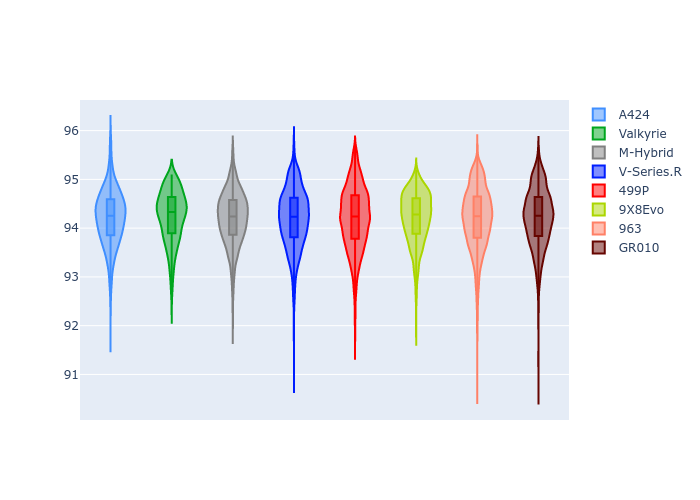

# Combined Plots

## Metadata

- BoP Accuracy: 99.90%
- Overall BoP Grade: A1
- Track: IMOLA
- Threshhold: 250.0kph

## BoP Table
| Manufacturer   | Car        | Weight   | Power   | PINC   | E/Stint   | FDS    | RDP    | QDP    | TDP    |
|:---------------|:-----------|:---------|:--------|:-------|:----------|:-------|:-------|:-------|:-------|
| Alpine         | A424       | 1037kg   | 506.0kw | +1.10% | 911MJ     | -      | 52.35% | 61.85% | 27.84% |
| Aston Martin   | Valkyrie   | 1030kg   | 520.0kw | -0.20% | 910MJ     | -      | 53.59% | 53.33% | 21.51% |
| BMW            | M-Hybrid   | 1039kg   | 502.0kw | +3.50% | 909MJ     | -      | 53.26% | 57.23% | 34.54% |
| Cadillac       | V-Series.R | 1046kg   | 520.0kw | -      | 911MJ     | -      | 47.80% | 56.73% | 19.63% |
| Ferrari        | 499P       | 1064kg   | 505.0kw | +1.30% | 907MJ     | 190kph | 53.02% | 42.32% | 9.88%  |
| Peugeot        | 9X8Evo     | 1030kg   | 520.0kw | -2.80% | 910MJ     | 190kph | 48.47% | 51.26% | 16.02% |
| Porsche        | 963        | 1038kg   | 506.0kw | +1.60% | 906MJ     | -      | 50.87% | 45.25% | 30.77% |
| Toyota         | GR010      | 1061kg   | 506.0kw | -0.40% | 902MJ     | 190kph | 52.43% | 57.12% | 12.82% |

## Performance Table
| Manufacturer   | Car        | RP      | QP      | Vavg      |   RDLC | BOP-Grade   | Match   |
|:---------------|:-----------|:--------|:--------|:----------|-------:|:------------|:--------|
| Alpine         | A424       | 1:33.92 | 1:29.61 | 311.62kph |   1.05 | ~A1         | 99.79%  |
| Aston Martin   | Valkyrie   | 1:33.92 | 1:29.09 | 313.52kph |   1.05 | ~A1         | 100.00% |
| BMW            | M-Hybrid   | 1:33.92 | 1:29.29 | 311.62kph |   1.05 | ~A1         | 100.00% |
| Cadillac       | V-Series.R | 1:33.93 | 1:29.33 | 308.16kph |   1.05 | ~A1         | 100.00% |
| Ferrari        | 499P       | 1:33.93 | 1:28.89 | 311.51kph |   1.06 | ~A1         | 99.83%  |
| Peugeot        | 9X8Evo     | 1:33.92 | 1:29.43 | 314.22kph |   1.05 | ~A1         | 100.00% |
| Porsche        | 963        | 1:33.92 | 1:29.34 | 311.60kph |   1.05 | ~A1         | 99.86%  |
| Toyota         | GR010      | 1:33.94 | 1:28.80 | 311.63kph |   1.06 | ~A1         | 99.76%  |

## Race Laptimes

## Quali Laptimes

## Topspeeds

## Laptimes Lineplot

