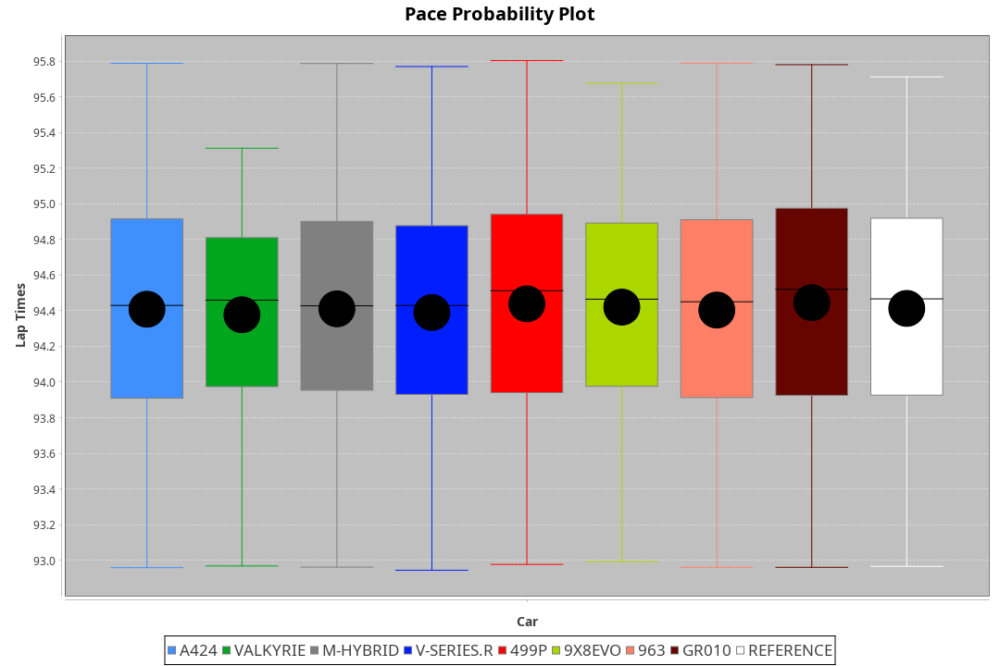
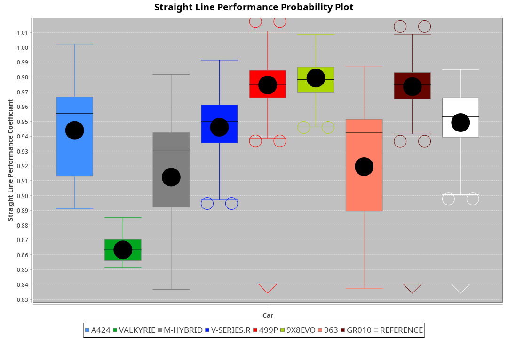
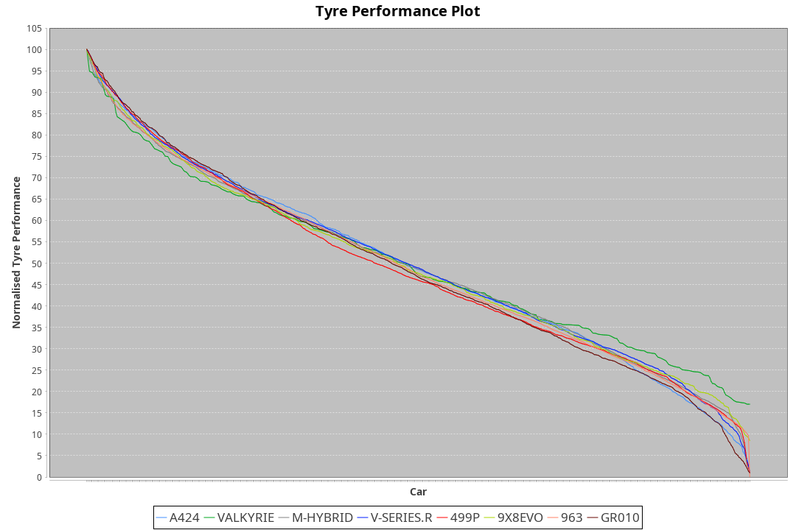

| Manufacturer | Car        | Weight | Power   | PINC    | E/Stint | FDS     |
|:-|:-|:-|:-|:-|:-|:-|
| Alpine       | A424       | 1057kg | 520.0kw |    -    | 916MJ   |    -    |
| Aston Martin | Valkyrie   | 1031kg | 505.0kw | 2.90%   | 905MJ   |    -    |
| BMW          | M-Hybrid   | 1053kg | 519.0kw | 0.10%   | 914MJ   |    -    |
| Cadillac     | V-Series.R | 1050kg | 514.0kw | 1.10%   | 910MJ   |    -    |
| Ferrari      | 499P       | 1081kg | 517.0kw | 0.50%   | 916MJ   | 190kph  |
| Peugeot      | 9X8Evo     | 1031kg | 503.0kw |    -    | 897MJ   | 190kph  |
| Porsche      | 963        | 1055kg | 513.0kw | 1.30%   | 911MJ   |    -    |
| Toyota       | GR010      | 1085kg | 520.0kw |    -    | 922MJ   | 190kph  |

### BoP Accuracy: 94.50%; Overall BoP Grade: A2
| Manufacturer | Car        | Type  | RP      | QP      | Weight | Power¹  | Threshhold | PINC    | Power²   | E/Stint | AVG Vmax  | FDS     | RDLC | L/Stint | BOP-Grade | Model Accuracy | Model Points | Match%  | SimDiff |
|:-|:-|:-|:-|:-|:-|:-|:-|:-|:-|:-|:-|:-|:-|:-|:-|:-|:-|:-|:-|
| Alpine       | A424       | LMDH  | 1:34.37 | 1:30.32 | 1057kg | 520.0kw | 250.0kph   |    -    | 520.00kw |  916MJ  | 299.01kph |    -    | 1.02 | 37      | ~A1       | 99.37%         | 2056         | 96.64%  | +0.05   |
| Aston Martin | Valkyrie   | LMHNH | 1:34.37 | 1:30.09 | 1031kg | 505.0kw | 250.0kph   | 2.90%   | 519.60kw |  905MJ  | 291.34kph |    -    | 1.06 | 37      | +D1       | 100.00%        | 247          | 69.77%  | #       |
| BMW          | M-Hybrid   | LMDH  | 1:34.37 | 1:29.96 | 1053kg | 519.0kw | 250.0kph   | 0.10%   | 519.50kw |  914MJ  | 301.88kph |    -    | 1.02 | 37      | ~A1       | 99.20%         | 3081         | 100.00% | -0.15   |
| Cadillac     | V-Series.R | LMDH  | 1:34.36 | 1:30.08 | 1050kg | 514.0kw | 250.0kph   | 1.10%   | 519.70kw |  910MJ  | 303.60kph |    -    | 1.02 | 37      | +A2       | 99.22%         | 5358         | 94.07%  | +0.25   |
| Ferrari      | 499P       | LMHHU | 1:34.39 | 1:29.90 | 1081kg | 517.0kw | 250.0kph   | 0.50%   | 519.60kw |  916MJ  | 301.36kph | 190kph  | 1.02 | 37      | ~A1       | 99.93%         | 6954         | 100.00% | -0.10   |
| Peugeot      | 9X8Evo     | LMHHU | 1:34.39 | 1:30.31 | 1031kg | 503.0kw | 250.0kph   |    -    | 503.00kw |  897MJ  | 312.74kph | 190kph  | 1.03 | 37      | ~A1       | 100.00%        | 1458         | 95.51%  | +0.34   |
| Porsche      | 963        | LMDH  | 1:34.37 | 1:30.03 | 1055kg | 513.0kw | 250.0kph   | 1.30%   | 519.70kw |  911MJ  | 300.90kph |    -    | 1.02 | 37      | ~A1       | 99.87%         | 14199        | 100.00% | -0.02   |
| Toyota       | GR010      | LMHHU | 1:34.38 | 1:29.70 | 1085kg | 520.0kw | 250.0kph   |    -    | 520.00kw |  922MJ  | 298.21kph | 190kph  | 1.02 | 37      | ~A1       | 99.92%         | 5012         | 100.00% | -0.16   |

## Power below Threshhold
| N/Nmax    | A424    | VALKYRIE | M-HYBRID | V-SERIES.R | 499P    | 9X8EVO  | 963     | GR010   |
|:-|:-|:-|:-|:-|:-|:-|:-|:-|
|  0.550    |  256    |  249     |  256     |  253       |  255    |  248    |  253    |  256    |
|  0.575    |  279    |  272     |  279     |  276       |  278    |  271    |  276    |  279    |
|  0.600    |  300    |  292     |  299     |  297       |  298    |  291    |  296    |  300    |
|  0.625    |  322    |  312     |  321     |  318       |  320    |  311    |  317    |  322    |
|  0.650    |  343    |  333     |  342     |  339       |  341    |  332    |  338    |  343    |
|  0.675    |  365    |  355     |  364     |  361       |  363    |  353    |  360    |  365    |
|  0.700    |  387    |  376     |  386     |  383       |  385    |  374    |  382    |  387    |
|  0.725    |  409    |  397     |  408     |  404       |  407    |  395    |  403    |  409    |
|  0.750    |  430    |  417     |  429     |  425       |  427    |  416    |  424    |  430    |
|  0.775    |  449    |  436     |  448     |  444       |  446    |  435    |  443    |  449    |
|  0.800    |  467    |  454     |  466     |  462       |  464    |  452    |  461    |  467    |
|  0.825    |  482    |  469     |  481     |  477       |  479    |  467    |  476    |  482    |
|  0.850    |  494    |  480     |  493     |  488       |  491    |  478    |  487    |  494    |
|  0.875    |  505    |  490     |  504     |  499       |  502    |  488    |  498    |  505    |
|  0.900    |  512    |  497     |  511     |  506       |  509    |  495    |  505    |  512    |
|  0.925    |  517    |  502     |  516     |  511       |  514    |  500    |  510    |  517    |
| **0.950** | **520** | **505**  | **519**  | **514**    | **517** | **503** | **513** | **520** |
|  0.975    |  518    |  503     |  517     |  512       |  515    |  501    |  511    |  518    |
|  1.000    |  514    |  500     |  513     |  508       |  511    |  498    |  507    |  514    |
|  1.025    |  444    |  431     |  443     |  439       |  441    |  430    |  438    |  444    |

## Power above Threshhold
| N/Nmax    | A424    | VALKYRIE   | M-HYBRID   | V-SERIES.R | 499P       | 9X8EVO  | 963        | GR010   |
|:-|:-|:-|:-|:-|:-|:-|:-|:-|
|  0.550    |  256    |  256.32    |  256.26    |  256.32    |  256.29    |  248    |  256.33    |  256    |
|  0.575    |  279    |  279.35    |  279.28    |  279.35    |  279.31    |  271    |  279.36    |  279    |
|  0.600    |  300    |  299.37    |  299.30    |  299.38    |  299.34    |  291    |  299.39    |  300    |
|  0.625    |  322    |  321.40    |  321.32    |  321.40    |  321.36    |  311    |  321.41    |  322    |
|  0.650    |  343    |  342.43    |  342.34    |  342.43    |  342.39    |  332    |  342.44    |  343    |
|  0.675    |  365    |  364.45    |  364.36    |  364.46    |  364.41    |  353    |  364.47    |  365    |
|  0.700    |  387    |  386.48    |  386.39    |  386.49    |  386.44    |  374    |  386.50    |  387    |
|  0.725    |  409    |  408.51    |  408.41    |  408.51    |  408.46    |  395    |  408.53    |  409    |
|  0.750    |  430    |  429.53    |  429.43    |  429.54    |  429.48    |  416    |  429.55    |  430    |
|  0.775    |  449    |  448.56    |  448.45    |  448.56    |  448.50    |  435    |  448.58    |  449    |
|  0.800    |  467    |  466.58    |  466.47    |  466.59    |  466.53    |  452    |  466.60    |  467    |
|  0.825    |  482    |  481.60    |  481.48    |  481.61    |  481.54    |  467    |  481.62    |  482    |
|  0.850    |  494    |  493.61    |  493.49    |  493.62    |  493.56    |  478    |  493.64    |  494    |
|  0.875    |  505    |  504.63    |  504.50    |  504.64    |  504.57    |  488    |  504.65    |  505    |
|  0.900    |  512    |  511.64    |  511.51    |  511.64    |  511.58    |  495    |  511.66    |  512    |
|  0.925    |  517    |  516.64    |  516.52    |  516.65    |  516.58    |  500    |  516.67    |  517    |
| **0.950** | **520** | **519.65** | **519.52** | **519.65** | **519.58** | **503** | **519.67** | **520** |
|  0.975    |  518    |  517.64    |  517.52    |  517.65    |  517.58    |  501    |  517.67    |  518    |
|  1.000    |  514    |  513.64    |  513.51    |  513.65    |  513.58    |  498    |  513.66    |  514    |
|  1.025    |  444    |  443.55    |  443.44    |  443.56    |  443.50    |  430    |  443.57    |  444    |
