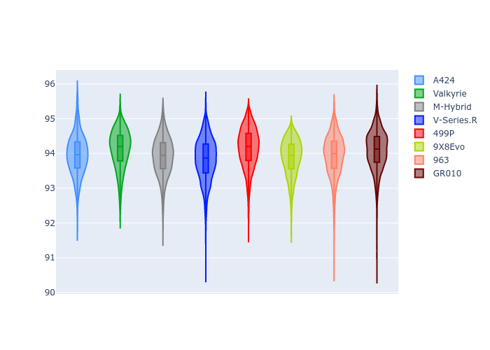
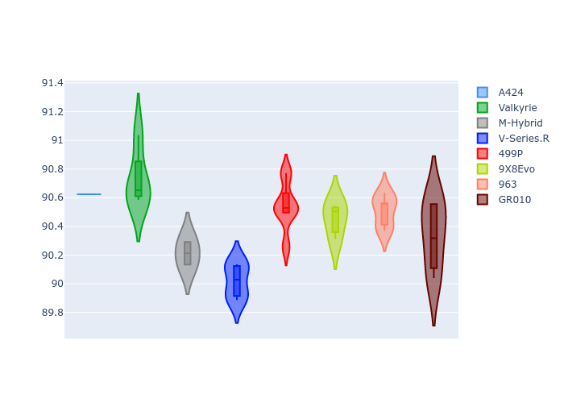
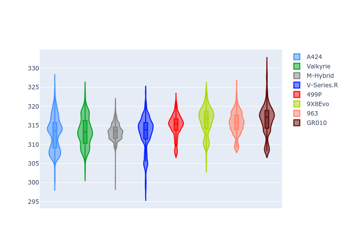
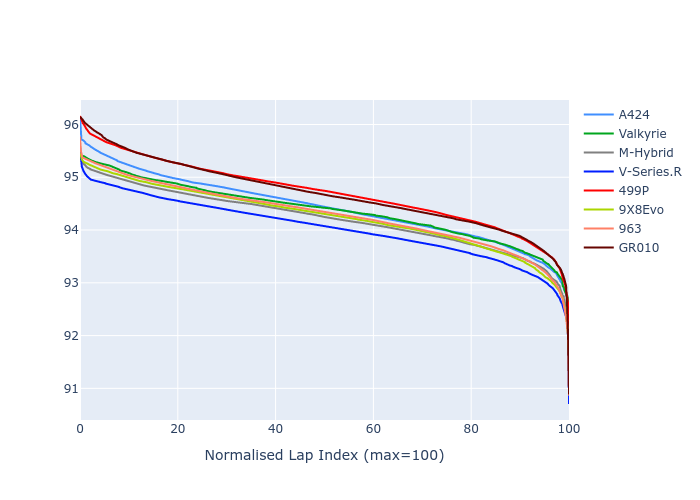

# Combined Plots

## Metadata

- BoP Accuracy: 98.93%
- Overall BoP Grade: A1
- Track: IMOLA
- Threshhold: 250.0kph
- Average Laptime: 1:34.00
- Average Quali Laptime: 1:29.92
- Average Topspeed: 314.60kph

## BoP Table
| Manufacturer   | Car        | Weight   | Power   | PINC   | E/Stint   | FDS    | RDP    | QDP    | TDP    |
|:---------------|:-----------|:---------|:--------|:-------|:----------|:-------|:-------|:-------|:-------|
| Alpine         | A424       | 1048kg   | 515.0kw | +0.70% | 920MJ     | -      | 51.64% | 59.31% | 26.80% |
| Aston Martin   | Valkyrie   | 1030kg   | 520.0kw | -      | 911MJ     | -      | 53.50% | 53.33% | 21.51% |
| BMW            | M-Hybrid   | 1040kg   | 517.0kw | -      | 914MJ     | -      | 52.89% | 56.22% | 33.41% |
| Cadillac       | V-Series.R | 1030kg   | 520.0kw | -      | 910MJ     | -      | 48.63% | 60.80% | 19.01% |
| Ferrari        | 499P       | 1065kg   | 503.0kw | -0.60% | 901MJ     | 190kph | 51.38% | 44.98% | 9.83%  |
| Peugeot        | 9X8Evo     | 1045kg   | 516.0kw | -1.00% | 913MJ     | 190kph | 48.87% | 52.78% | 15.41% |
| Porsche        | 963        | 1043kg   | 514.0kw | +0.40% | 911MJ     | -      | 50.70% | 44.30% | 29.51% |
| Toyota         | GR010      | 1069kg   | 501.0kw | +1.10% | 902MJ     | 190kph | 51.09% | 52.71% | 11.46% |

## Performance Table
| Manufacturer   | Car        | RP      | QP      | Vavg      |   RDLC | BOP-Grade   | Match   |
|:---------------|:-----------|:--------|:--------|:----------|-------:|:------------|:--------|
| Alpine         | A424       | 1:33.74 | 1:29.98 | 314.04kph |   1.04 | ~A1         | 99.91%  |
| Aston Martin   | Valkyrie   | 1:34.10 | 1:29.88 | 315.93kph |   1.05 | ~A1         | 100.00% |
| BMW            | M-Hybrid   | 1:33.69 | 1:29.60 | 314.12kph |   1.05 | ~A1         | 100.00% |
| Cadillac       | V-Series.R | 1:33.58 | 1:29.53 | 313.28kph |   1.05 | ~A1         | 99.93%  |
| Ferrari        | 499P       | 1:34.50 | 1:30.17 | 313.47kph |   1.05 | ~A1         | 95.64%  |
| Peugeot        | 9X8Evo     | 1:34.24 | 1:30.34 | 314.84kph |   1.04 | ~A1         | 99.61%  |
| Porsche        | 963        | 1:33.72 | 1:29.80 | 316.24kph |   1.04 | ~A1         | 99.91%  |
| Toyota         | GR010      | 1:34.43 | 1:30.09 | 314.87kph |   1.05 | ~A1         | 96.44%  |

## Race Laptimes

## Quali Laptimes

## Topspeeds

## Laptimes Lineplot

