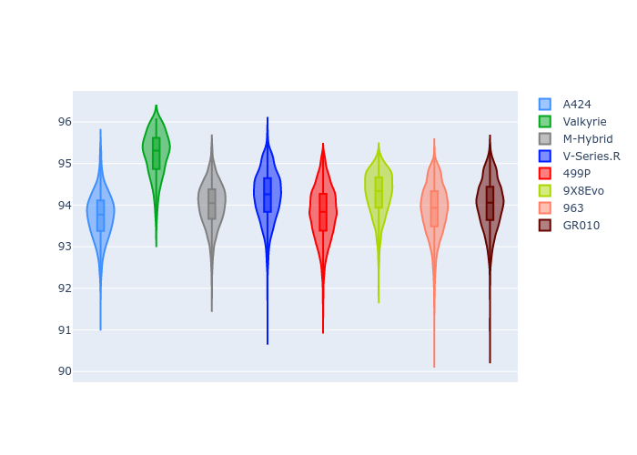
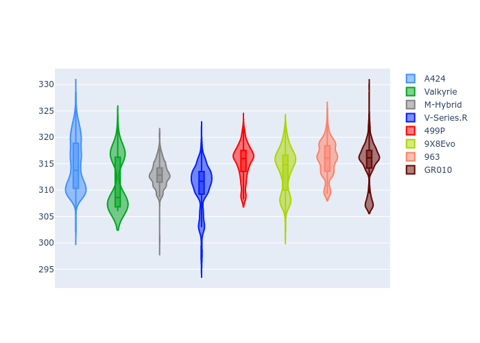

# Combined Plots

## Metadata

- BoP Accuracy: 99.07%
- Overall BoP Grade: A1
- Track: IMOLA
- Threshhold: 210.0kph

## BoP Table
| Manufacturer   | Car        | Weight   | Power   | PINC   | E/Stint   | FDS    | RDP    | QDP    | TDP    |
|:---------------|:-----------|:---------|:--------|:-------|:----------|:-------|:-------|:-------|:-------|
| Alpine         | A424       | 1047kg   | 520.0kw | -      | 922MJ     | -      | 52.35% | 61.85% | 27.84% |
| Aston Martin   | Valkyrie   | 1042kg   | 504.0kw | +0.40% | 899MJ     | -      | 53.59% | 53.33% | 21.51% |
| BMW            | M-Hybrid   | 1041kg   | 512.0kw | -      | 910MJ     | -      | 53.26% | 57.23% | 34.54% |
| Cadillac       | V-Series.R | 1034kg   | 510.0kw | -      | 901MJ     | -      | 47.80% | 56.73% | 19.63% |
| Ferrari        | 499P       | 1063kg   | 508.0kw | -      | 906MJ     | 190kph | 53.02% | 42.32% | 9.88%  |
| Peugeot        | 9X8Evo     | 1050kg   | 510.0kw | -      | 910MJ     | 190kph | 48.47% | 51.26% | 16.02% |
| Porsche        | 963        | 1047kg   | 516.0kw | -      | 912MJ     | -      | 50.87% | 45.25% | 30.77% |
| Toyota         | GR010      | 1080kg   | 512.0kw | -      | 910MJ     | 190kph | 52.43% | 57.12% | 12.82% |

## Performance Table
| Manufacturer   | Car        | RP      | QP      | Vavg      |   RDLC | BOP-Grade   | Match   |
|:---------------|:-----------|:--------|:--------|:----------|-------:|:------------|:--------|
| Alpine         | A424       | 1:33.60 | 1:29.31 | 312.67kph |   1.05 | ~A1         | 99.30%  |
| Aston Martin   | Valkyrie   | 1:35.05 | 1:30.12 | 309.21kph |   1.05 | ~A1         | 96.39%  |
| BMW            | M-Hybrid   | 1:33.96 | 1:29.33 | 310.61kph |   1.05 | ~A1         | 100.00% |
| Cadillac       | V-Series.R | 1:34.16 | 1:29.54 | 307.28kph |   1.05 | ~A1         | 100.00% |
| Ferrari        | 499P       | 1:33.94 | 1:28.89 | 311.15kph |   1.06 | ~A1         | 99.76%  |
| Peugeot        | 9X8Evo     | 1:34.57 | 1:30.03 | 312.32kph |   1.05 | ~A1         | 97.45%  |
| Porsche        | 963        | 1:33.86 | 1:29.29 | 311.44kph |   1.05 | ~A1         | 99.78%  |
| Toyota         | GR010      | 1:34.02 | 1:28.87 | 311.30kph |   1.06 | ~A1         | 99.85%  |

## Race Laptimes

## Quali Laptimes

## Topspeeds

## Laptimes Lineplot

