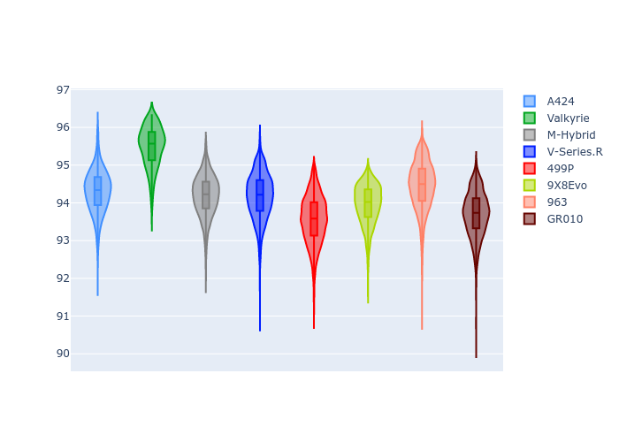
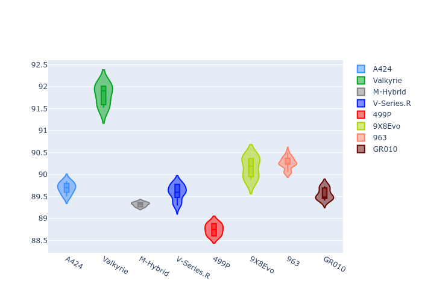
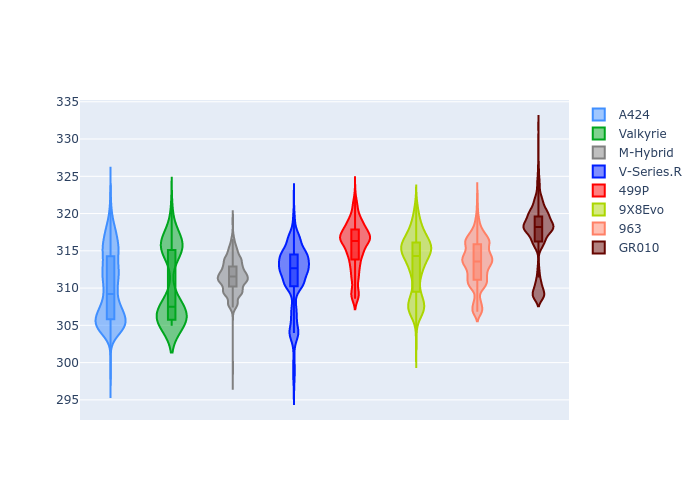
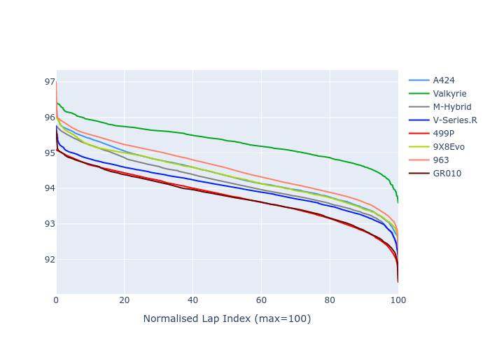

# Combined Plots

## Metadata

- BoP Accuracy: 98.90%
- Overall BoP Grade: A1
- Track: IMOLA
- Threshhold: 250.0kph

## BoP Table
| Manufacturer   | Car        | Weight   | Power   | PINC   | E/Stint   | FDS    | RDP    | QDP    | TDP    |
|:---------------|:-----------|:---------|:--------|:-------|:----------|:-------|:-------|:-------|:-------|
| Alpine         | A424       | 1042kg   | 519.0kw | -5.40% | 907MJ     | -      | 52.35% | 61.85% | 27.84% |
| Aston Martin   | Valkyrie   | 1051kg   | 505.0kw | -      | 900MJ     | -      | 53.59% | 53.33% | 21.51% |
| BMW            | M-Hybrid   | 1042kg   | 513.0kw | -1.60% | 907MJ     | -      | 53.26% | 57.23% | 34.54% |
| Cadillac       | V-Series.R | 1041kg   | 510.0kw | +2.00% | 907MJ     | -      | 47.80% | 56.73% | 19.63% |
| Ferrari        | 499P       | 1045kg   | 508.0kw | -1.80% | 900MJ     | 190kph | 53.02% | 42.32% | 9.88%  |
| Peugeot        | 9X8Evo     | 1030kg   | 520.0kw | -5.40% | 903MJ     | 190kph | 48.47% | 51.26% | 16.02% |
| Porsche        | 963        | 1053kg   | 503.0kw | +1.20% | 904MJ     | -      | 50.87% | 45.25% | 30.77% |
| Toyota         | GR010      | 1065kg   | 500.0kw | +3.60% | 907MJ     | 190kph | 52.43% | 57.12% | 12.82% |

## Performance Table
| Manufacturer   | Car        | RP      | QP      | Vavg      |   RDLC | BOP-Grade   | Match   |
|:---------------|:-----------|:--------|:--------|:----------|-------:|:------------|:--------|
| Alpine         | A424       | 1:34.37 | 1:30.02 | 308.18kph |   1.05 | ~A1         | 99.75%  |
| Aston Martin   | Valkyrie   | 1:35.30 | 1:30.35 | 308.12kph |   1.05 | +A2         | 93.89%  |
| BMW            | M-Hybrid   | 1:34.18 | 1:29.53 | 309.32kph |   1.05 | ~A1         | 100.00% |
| Cadillac       | V-Series.R | 1:34.04 | 1:29.42 | 308.25kph |   1.05 | ~A1         | 99.89%  |
| Ferrari        | 499P       | 1:33.77 | 1:28.74 | 311.49kph |   1.06 | ~A1         | 98.74%  |
| Peugeot        | 9X8Evo     | 1:34.33 | 1:29.82 | 311.86kph |   1.05 | ~A1         | 99.83%  |
| Porsche        | 963        | 1:34.55 | 1:29.92 | 308.97kph |   1.05 | ~A1         | 99.83%  |
| Toyota         | GR010      | 1:33.76 | 1:28.64 | 313.32kph |   1.06 | ~A1         | 99.27%  |

## Race Laptimes

## Quali Laptimes

## Topspeeds

## Laptimes Lineplot

