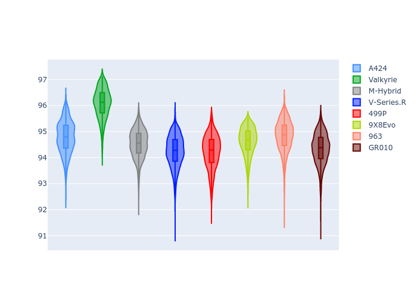
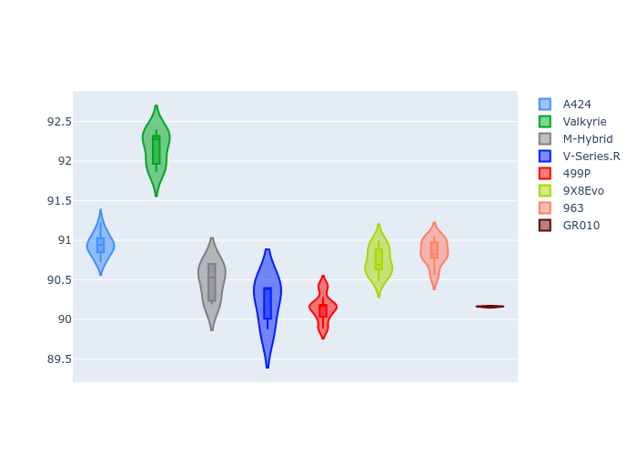
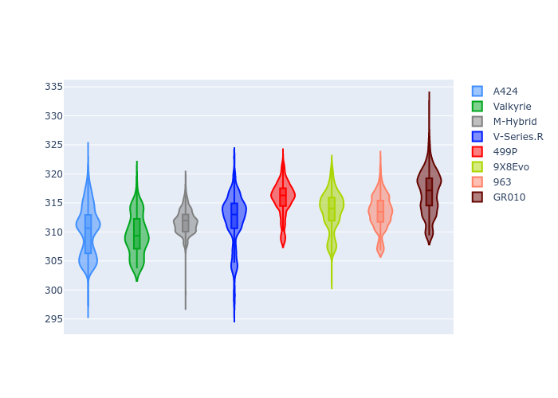
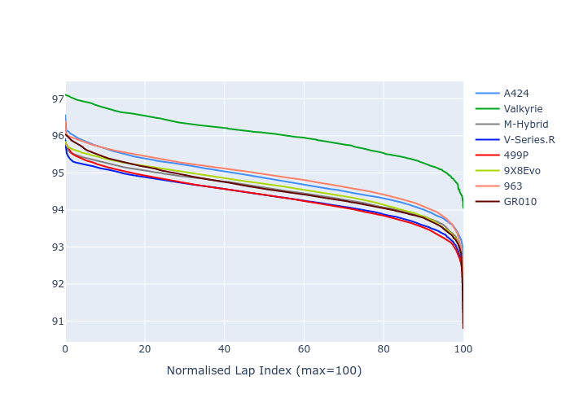

# Combined Plots

## Metadata

- BoP Accuracy: 96.12%
- Overall BoP Grade: A1
- Track: IMOLA
- Threshhold: 250.0kph
- Average Laptime: 1:34.36
- Average Quali Laptime: 1:30.25
- Average Topspeed: 312.91kph

## BoP Table
| Manufacturer   | Car        | Weight   | Power   | PINC   | E/Stint   | FDS    | RDP    | QDP    | TDP    |
|:---------------|:-----------|:---------|:--------|:-------|:----------|:-------|:-------|:-------|:-------|
| Alpine         | A424       | 1042kg   | 519.0kw | -5.40% | 907MJ     | -      | 51.64% | 59.31% | 26.80% |
| Aston Martin   | Valkyrie   | 1051kg   | 505.0kw | -      | 900MJ     | -      | 53.50% | 53.33% | 21.51% |
| BMW            | M-Hybrid   | 1042kg   | 513.0kw | -1.60% | 907MJ     | -      | 52.89% | 56.22% | 33.41% |
| Cadillac       | V-Series.R | 1041kg   | 510.0kw | +2.00% | 907MJ     | -      | 48.63% | 60.80% | 19.01% |
| Ferrari        | 499P       | 1045kg   | 508.0kw | -1.80% | 900MJ     | 190kph | 51.38% | 44.98% | 9.83%  |
| Peugeot        | 9X8Evo     | 1030kg   | 520.0kw | -5.40% | 903MJ     | 190kph | 48.87% | 52.78% | 15.41% |
| Porsche        | 963        | 1053kg   | 503.0kw | +1.20% | 904MJ     | -      | 50.70% | 44.30% | 29.51% |
| Toyota         | GR010      | 1065kg   | 500.0kw | +3.60% | 907MJ     | 190kph | 51.09% | 52.71% | 11.46% |

## Performance Table
| Manufacturer   | Car        | RP      | QP      | Vavg      |   RDLC | BOP-Grade   | Match   |
|:---------------|:-----------|:--------|:--------|:----------|-------:|:------------|:--------|
| Alpine         | A424       | 1:34.34 | 1:30.54 | 310.06kph |   1.04 | ~A1         | 98.99%  |
| Aston Martin   | Valkyrie   | 1:35.51 | 1:31.18 | 310.32kph |   1.05 | +C2         | 70.64%  |
| BMW            | M-Hybrid   | 1:34.22 | 1:30.09 | 311.59kph |   1.05 | ~A1         | 100.00% |
| Cadillac       | V-Series.R | 1:34.11 | 1:30.01 | 311.64kph |   1.05 | ~A1         | 99.96%  |
| Ferrari        | 499P       | 1:33.91 | 1:29.62 | 315.68kph |   1.05 | ~A1         | 99.90%  |
| Peugeot        | 9X8Evo     | 1:34.33 | 1:30.42 | 313.35kph |   1.04 | ~A1         | 100.00% |
| Porsche        | 963        | 1:34.46 | 1:30.48 | 313.39kph |   1.04 | ~A1         | 99.87%  |
| Toyota         | GR010      | 1:34.00 | 1:29.69 | 317.27kph |   1.05 | ~A1         | 99.62%  |

## Race Laptimes

## Quali Laptimes

## Topspeeds

## Laptimes Lineplot

