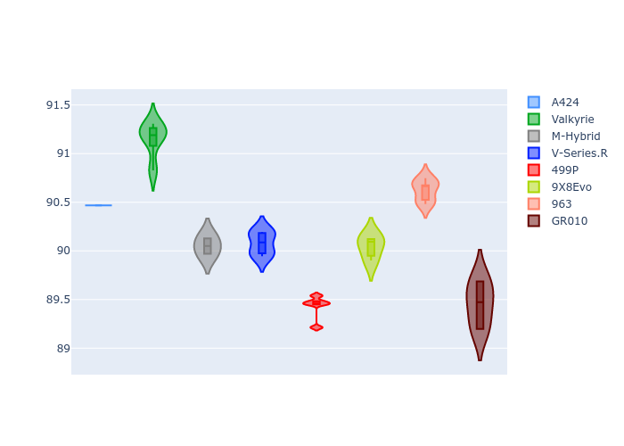
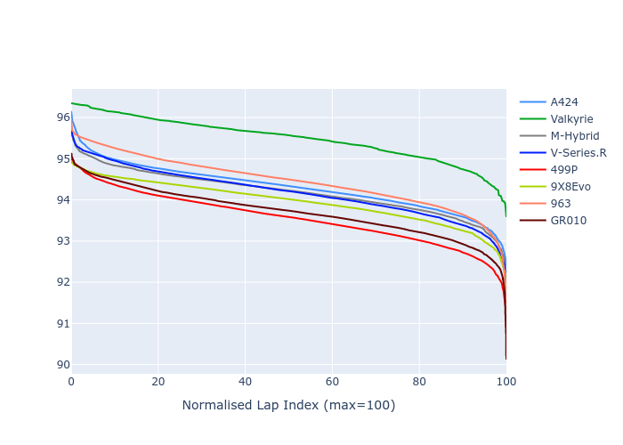

# Combined Plots

## Metadata

- BoP Accuracy: 98.41%
- Overall BoP Grade: A1
- Track: IMOLA
- Threshhold: 250.0kph

## BoP Table
| Manufacturer   | Car        | Weight   | Power   | PINC   | E/Stint   | FDS    |
|:---------------|:-----------|:---------|:--------|:-------|:----------|:-------|
| Alpine         | A424       | 1042kg   | 519.0kw | -5.40% | 907MJ     | -      |
| Aston Martin   | Valkyrie   | 1051kg   | 505.0kw | -      | 900MJ     | -      |
| BMW            | M-Hybrid   | 1042kg   | 513.0kw | -1.60% | 907MJ     | -      |
| Cadillac       | V-Series.R | 1041kg   | 510.0kw | +2.00% | 907MJ     | -      |
| Ferrari        | 499P       | 1045kg   | 508.0kw | -1.80% | 900MJ     | 190kph |
| Peugeot        | 9X8Evo     | 1030kg   | 520.0kw | -5.40% | 903MJ     | 190kph |
| Porsche        | 963        | 1053kg   | 503.0kw | +1.20% | 904MJ     | -      |
| Toyota         | GR010      | 1065kg   | 500.0kw | +3.60% | 907MJ     | 190kph |

## Performance Table
| Manufacturer   | Car        | RP      | QP      | Vavg      |   RDLC | BOP-Grade   | Match   |
|:---------------|:-----------|:--------|:--------|:----------|-------:|:------------|:--------|
| Alpine         | A424       | 1:34.33 | 1:30.11 | 308.39kph |   1.05 | ~A1         | 99.54%  |
| Aston Martin   | Valkyrie   | 1:35.31 | 1:30.37 | 308.12kph |   1.05 | +A2         | 90.44%  |
| BMW            | M-Hybrid   | 1:34.13 | 1:29.63 | 309.37kph |   1.05 | ~A1         | 99.96%  |
| Cadillac       | V-Series.R | 1:33.98 | 1:29.57 | 308.49kph |   1.05 | ~A1         | 99.68%  |
| Ferrari        | 499P       | 1:33.98 | 1:29.42 | 311.57kph |   1.05 | ~A1         | 99.46%  |
| Peugeot        | 9X8Evo     | 1:34.38 | 1:29.88 | 311.86kph |   1.05 | ~A1         | 98.54%  |
| Porsche        | 963        | 1:34.46 | 1:29.99 | 308.60kph |   1.05 | ~A1         | 99.89%  |
| Toyota         | GR010      | 1:34.01 | 1:29.37 | 312.87kph |   1.05 | ~A1         | 99.78%  |

## Race Laptimes

## Quali Laptimes

## Topspeeds

## Laptimes Lineplot

