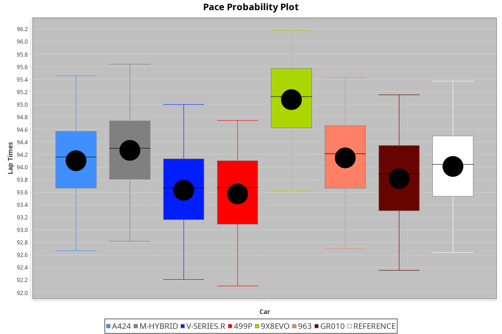
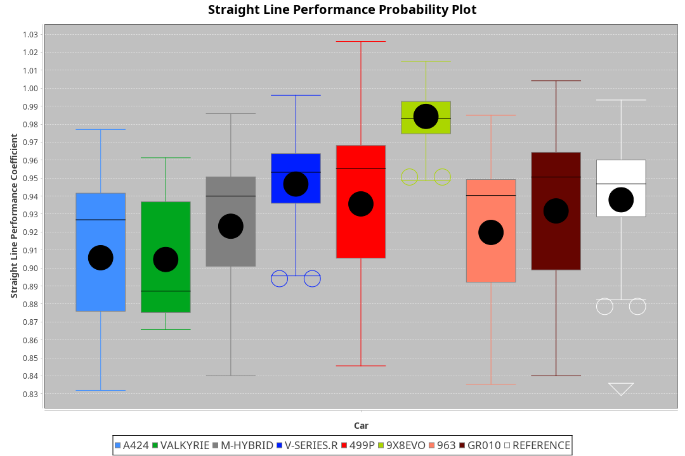
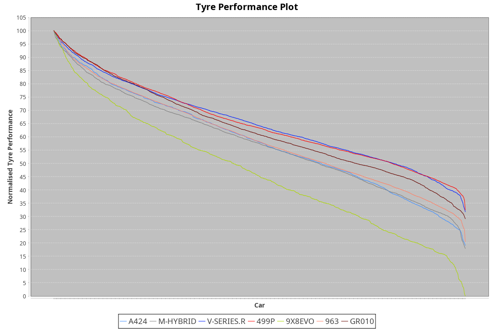

| Manufacturer | Car        | Weight | Power   | PINC    | E/Stint | FDS     |
|:-|:-|:-|:-|:-|:-|:-|
| Alpine       | A424       | 1042kg | 519.0kw | -5.40%  | 907MJ   |    -    |
| Aston Martin | Valkyrie   | 1051kg | 505.0kw |    -    | 900MJ   |    -    |
| BMW          | M-Hybrid   | 1042kg | 513.0kw | -1.60%  | 907MJ   |    -    |
| Cadillac     | V-Series.R | 1041kg | 510.0kw | 2.00%   | 907MJ   |    -    |
| Ferrari      | 499P       | 1045kg | 508.0kw | -1.80%  | 900MJ   | 190kph  |
| Peugeot      | 9X8Evo     | 1030kg | 520.0kw | -5.40%  | 903MJ   | 190kph  |
| Porsche      | 963        | 1053kg | 503.0kw | 1.20%   | 904MJ   |    -    |
| Toyota       | GR010      | 1065kg | 500.0kw | 3.60%   | 907MJ   | 190kph  |

### BoP Accuracy: 79.52%; Overall BoP Grade: C1
| Manufacturer | Car        | Type  | RP      | QP      | Weight | Power¹  | Threshhold | PINC    | Power²   | E/Stint | AVG Vmax  | FDS     | RDLC | L/Stint | BOP-Grade | Model Accuracy | Model Points | Match%  | SimDiff |
|:-|:-|:-|:-|:-|:-|:-|:-|:-|:-|:-|:-|:-|:-|:-|:-|:-|:-|:-|:-|
| Alpine       | A424       | LMDH  | 1:34.50 | 1:30.00 | 1042kg | 519.0kw | 250.0kph   | -5.40%  | 491.00kw |  907MJ  | 303.67kph |    -    | 1.03 | 37      | ~A1       | 97.47%         | 1810         | 97.20%  | -0.10   |
| Aston Martin | Valkyrie   | LMHNH | 1:35.54 | 1:30.51 | 1051kg | 505.0kw | 250.0kph   |    -    | 505.00kw |  900MJ  | 295.56kph |    -    | 1.02 | 37      | +Ω1       | 100.00%        | 466          | 35.87%  | -0.13   |
| BMW          | M-Hybrid   | LMDH  | 1:34.61 | 1:29.89 | 1042kg | 513.0kw | 250.0kph   | -1.60%  | 504.80kw |  907MJ  | 301.44kph |    -    | 1.03 | 37      | ~A1       | 100.00%        | 3339         | 100.00% | +0.16   |
| Cadillac     | V-Series.R | LMDH  | 1:34.22 | 1:29.44 | 1041kg | 510.0kw | 250.0kph   | 2.00%   | 520.20kw |  907MJ  | 304.55kph |    -    | 1.03 | 37      | -B2       | 99.00%         | 6039         | 81.73%  | +0.06   |
| Ferrari      | 499P       | LMHHU | 1:34.16 | 1:29.44 | 1045kg | 508.0kw | 250.0kph   | -1.80%  | 498.90kw |  900MJ  | 301.21kph | 190kph  | 1.06 | 37      | -C1       | 99.56%         | 7418         | 77.70%  | -0.19   |
| Peugeot      | 9X8Evo     | LMHHU | 1:34.03 | 1:29.50 | 1030kg | 520.0kw | 250.0kph   | -5.40%  | 491.90kw |  903MJ  | 311.34kph | 190kph  | 1.02 | 37      | -D1       | 100.00%        | 1889         | 67.22%  | -0.07   |
| Porsche      | 963        | LMDH  | 1:35.11 | 1:30.18 | 1053kg | 503.0kw | 250.0kph   | 1.20%   | 509.00kw |  904MJ  | 298.77kph |    -    | 1.03 | 37      | +B2       | 100.00%        | 14574        | 81.44%  | +0.29   |
| Toyota       | GR010      | LMHHU | 1:34.45 | 1:29.67 | 1065kg | 500.0kw | 250.0kph   | 3.60%   | 518.00kw |  907MJ  | 299.80kph | 190kph  | 1.04 | 37      | ~A1       | 97.78%         | 5323         | 95.01%  | -0.03   |

## Power below Threshhold
| N/Nmax    | A424    | VALKYRIE | M-HYBRID | V-SERIES.R | 499P    | 9X8EVO  | 963     | GR010   |
|:-|:-|:-|:-|:-|:-|:-|:-|:-|
|  0.550    |  256    |  249     |  253     |  251       |  250    |  256    |  248    |  246    |
|  0.575    |  279    |  272     |  276     |  274       |  273    |  279    |  271    |  269    |
|  0.600    |  299    |  292     |  296     |  295       |  293    |  300    |  291    |  289    |
|  0.625    |  321    |  312     |  317     |  316       |  314    |  322    |  311    |  309    |
|  0.650    |  342    |  333     |  338     |  337       |  335    |  343    |  332    |  330    |
|  0.675    |  364    |  355     |  360     |  358       |  357    |  365    |  353    |  351    |
|  0.700    |  386    |  376     |  382     |  380       |  378    |  387    |  374    |  372    |
|  0.725    |  408    |  397     |  403     |  401       |  399    |  409    |  395    |  393    |
|  0.750    |  429    |  417     |  424     |  422       |  420    |  430    |  416    |  413    |
|  0.775    |  448    |  436     |  443     |  441       |  439    |  449    |  435    |  432    |
|  0.800    |  466    |  454     |  461     |  458       |  456    |  467    |  452    |  449    |
|  0.825    |  481    |  469     |  476     |  473       |  471    |  482    |  467    |  464    |
|  0.850    |  493    |  480     |  487     |  485       |  483    |  494    |  478    |  475    |
|  0.875    |  504    |  490     |  498     |  495       |  493    |  505    |  488    |  485    |
|  0.900    |  511    |  497     |  505     |  502       |  500    |  512    |  495    |  492    |
|  0.925    |  516    |  502     |  510     |  507       |  505    |  517    |  500    |  497    |
| **0.950** | **519** | **505**  | **513**  | **510**    | **508** | **520** | **503** | **500** |
|  0.975    |  517    |  503     |  511     |  508       |  506    |  518    |  501    |  498    |
|  1.000    |  513    |  500     |  507     |  505       |  503    |  514    |  498    |  495    |
|  1.025    |  443    |  431     |  438     |  436       |  434    |  444    |  430    |  427    |

## Power above Threshhold
| N/Nmax    | A424       | VALKYRIE | M-HYBRID   | V-SERIES.R | 499P       | 9X8EVO     | 963        | GR010   |
|:-|:-|:-|:-|:-|:-|:-|:-|:-|
|  0.550    |  241.48    |  249     |  248.39    |  256.10    |  245.42    |  242.45    |  251.02    |  255    |
|  0.575    |  264.52    |  272     |  271.43    |  279.11    |  268.46    |  264.49    |  274.02    |  278    |
|  0.600    |  283.56    |  292     |  291.46    |  300.12    |  288.50    |  284.53    |  294.02    |  299    |
|  0.625    |  303.60    |  312     |  312.49    |  322.12    |  308.53    |  304.57    |  315.02    |  321    |
|  0.650    |  324.64    |  333     |  333.52    |  343.13    |  329.57    |  324.61    |  336.02    |  342    |
|  0.675    |  344.68    |  355     |  354.56    |  365.14    |  350.60    |  345.65    |  357.03    |  364    |
|  0.700    |  365.73    |  376     |  375.59    |  387.15    |  371.64    |  366.69    |  379.03    |  386    |
|  0.725    |  386.77    |  397     |  396.62    |  409.16    |  392.67    |  386.72    |  400.03    |  407    |
|  0.750    |  405.81    |  417     |  416.65    |  430.17    |  411.71    |  406.76    |  421.03    |  428    |
|  0.775    |  424.84    |  436     |  435.68    |  449.17    |  430.74    |  424.79    |  440.03    |  447    |
|  0.800    |  440.87    |  454     |  453.71    |  467.18    |  447.77    |  441.83    |  457.03    |  465    |
|  0.825    |  455.90    |  469     |  468.74    |  482.19    |  462.79    |  455.85    |  472.03    |  480    |
|  0.850    |  466.93    |  480     |  479.75    |  494.19    |  473.81    |  466.87    |  484.03    |  492    |
|  0.875    |  476.95    |  490     |  489.77    |  505.19    |  483.83    |  476.89    |  494.03    |  503    |
|  0.900    |  482.96    |  497     |  496.78    |  512.20    |  490.84    |  483.91    |  501.04    |  510    |
|  0.925    |  487.97    |  502     |  501.79    |  517.20    |  495.85    |  488.91    |  506.04    |  515    |
| **0.950** | **490.97** | **505**  | **504.79** | **520.20** | **498.86** | **491.92** | **509.04** | **518** |
|  0.975    |  488.97    |  503     |  502.79    |  518.20    |  496.85    |  489.92    |  507.04    |  516    |
|  1.000    |  485.96    |  500     |  499.78    |  514.20    |  493.85    |  486.91    |  504.04    |  512    |
|  1.025    |  419.83    |  431     |  430.68    |  444.17    |  425.73    |  419.79    |  435.03    |  442    |
