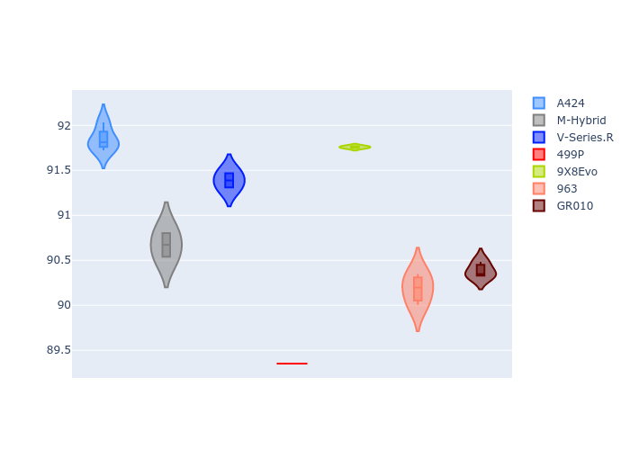

# Combined Plots

## Metadata

- BoP Accuracy: 90.39%
- Overall BoP Grade: A2
- Track: IMOLA
- Threshhold: 0.0kph
- Average Laptime: 1:34.16
- Average Quali Laptime: 1:31.44
- Average Topspeed: 315.77kph

## BoP Table
| Manufacturer   | Car        | Weight   | Power   | PINC   | E/Stint   | FDS    | RDP    | QDP     | TDP    |
|:---------------|:-----------|:---------|:--------|:-------|:----------|:-------|:-------|:--------|:-------|
| Alpine         | A424       | 1042kg   | 514.0kw | -      | 909MJ     | -      | 46.25% | 100.00% | 13.95% |
| BMW            | M-Hybrid   | 1035kg   | 511.0kw | -      | 905MJ     | -      | 54.22% | 40.00%  | 10.62% |
| Cadillac       | V-Series.R | 1030kg   | 517.0kw | -      | 908MJ     | -      | 53.20% | 66.67%  | 30.73% |
| Ferrari        | 499P       | 1041kg   | 510.0kw | -      | 904MJ     | 190kph | 46.66% | 20.00%  | 11.63% |
| Peugeot        | 9X8Evo     | 1061kg   | 510.0kw | -      | 906MJ     | 190kph | 49.50% | 50.00%  | 18.03% |
| Porsche        | 963        | 1033kg   | 508.0kw | -      | 901MJ     | -      | 51.94% | 42.86%  | 3.54%  |
| Toyota         | GR010      | 1060kg   | 516.0kw | -      | 916MJ     | 190kph | 54.63% | 50.00%  | 8.80%  |

## Performance Table
| Manufacturer   | Car        | RP      | QP      | Vavg      |   RDLC | BOP-Grade   | Match   |
|:---------------|:-----------|:--------|:--------|:----------|-------:|:------------|:--------|
| Alpine         | A424       | 1:34.60 | 1:32.49 | 315.20kph |   1.02 | +C1         | 80.00%  |
| BMW            | M-Hybrid   | 1:34.32 | 1:31.34 | 314.42kph |   1.03 | +A2         | 91.46%  |
| Cadillac       | V-Series.R | 1:34.17 | 1:31.99 | 313.14kph |   1.02 | +A2         | 91.67%  |
| Ferrari        | 499P       | 1:33.56 | 1:30.12 | 319.07kph |   1.04 | -A2         | 93.71%  |
| Peugeot        | 9X8Evo     | 1:34.57 | 1:32.39 | 315.55kph |   1.02 | +C1         | 77.89%  |
| Porsche        | 963        | 1:34.08 | 1:30.80 | 315.66kph |   1.04 | ~A1         | 99.80%  |
| Toyota         | GR010      | 1:33.81 | 1:30.97 | 317.33kph |   1.03 | ~A1         | 98.21%  |

## Race Laptimes

## Quali Laptimes

## Topspeeds

## Laptimes Lineplot

