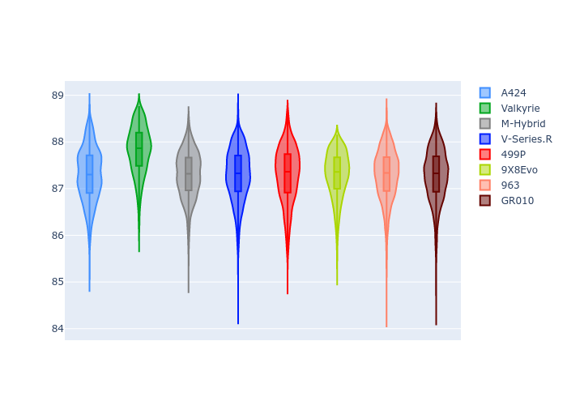
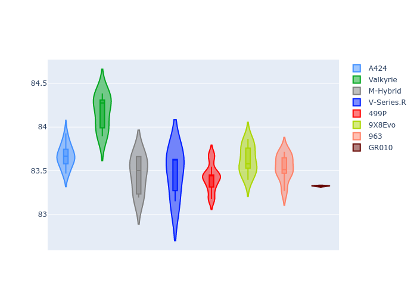
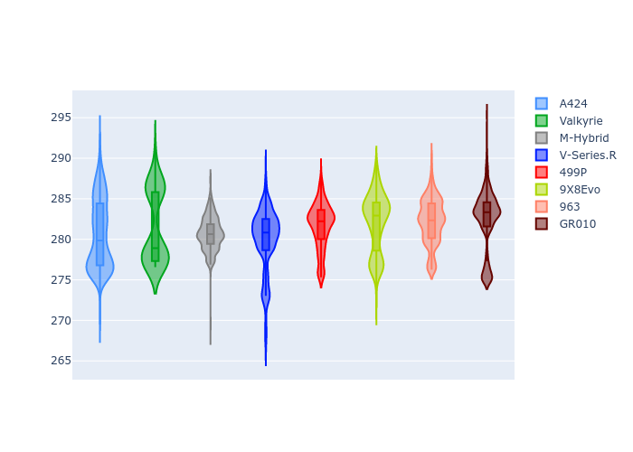
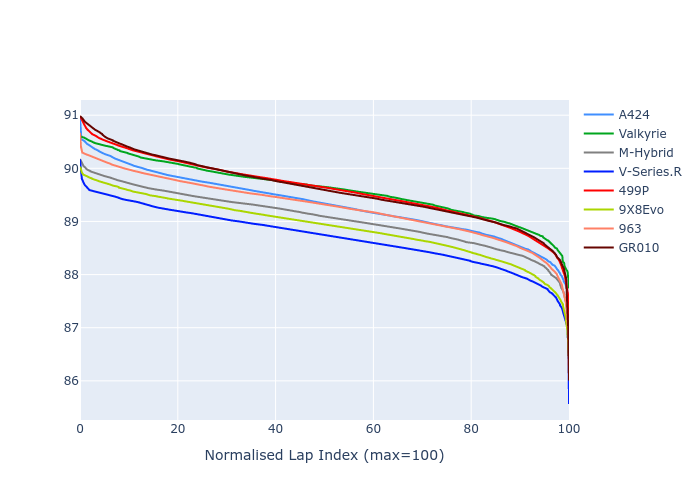

# Combined Plots

## Metadata

- BoP Accuracy: 98.63%
- Overall BoP Grade: A1
- Track: INTERLAGOS
- Threshhold: 250.0kph
- Average Laptime: 1:29.26
- Average Quali Laptime: 1:25.03
- Laptime Std Dev: 0.32 seconds
- Filtered Average Topspeed: 281.47kph

## BoP Table
| Manufacturer   | Car        | Weight   | Power   | PINC   | E/Stint   | FDS    | RDP    | QDP    | TDP    |
|:---------------|:-----------|:---------|:--------|:-------|:----------|:-------|:-------|:-------|:-------|
| Alpine         | A424       | 1066kg   | 511.0kw | +0.10% | 912MJ     | -      | 51.45% | 55.09% | 24.89% |
| Aston Martin   | Valkyrie   | 1030kg   | 512.0kw | -      | 904MJ     | -      | 53.07% | 48.70% | 24.00% |
| BMW            | M-Hybrid   | 1060kg   | 513.0kw | +0.10% | 911MJ     | -      | 52.63% | 52.34% | 34.06% |
| Cadillac       | V-Series.R | 1057kg   | 519.0kw | -      | 913MJ     | -      | 48.80% | 57.26% | 18.10% |
| Ferrari        | 499P       | 1052kg   | 503.0kw | -0.60% | 898MJ     | 190kph | 51.39% | 44.34% | 9.89%  |
| Peugeot        | 9X8Evo     | 1062kg   | 518.0kw | -0.10% | 917MJ     | 190kph | 49.16% | 50.25% | 18.00% |
| Porsche        | 963        | 1066kg   | 511.0kw | -0.10% | 908MJ     | -      | 50.61% | 41.90% | 27.68% |
| Toyota         | GR010      | 1061kg   | 502.0kw | +0.10% | 901MJ     | 190kph | 51.33% | 51.71% | 14.89% |

## Performance Table
| Manufacturer   | Car        | RP      | QP      | Vavg      |   RDLC | BOP-Grade   | Match   |
|:---------------|:-----------|:--------|:--------|:----------|-------:|:------------|:--------|
| Alpine         | A424       | 1:29.32 | 1:25.23 | 279.64kph |   1.05 | ~A1         | 99.83%  |
| Aston Martin   | Valkyrie   | 1:29.60 | 1:25.64 | 281.89kph |   1.05 | ~A1         | 99.00%  |
| BMW            | M-Hybrid   | 1:29.06 | 1:24.78 | 280.11kph |   1.05 | ~A1         | 100.00% |
| Cadillac       | V-Series.R | 1:28.71 | 1:24.43 | 279.52kph |   1.05 | ~A1         | 99.83%  |
| Ferrari        | 499P       | 1:29.60 | 1:25.17 | 283.35kph |   1.05 | ~A1         | 96.10%  |
| Peugeot        | 9X8Evo     | 1:28.89 | 1:24.83 | 282.91kph |   1.05 | ~A1         | 99.89%  |
| Porsche        | 963        | 1:29.27 | 1:25.19 | 281.29kph |   1.05 | ~A1         | 99.93%  |
| Toyota         | GR010      | 1:29.60 | 1:24.99 | 283.02kph |   1.05 | -A2         | 94.45%  |

## Race Laptimes

## Quali Laptimes

## Topspeeds

## Laptimes Lineplot

