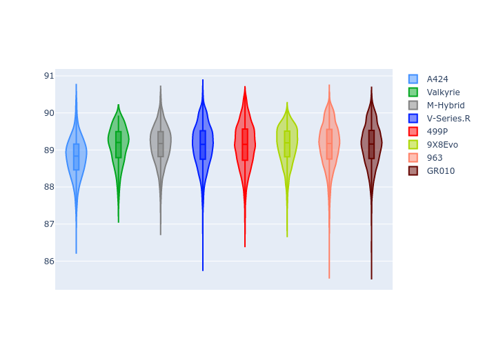
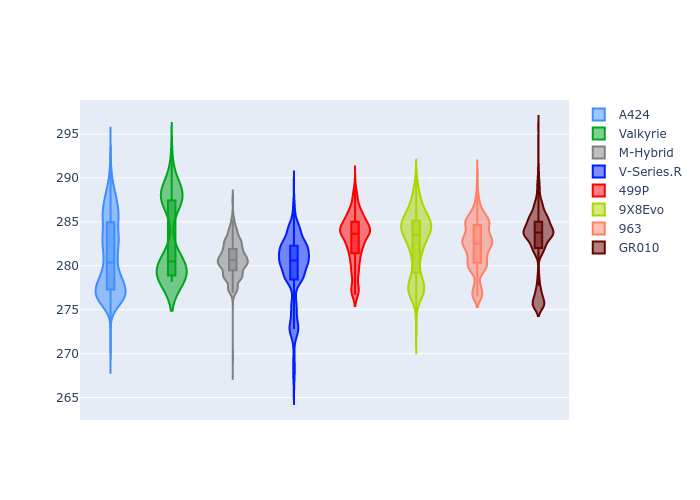

# Combined Plots

## Metadata

- BoP Accuracy: 99.74%
- Overall BoP Grade: A1
- Track: INTERLAGOS
- Threshhold: 250.0kph
- Average Laptime: 1:29.09
- Average Quali Laptime: 1:24.75
- Average Topspeed: 281.96kph

## BoP Table
| Manufacturer   | Car        | Weight   | Power   | PINC   | E/Stint   | FDS    | RDP    | QDP    | TDP    |
|:---------------|:-----------|:---------|:--------|:-------|:----------|:-------|:-------|:-------|:-------|
| Alpine         | A424       | 1067kg   | 520.0kw | -      | 919MJ     | -      | 51.64% | 59.31% | 26.80% |
| Aston Martin   | Valkyrie   | 1036kg   | 517.0kw | -      | 909MJ     | -      | 53.50% | 53.33% | 21.51% |
| BMW            | M-Hybrid   | 1050kg   | 512.0kw | +0.10% | 909MJ     | -      | 52.89% | 56.22% | 33.41% |
| Cadillac       | V-Series.R | 1034kg   | 511.0kw | -      | 903MJ     | -      | 48.63% | 60.80% | 19.01% |
| Ferrari        | 499P       | 1069kg   | 508.0kw | -0.10% | 905MJ     | 190kph | 51.38% | 44.98% | 9.83%  |
| Peugeot        | 9X8Evo     | 1048kg   | 510.0kw | +0.10% | 909MJ     | 190kph | 48.87% | 52.78% | 15.41% |
| Porsche        | 963        | 1065kg   | 516.0kw | -0.10% | 913MJ     | -      | 50.70% | 44.30% | 29.51% |
| Toyota         | GR010      | 1086kg   | 512.0kw | -0.10% | 913MJ     | 190kph | 51.09% | 52.71% | 11.46% |

## Performance Table
| Manufacturer   | Car        | RP      | QP      | Vavg      |   RDLC | BOP-Grade   | Match   |
|:---------------|:-----------|:--------|:--------|:----------|-------:|:------------|:--------|
| Alpine         | A424       | 1:28.79 | 1:24.71 | 281.14kph |   1.05 | ~A1         | 99.88%  |
| Aston Martin   | Valkyrie   | 1:29.12 | 1:24.62 | 283.06kph |   1.05 | ~A1         | 100.00% |
| BMW            | M-Hybrid   | 1:29.14 | 1:24.72 | 280.73kph |   1.05 | ~A1         | 99.66%  |
| Cadillac       | V-Series.R | 1:29.12 | 1:24.74 | 279.70kph |   1.05 | ~A1         | 99.56%  |
| Ferrari        | 499P       | 1:29.12 | 1:24.68 | 283.07kph |   1.05 | ~A1         | 99.30%  |
| Peugeot        | 9X8Evo     | 1:29.13 | 1:24.91 | 282.67kph |   1.05 | ~A1         | 100.00% |
| Porsche        | 963        | 1:29.13 | 1:25.02 | 282.38kph |   1.05 | ~A1         | 99.85%  |
| Toyota         | GR010      | 1:29.13 | 1:24.57 | 282.94kph |   1.05 | ~A1         | 99.69%  |

## Race Laptimes

## Quali Laptimes

## Topspeeds

## Laptimes Lineplot

