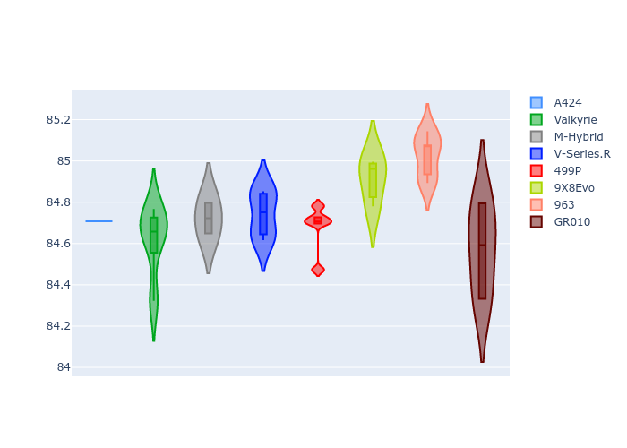
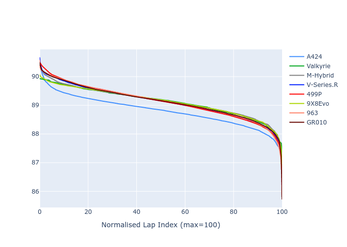

# Combined Plots

## Metadata

- BoP Accuracy: 95.37%
- Overall BoP Grade: A1
- Track: INTERLAGOS
- Threshhold: 210.0kph

## BoP Table
| Manufacturer   | Car        | Weight   | Power   | PINC   | E/Stint   | FDS    |
|:---------------|:-----------|:---------|:--------|:-------|:----------|:-------|
| Alpine         | A424       | 1067kg   | 520.0kw | -1.00% | 917MJ     | -      |
| Aston Martin   | Valkyrie   | 1040kg   | 506.0kw | +0.40% | 900MJ     | -      |
| BMW            | M-Hybrid   | 1061kg   | 512.0kw | +1.00% | 912MJ     | -      |
| Cadillac       | V-Series.R | 1054kg   | 510.0kw | +1.00% | 906MJ     | -      |
| Ferrari        | 499P       | 1083kg   | 508.0kw | -1.00% | 905MJ     | 190kph |
| Peugeot        | 9X8Evo     | 1066kg   | 510.0kw | -1.00% | 909MJ     | 190kph |
| Porsche        | 963        | 1067kg   | 516.0kw | -1.00% | 911MJ     | -      |
| Toyota         | GR010      | 1100kg   | 512.0kw | +1.00% | 917MJ     | 190kph |

## Performance Table
| Manufacturer   | Car        | RP      | QP      | Vavg      |   RDLC | BOP-Grade   | Match   |
|:---------------|:-----------|:--------|:--------|:----------|-------:|:------------|:--------|
| Alpine         | A424       | 1:26.09 | 1:22.97 | 278.84kph |   1.04 | ~A1         | 97.39%  |
| Aston Martin   | Valkyrie   | 1:28.01 | 1:24.16 | 278.78kph |   1.05 | +C1         | 79.00%  |
| BMW            | M-Hybrid   | 1:26.52 | 1:23.11 | 278.32kph |   1.04 | ~A1         | 99.49%  |
| Cadillac       | V-Series.R | 1:27.02 | 1:23.64 | 275.50kph |   1.04 | ~A1         | 99.66%  |
| Ferrari        | 499P       | 1:27.04 | 1:23.52 | 277.40kph |   1.04 | ~A1         | 99.98%  |
| Peugeot        | 9X8Evo     | 1:27.55 | 1:24.08 | 278.73kph |   1.04 | +A2         | 90.04%  |
| Porsche        | 963        | 1:26.56 | 1:23.20 | 277.23kph |   1.04 | ~A1         | 99.81%  |
| Toyota         | GR010      | 1:26.16 | 1:22.62 | 278.57kph |   1.04 | ~A1         | 97.58%  |

## Race Laptimes

## Quali Laptimes

## Topspeeds

## Laptimes Lineplot

