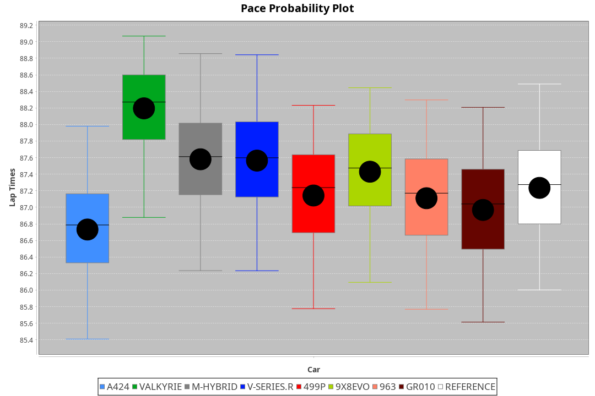
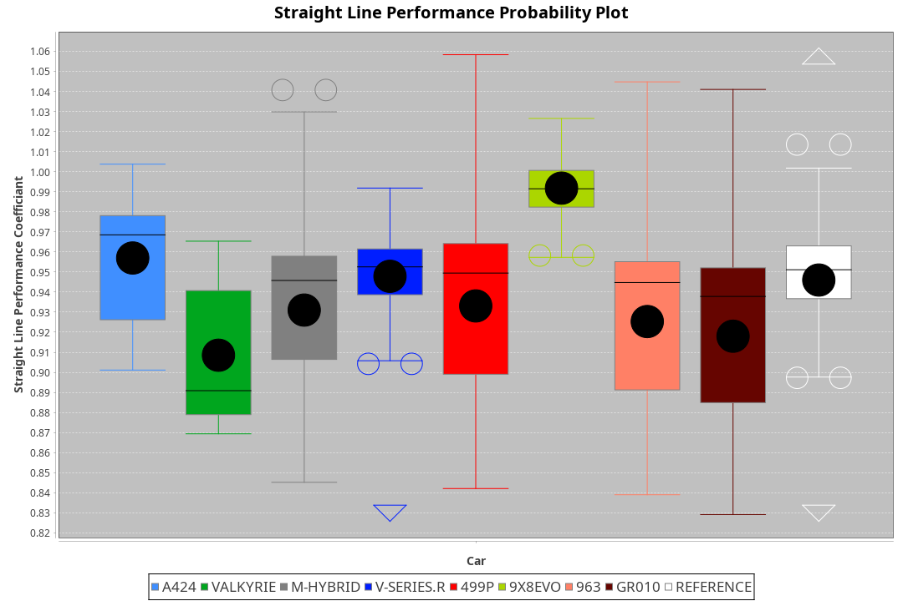
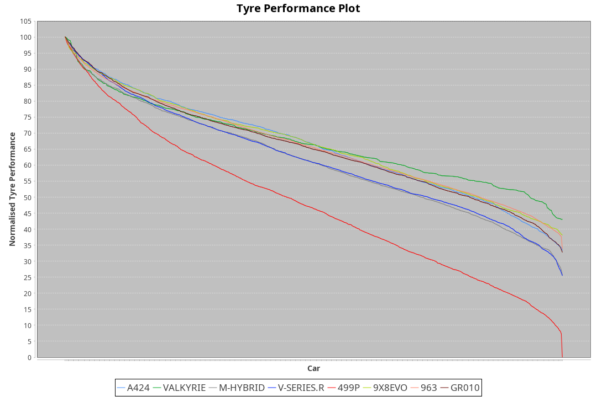

| Manufacturer | Car        | Weight | Power   | PINC    | E/Stint | FDS     |
|:-|:-|:-|:-|:-|:-|:-|
| Alpine       | A424       | 1053kg | 517.0kw |    -    | 915MJ   |    -    |
| Aston Martin | Valkyrie   | 1032kg | 520.0kw |    -    | 911MJ   |    -    |
| BMW          | M-Hybrid   | 1041kg | 512.0kw |    -    | 908MJ   |    -    |
| Cadillac     | V-Series.R | 1036kg | 507.0kw |    -    | 900MJ   |    -    |
| Ferrari      | 499P       | 1063kg | 505.0kw |    -    | 903MJ   | 190kph  |
| Peugeot      | 9X8Evo     | 1050kg | 507.0kw |    -    | 906MJ   | 190kph  |
| Porsche      | 963        | 1053kg | 513.0kw |    -    | 909MJ   |    -    |
| Toyota       | GR010      | 1080kg | 510.0kw |    -    | 911MJ   | 190kph  |

### BoP Accuracy: 82.15%; Overall BoP Grade: B2
| Manufacturer | Car        | Type  | RP      | QP      | Weight | Power¹  | Threshhold | PINC    | Power²   | E/Stint | AVG Vmax  | FDS     | RDLC | L/Stint | BOP-Grade | Model Accuracy | Model Points | Match% | SimDiff |
|:-|:-|:-|:-|:-|:-|:-|:-|:-|:-|:-|:-|:-|:-|:-|:-|:-|:-|:-|:-|
| Alpine       | A424       | LMDH  | 1:27.24 | 1:24.33 | 1053kg | 517.0kw | 210.0kph   |    -    | 517.00kw |  915MJ  | 283.54kph |    -    | 1.00 | 43      | -A2       | 99.49%         | 1360         | 91.45% | +0.08   |
| Aston Martin | Valkyrie   | LMHNH | 1:28.80 | 1:25.20 | 1032kg | 520.0kw | 210.0kph   |    -    | 520.00kw |  911MJ  | 277.04kph |    -    | 1.03 | 43      | +Ω1       | 100.00%        | 312          | 32.59% | #       |
| BMW          | M-Hybrid   | LMDH  | 1:27.23 | 1:23.58 | 1041kg | 512.0kw | 210.0kph   |    -    | 512.00kw |  908MJ  | 282.53kph |    -    | 1.01 | 43      | -A2       | 98.62%         | 2363         | 91.01% | +0.19   |
| Cadillac     | V-Series.R | LMDH  | 1:27.22 | 1:23.87 | 1036kg | 507.0kw | 210.0kph   |    -    | 507.00kw |  900MJ  | 277.78kph |    -    | 1.02 | 43      | -A2       | 98.50%         | 4201         | 90.72% | +0.50   |
| Ferrari      | 499P       | LMHHU | 1:27.24 | 1:23.76 | 1063kg | 505.0kw | 210.0kph   |    -    | 505.00kw |  903MJ  | 280.87kph | 190kph  | 1.02 | 43      | -B1       | 100.00%        | 4441         | 88.20% | +0.16   |
| Peugeot      | 9X8Evo     | LMHHU | 1:27.21 | 1:24.05 | 1050kg | 507.0kw | 210.0kph   |    -    | 507.00kw |  906MJ  | 282.20kph | 190kph  | 1.00 | 43      | +B2       | 100.00%        | 808          | 81.66% | +0.51   |
| Porsche      | 963        | LMDH  | 1:27.23 | 1:23.56 | 1053kg | 513.0kw | 210.0kph   |    -    | 513.00kw |  909MJ  | 280.55kph |    -    | 1.00 | 43      | -B1       | 99.87%         | 12613        | 89.28% | -0.22   |
| Toyota       | GR010      | LMHHU | 1:27.27 | 1:23.63 | 1080kg | 510.0kw | 210.0kph   |    -    | 510.00kw |  911MJ  | 277.94kph | 190kph  | 1.01 | 43      | -A2       | 99.73%         | 2956         | 92.27% | +0.16   |

## Power below Threshhold
| N/Nmax    | A424    | VALKYRIE | M-HYBRID | V-SERIES.R | 499P    | 9X8EVO  | 963     | GR010   |
|:-|:-|:-|:-|:-|:-|:-|:-|:-|
|  0.550    |  255    |  256     |  252     |  250       |  249    |  250    |  253    |  251    |
|  0.575    |  278    |  279     |  275     |  273       |  272    |  273    |  276    |  274    |
|  0.600    |  298    |  300     |  296     |  293       |  292    |  293    |  296    |  295    |
|  0.625    |  320    |  322     |  317     |  314       |  312    |  314    |  317    |  316    |
|  0.650    |  341    |  343     |  338     |  335       |  333    |  335    |  338    |  337    |
|  0.675    |  363    |  365     |  359     |  356       |  355    |  356    |  360    |  358    |
|  0.700    |  385    |  387     |  381     |  377       |  376    |  377    |  382    |  380    |
|  0.725    |  407    |  409     |  403     |  399       |  397    |  399    |  403    |  401    |
|  0.750    |  427    |  430     |  423     |  419       |  417    |  419    |  424    |  422    |
|  0.775    |  446    |  449     |  442     |  438       |  436    |  438    |  443    |  441    |
|  0.800    |  464    |  467     |  460     |  455       |  454    |  455    |  461    |  458    |
|  0.825    |  479    |  482     |  475     |  470       |  469    |  470    |  476    |  473    |
|  0.850    |  491    |  494     |  486     |  482       |  480    |  482    |  487    |  485    |
|  0.875    |  502    |  505     |  497     |  492       |  490    |  492    |  498    |  495    |
|  0.900    |  509    |  512     |  504     |  499       |  497    |  499    |  505    |  502    |
|  0.925    |  514    |  517     |  509     |  504       |  502    |  504    |  510    |  507    |
| **0.950** | **517** | **520**  | **512**  | **507**    | **505** | **507** | **513** | **510** |
|  0.975    |  515    |  518     |  510     |  505       |  503    |  505    |  511    |  508    |
|  1.000    |  511    |  514     |  506     |  502       |  500    |  502    |  507    |  505    |
|  1.025    |  441    |  444     |  437     |  433       |  431    |  433    |  438    |  436    |

## Power above Threshhold
| N/Nmax    | A424    | VALKYRIE | M-HYBRID | V-SERIES.R | 499P    | 9X8EVO  | 963     | GR010   |
|:-|:-|:-|:-|:-|:-|:-|:-|:-|
|  0.550    |  255    |  256     |  252     |  250       |  249    |  250    |  253    |  251    |
|  0.575    |  278    |  279     |  275     |  273       |  272    |  273    |  276    |  274    |
|  0.600    |  298    |  300     |  296     |  293       |  292    |  293    |  296    |  295    |
|  0.625    |  320    |  322     |  317     |  314       |  312    |  314    |  317    |  316    |
|  0.650    |  341    |  343     |  338     |  335       |  333    |  335    |  338    |  337    |
|  0.675    |  363    |  365     |  359     |  356       |  355    |  356    |  360    |  358    |
|  0.700    |  385    |  387     |  381     |  377       |  376    |  377    |  382    |  380    |
|  0.725    |  407    |  409     |  403     |  399       |  397    |  399    |  403    |  401    |
|  0.750    |  427    |  430     |  423     |  419       |  417    |  419    |  424    |  422    |
|  0.775    |  446    |  449     |  442     |  438       |  436    |  438    |  443    |  441    |
|  0.800    |  464    |  467     |  460     |  455       |  454    |  455    |  461    |  458    |
|  0.825    |  479    |  482     |  475     |  470       |  469    |  470    |  476    |  473    |
|  0.850    |  491    |  494     |  486     |  482       |  480    |  482    |  487    |  485    |
|  0.875    |  502    |  505     |  497     |  492       |  490    |  492    |  498    |  495    |
|  0.900    |  509    |  512     |  504     |  499       |  497    |  499    |  505    |  502    |
|  0.925    |  514    |  517     |  509     |  504       |  502    |  504    |  510    |  507    |
| **0.950** | **517** | **520**  | **512**  | **507**    | **505** | **507** | **513** | **510** |
|  0.975    |  515    |  518     |  510     |  505       |  503    |  505    |  511    |  508    |
|  1.000    |  511    |  514     |  506     |  502       |  500    |  502    |  507    |  505    |
|  1.025    |  441    |  444     |  437     |  433       |  431    |  433    |  438    |  436    |
