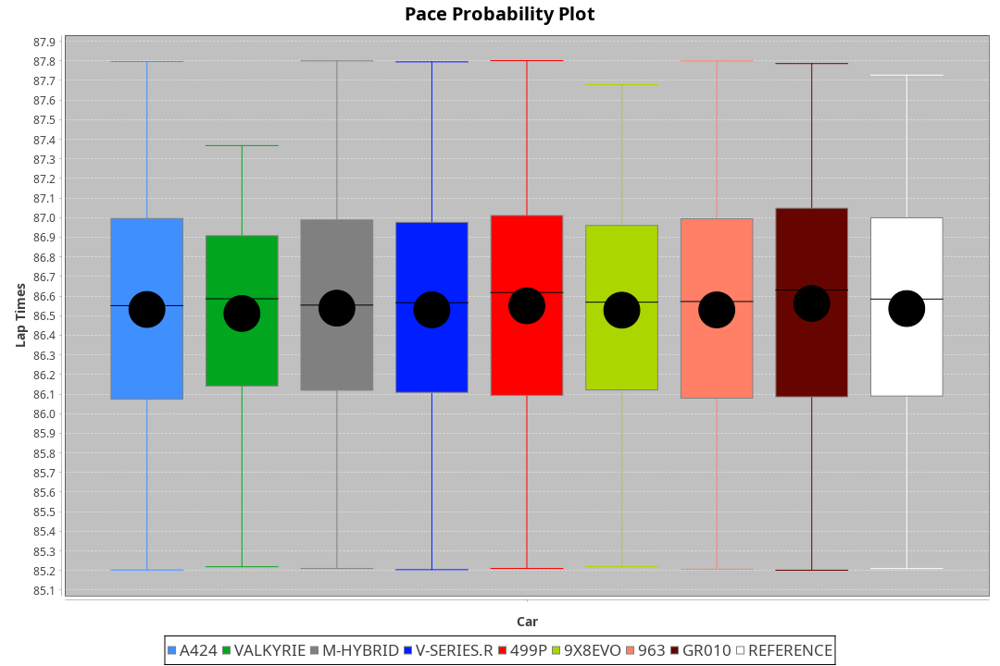
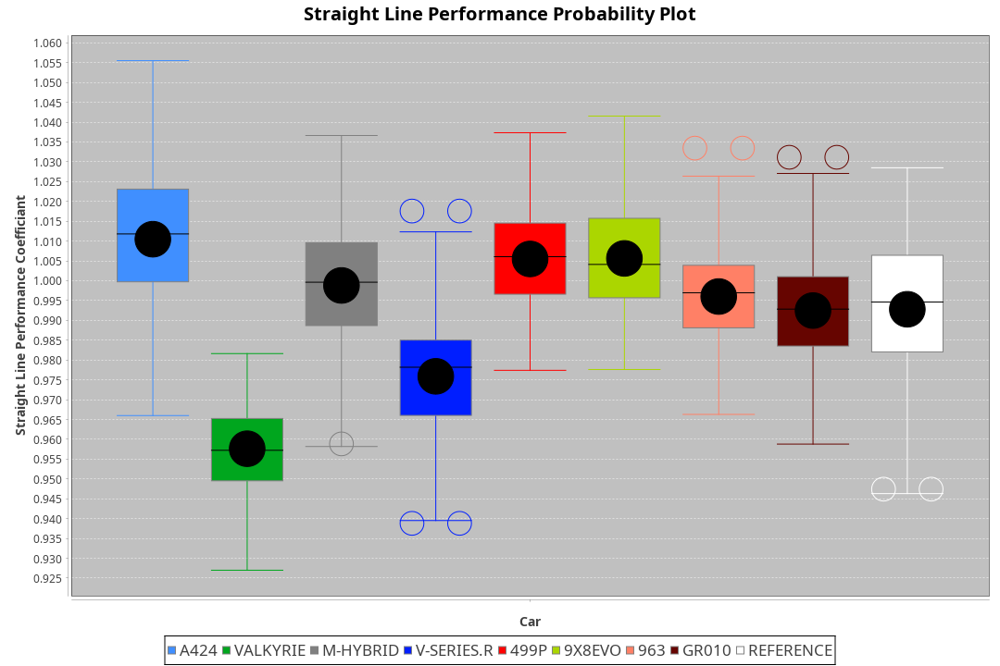
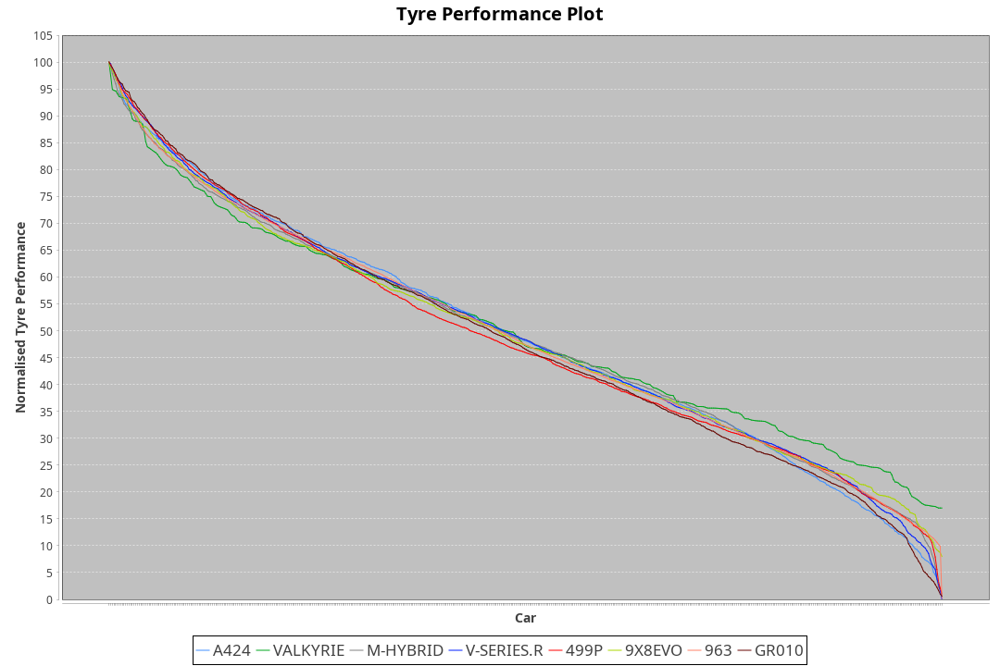

| Manufacturer | Car        | Weight | Power   | PINC    | E/Stint | FDS     |
|:-|:-|:-|:-|:-|:-|:-|
| Alpine       | A424       | 1042kg | 514.0kw |    -    | 911MJ   |    -    |
| Aston Martin | Valkyrie   | 1032kg | 520.0kw |    -    | 911MJ   |    -    |
| BMW          | M-Hybrid   | 1054kg | 519.0kw |    -    | 915MJ   |    -    |
| Cadillac     | V-Series.R | 1048kg | 517.0kw |    -    | 910MJ   |    -    |
| Ferrari      | 499P       | 1066kg | 508.0kw |    -    | 906MJ   | 190kph  |
| Peugeot      | 9X8Evo     | 1034kg | 510.0kw |    -    | 907MJ   | 190kph  |
| Porsche      | 963        | 1051kg | 516.0kw |    -    | 912MJ   |    -    |
| Toyota       | GR010      | 1065kg | 507.0kw |    -    | 907MJ   | 190kph  |

### BoP Accuracy: 95.03%; Overall BoP Grade: A1
| Manufacturer | Car        | Type  | RP      | QP      | Weight | Power¹  | Threshhold | PINC    | Power²   | E/Stint | AVG Vmax  | FDS     | RDLC | L/Stint | BOP-Grade | Model Accuracy | Model Points | Match%  | SimDiff |
|:-|:-|:-|:-|:-|:-|:-|:-|:-|:-|:-|:-|:-|:-|:-|:-|:-|:-|:-|:-|
| Alpine       | A424       | LMDH  | 1:26.70 | 1:23.21 | 1042kg | 514.0kw | 0.0kph     |    -    | 514.00kw |  911MJ  | 274.45kph |    -    | 1.02 | 43      | ~A1       | 99.58%         | 1429         | 98.59%  | +0.34   |
| Aston Martin | Valkyrie   | LMHNH | 1:26.70 | 1:23.14 | 1032kg | 520.0kw | 0.0kph     |    -    | 520.00kw |  911MJ  | 263.58kph |    -    | 1.06 | 43      | +C2       | 100.00%        | 247          | 72.68%  | #       |
| BMW          | M-Hybrid   | LMDH  | 1:26.70 | 1:23.11 | 1054kg | 519.0kw | 0.0kph     |    -    | 519.00kw |  915MJ  | 269.55kph |    -    | 1.02 | 43      | ~A1       | 99.97%         | 2912         | 100.00% | +0.20   |
| Cadillac     | V-Series.R | LMDH  | 1:26.69 | 1:23.24 | 1048kg | 517.0kw | 0.0kph     |    -    | 517.00kw |  910MJ  | 273.20kph |    -    | 1.02 | 43      | +A2       | 99.49%         | 5225         | 94.83%  | +0.28   |
| Ferrari      | 499P       | LMHHU | 1:26.70 | 1:22.99 | 1066kg | 508.0kw | 0.0kph     |    -    | 508.00kw |  906MJ  | 276.27kph | 190kph  | 1.03 | 43      | ~A1       | 100.00%        | 5378         | 99.05%  | +0.28   |
| Peugeot      | 9X8Evo     | LMHHU | 1:26.70 | 1:23.25 | 1034kg | 510.0kw | 0.0kph     |    -    | 510.00kw |  907MJ  | 280.80kph | 190kph  | 1.02 | 43      | ~A1       | 100.00%        | 1459         | 95.42%  | +0.37   |
| Porsche      | 963        | LMDH  | 1:26.70 | 1:23.03 | 1051kg | 516.0kw | 0.0kph     |    -    | 516.00kw |  912MJ  | 270.51kph |    -    | 1.02 | 43      | ~A1       | 99.92%         | 14207        | 100.00% | -0.20   |
| Toyota       | GR010      | LMHHU | 1:26.70 | 1:22.89 | 1065kg | 507.0kw | 0.0kph     |    -    | 507.00kw |  907MJ  | 274.70kph | 190kph  | 1.03 | 43      | ~A1       | 99.86%         | 4280         | 99.65%  | +0.27   |

## Power below Threshhold
| N/Nmax    | A424    | VALKYRIE | M-HYBRID | V-SERIES.R | 499P    | 9X8EVO  | 963     | GR010   |
|:-|:-|:-|:-|:-|:-|:-|:-|:-|
|  0.550    |  253    |  256     |  256     |  255       |  250    |  251    |  254    |  250    |
|  0.575    |  276    |  279     |  279     |  278       |  273    |  274    |  277    |  273    |
|  0.600    |  297    |  300     |  299     |  298       |  293    |  295    |  298    |  293    |
|  0.625    |  318    |  322     |  321     |  320       |  314    |  316    |  319    |  314    |
|  0.650    |  339    |  343     |  342     |  341       |  335    |  337    |  340    |  335    |
|  0.675    |  361    |  365     |  364     |  363       |  357    |  358    |  362    |  356    |
|  0.700    |  383    |  387     |  386     |  385       |  378    |  380    |  384    |  377    |
|  0.725    |  404    |  409     |  408     |  407       |  399    |  401    |  406    |  399    |
|  0.750    |  425    |  430     |  429     |  427       |  420    |  422    |  427    |  419    |
|  0.775    |  444    |  449     |  448     |  446       |  439    |  441    |  446    |  438    |
|  0.800    |  462    |  467     |  466     |  464       |  456    |  458    |  463    |  455    |
|  0.825    |  477    |  482     |  481     |  479       |  471    |  473    |  478    |  470    |
|  0.850    |  488    |  494     |  493     |  491       |  483    |  485    |  490    |  482    |
|  0.875    |  499    |  505     |  504     |  502       |  493    |  495    |  501    |  492    |
|  0.900    |  506    |  512     |  511     |  509       |  500    |  502    |  508    |  499    |
|  0.925    |  511    |  517     |  516     |  514       |  505    |  507    |  513    |  504    |
| **0.950** | **514** | **520**  | **519**  | **517**    | **508** | **510** | **516** | **507** |
|  0.975    |  512    |  518     |  517     |  515       |  506    |  508    |  514    |  505    |
|  1.000    |  508    |  514     |  513     |  511       |  503    |  505    |  510    |  502    |
|  1.025    |  439    |  444     |  443     |  441       |  434    |  436    |  441    |  433    |

## Power above Threshhold
| N/Nmax    | A424    | VALKYRIE | M-HYBRID | V-SERIES.R | 499P    | 9X8EVO  | 963     | GR010   |
|:-|:-|:-|:-|:-|:-|:-|:-|:-|
|  0.550    |  253    |  256     |  256     |  255       |  250    |  251    |  254    |  250    |
|  0.575    |  276    |  279     |  279     |  278       |  273    |  274    |  277    |  273    |
|  0.600    |  297    |  300     |  299     |  298       |  293    |  295    |  298    |  293    |
|  0.625    |  318    |  322     |  321     |  320       |  314    |  316    |  319    |  314    |
|  0.650    |  339    |  343     |  342     |  341       |  335    |  337    |  340    |  335    |
|  0.675    |  361    |  365     |  364     |  363       |  357    |  358    |  362    |  356    |
|  0.700    |  383    |  387     |  386     |  385       |  378    |  380    |  384    |  377    |
|  0.725    |  404    |  409     |  408     |  407       |  399    |  401    |  406    |  399    |
|  0.750    |  425    |  430     |  429     |  427       |  420    |  422    |  427    |  419    |
|  0.775    |  444    |  449     |  448     |  446       |  439    |  441    |  446    |  438    |
|  0.800    |  462    |  467     |  466     |  464       |  456    |  458    |  463    |  455    |
|  0.825    |  477    |  482     |  481     |  479       |  471    |  473    |  478    |  470    |
|  0.850    |  488    |  494     |  493     |  491       |  483    |  485    |  490    |  482    |
|  0.875    |  499    |  505     |  504     |  502       |  493    |  495    |  501    |  492    |
|  0.900    |  506    |  512     |  511     |  509       |  500    |  502    |  508    |  499    |
|  0.925    |  511    |  517     |  516     |  514       |  505    |  507    |  513    |  504    |
| **0.950** | **514** | **520**  | **519**  | **517**    | **508** | **510** | **516** | **507** |
|  0.975    |  512    |  518     |  517     |  515       |  506    |  508    |  514    |  505    |
|  1.000    |  508    |  514     |  513     |  511       |  503    |  505    |  510    |  502    |
|  1.025    |  439    |  444     |  443     |  441       |  434    |  436    |  441    |  433    |
