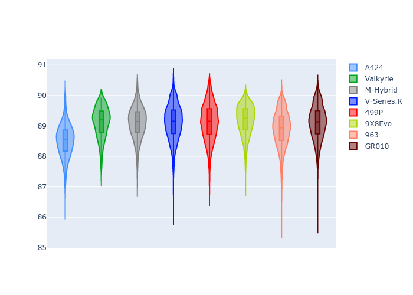
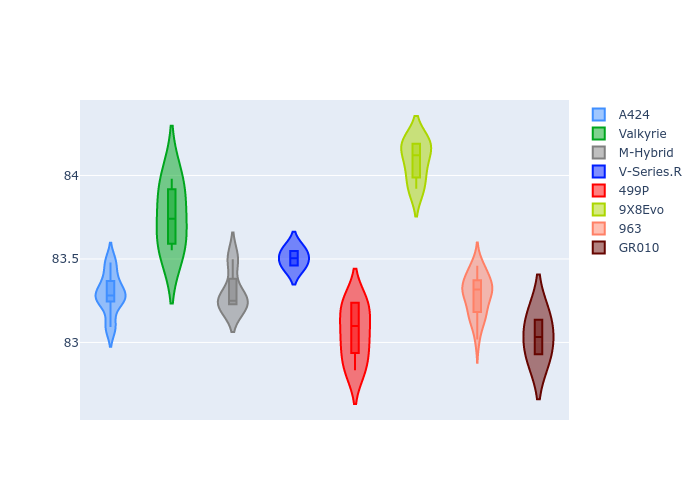
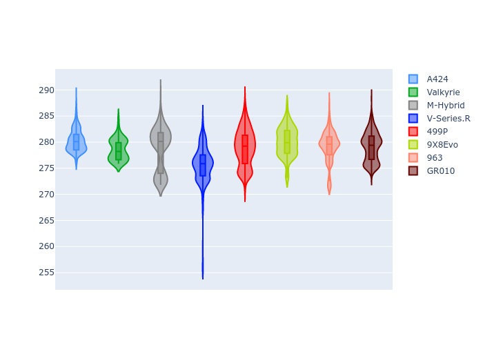
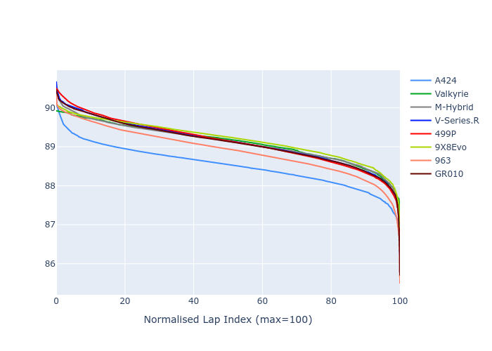

# Combined Plots

## Metadata

- BoP Accuracy: 99.21%
- Overall BoP Grade: A1
- Track: INTERLAGOS
- Threshhold: 250.0kph

## BoP Table
| Manufacturer   | Car        | Weight   | Power   | PINC   | E/Stint   | FDS    | RDP    | QDP    | TDP    |
|:---------------|:-----------|:---------|:--------|:-------|:----------|:-------|:-------|:-------|:-------|
| Alpine         | A424       | 1057kg   | 520.0kw | -0.10% | 918MJ     | -      | 52.35% | 61.85% | 27.84% |
| Aston Martin   | Valkyrie   | 1040kg   | 505.0kw | +0.40% | 900MJ     | -      | 53.59% | 53.33% | 21.51% |
| BMW            | M-Hybrid   | 1051kg   | 512.0kw | +0.10% | 909MJ     | -      | 53.26% | 57.23% | 34.54% |
| Cadillac       | V-Series.R | 1044kg   | 510.0kw | +0.10% | 904MJ     | -      | 47.80% | 56.73% | 19.63% |
| Ferrari        | 499P       | 1073kg   | 508.0kw | -0.10% | 906MJ     | 190kph | 53.02% | 42.32% | 9.88%  |
| Peugeot        | 9X8Evo     | 1059kg   | 510.0kw | -0.10% | 910MJ     | 190kph | 48.47% | 51.26% | 16.02% |
| Porsche        | 963        | 1057kg   | 516.0kw | -0.10% | 912MJ     | -      | 50.87% | 45.25% | 30.77% |
| Toyota         | GR010      | 1090kg   | 512.0kw | -0.10% | 913MJ     | 190kph | 52.43% | 57.12% | 12.82% |

## Performance Table
| Manufacturer   | Car        | RP      | QP      | Vavg      |   RDLC | BOP-Grade   | Match   |
|:---------------|:-----------|:--------|:--------|:----------|-------:|:------------|:--------|
| Alpine         | A424       | 1:26.55 | 1:23.29 | 280.27kph |   1.04 | ~A1         | 99.05%  |
| Aston Martin   | Valkyrie   | 1:27.58 | 1:23.75 | 278.60kph |   1.05 | ~A1         | 100.00% |
| BMW            | M-Hybrid   | 1:26.88 | 1:23.31 | 278.58kph |   1.04 | ~A1         | 100.00% |
| Cadillac       | V-Series.R | 1:27.07 | 1:23.50 | 275.59kph |   1.04 | ~A1         | 100.00% |
| Ferrari        | 499P       | 1:27.03 | 1:23.05 | 278.93kph |   1.05 | ~A1         | 99.81%  |
| Peugeot        | 9X8Evo     | 1:27.58 | 1:24.09 | 280.06kph |   1.04 | ~A1         | 95.27%  |
| Porsche        | 963        | 1:26.81 | 1:23.28 | 279.17kph |   1.04 | ~A1         | 99.78%  |
| Toyota         | GR010      | 1:27.11 | 1:23.03 | 279.08kph |   1.05 | ~A1         | 99.76%  |

## Race Laptimes

## Quali Laptimes

## Topspeeds

## Laptimes Lineplot

