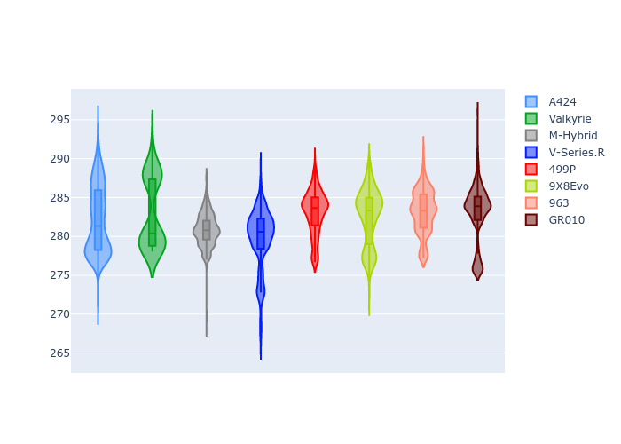

# Combined Plots

## Metadata

- BoP Accuracy: 94.36%
- Overall BoP Grade: A2
- Track: INTERLAGOS
- Threshhold: 210.0kph

## BoP Table
| Manufacturer   | Car        | Weight   | Power   | PINC   | E/Stint   | FDS    |
|:---------------|:-----------|:---------|:--------|:-------|:----------|:-------|
| Alpine         | A424       | 1057kg   | 520.0kw | -1.00% | 916MJ     | -      |
| Aston Martin   | Valkyrie   | 1040kg   | 505.0kw | +0.40% | 900MJ     | -      |
| BMW            | M-Hybrid   | 1051kg   | 512.0kw | +1.00% | 911MJ     | -      |
| Cadillac       | V-Series.R | 1044kg   | 510.0kw | +1.00% | 905MJ     | -      |
| Ferrari        | 499P       | 1073kg   | 508.0kw | -1.00% | 904MJ     | 190kph |
| Peugeot        | 9X8Evo     | 1056kg   | 510.0kw | -1.00% | 907MJ     | 190kph |
| Porsche        | 963        | 1057kg   | 516.0kw | -1.00% | 910MJ     | -      |
| Toyota         | GR010      | 1090kg   | 512.0kw | +1.00% | 916MJ     | 190kph |

## Performance Table
| Manufacturer   | Car        | RP      | QP      | Vavg      |   RDLC | BOP-Grade   | Match   |
|:---------------|:-----------|:--------|:--------|:----------|-------:|:------------|:--------|
| Alpine         | A424       | 1:26.07 | 1:22.95 | 279.80kph |   1.04 | ~A1         | 97.31%  |
| Aston Martin   | Valkyrie   | 1:28.12 | 1:24.27 | 278.58kph |   1.05 | +C2         | 70.85%  |
| BMW            | M-Hybrid   | 1:26.50 | 1:23.09 | 279.28kph |   1.04 | ~A1         | 99.49%  |
| Cadillac       | V-Series.R | 1:27.00 | 1:23.62 | 276.45kph |   1.04 | ~A1         | 99.75%  |
| Ferrari        | 499P       | 1:27.03 | 1:23.51 | 278.34kph |   1.04 | ~A1         | 99.98%  |
| Peugeot        | 9X8Evo     | 1:27.54 | 1:24.07 | 279.68kph |   1.04 | +A2         | 90.38%  |
| Porsche        | 963        | 1:26.54 | 1:23.18 | 278.18kph |   1.04 | ~A1         | 99.78%  |
| Toyota         | GR010      | 1:26.14 | 1:22.61 | 279.50kph |   1.04 | ~A1         | 97.36%  |

## Race Laptimes

## Quali Laptimes

## Topspeeds

## Laptimes Lineplot

