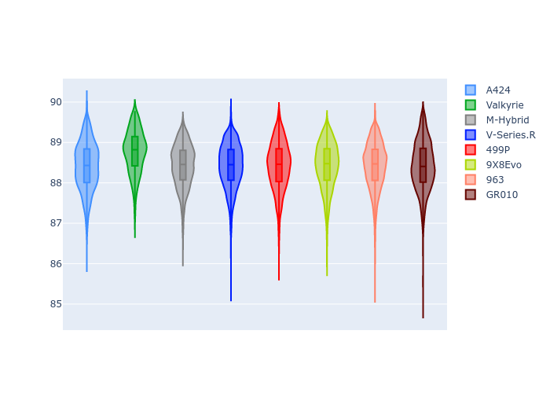
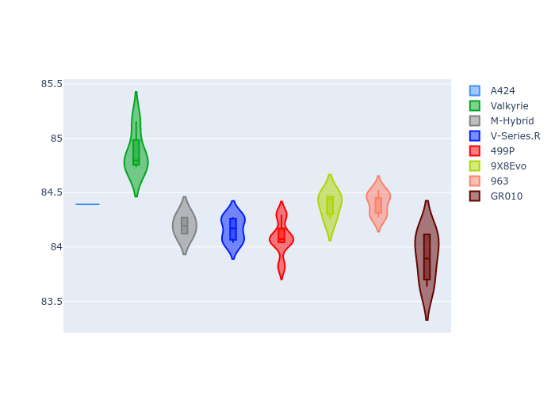
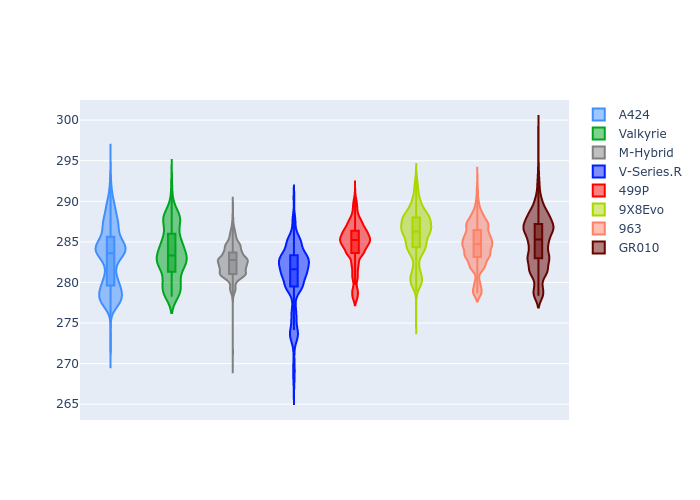
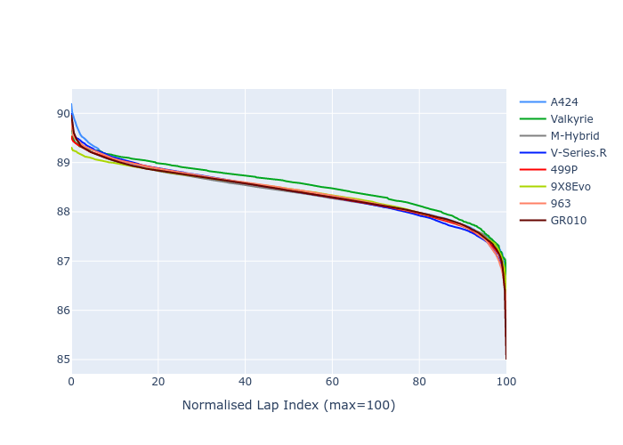

# Combined Plots

## Metadata

- BoP Accuracy: 99.89%
- Overall BoP Grade: A1
- Track: INTERLAGOS
- Threshhold: 250.0kph
- Average Laptime: 1:28.46
- Average Quali Laptime: 1:24.30
- Laptime Std Dev: 0.12 seconds
- Filtered Average Topspeed: 283.77kph

## BoP Table
| Manufacturer   | Car        | Weight   | Power   | PINC   | E/Stint   | FDS    | RDP    | QDP    | TDP    |
|:---------------|:-----------|:---------|:--------|:-------|:----------|:-------|:-------|:-------|:-------|
| Alpine         | A424       | 1044kg   | 513.0kw | +1.30% | 914MJ     | -      | 51.45% | 55.09% | 24.89% |
| Aston Martin   | Valkyrie   | 1030kg   | 520.0kw | -      | 911MJ     | -      | 53.07% | 48.70% | 24.00% |
| BMW            | M-Hybrid   | 1045kg   | 514.0kw | +1.10% | 913MJ     | -      | 52.63% | 52.34% | 34.06% |
| Cadillac       | V-Series.R | 1045kg   | 520.0kw | -      | 913MJ     | -      | 48.80% | 57.26% | 18.10% |
| Ferrari        | 499P       | 1060kg   | 520.0kw | -2.10% | 910MJ     | 190kph | 51.39% | 44.34% | 9.89%  |
| Peugeot        | 9X8Evo     | 1030kg   | 520.0kw | -0.90% | 913MJ     | 200kph | 49.16% | 50.25% | 18.00% |
| Porsche        | 963        | 1035kg   | 520.0kw | -1.90% | 908MJ     | -      | 50.61% | 41.90% | 27.68% |
| Toyota         | GR010      | 1059kg   | 520.0kw | -2.20% | 911MJ     | 200kph | 51.33% | 51.71% | 14.89% |

## Performance Table
| Manufacturer   | Car        | RP      | QP      | Vavg      |   RDLC | BOP-Grade   | Match   |
|:---------------|:-----------|:--------|:--------|:----------|-------:|:------------|:--------|
| Alpine         | A424       | 1:28.41 | 1:24.39 | 283.12kph |   1.05 | ~A1         | 99.88%  |
| Aston Martin   | Valkyrie   | 1:28.77 | 1:24.87 | 283.48kph |   1.05 | ~A1         | 99.91%  |
| BMW            | M-Hybrid   | 1:28.42 | 1:24.20 | 282.56kph |   1.05 | ~A1         | 100.00% |
| Cadillac       | V-Series.R | 1:28.41 | 1:24.16 | 280.88kph |   1.05 | ~A1         | 99.92%  |
| Ferrari        | 499P       | 1:28.42 | 1:24.09 | 284.75kph |   1.05 | ~A1         | 99.92%  |
| Peugeot        | 9X8Evo     | 1:28.41 | 1:24.39 | 285.80kph |   1.05 | ~A1         | 100.00% |
| Porsche        | 963        | 1:28.42 | 1:24.40 | 284.64kph |   1.05 | ~A1         | 99.93%  |
| Toyota         | GR010      | 1:28.42 | 1:23.91 | 284.95kph |   1.05 | ~A1         | 99.56%  |

## Race Laptimes

## Quali Laptimes

## Topspeeds

## Laptimes Lineplot

