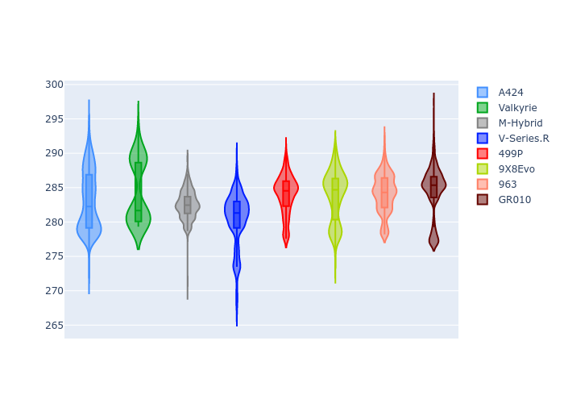
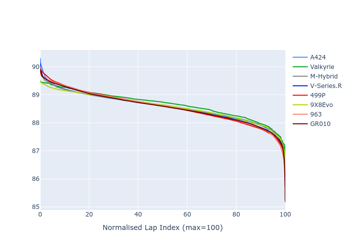

# Combined Plots

## Metadata

- BoP Accuracy: 99.79%
- Overall BoP Grade: A1
- Track: INTERLAGOS
- Threshhold: 210.0kph

## BoP Table
| Manufacturer   | Car        | Weight   | Power   | PINC   | E/Stint   | FDS    |
|:---------------|:-----------|:---------|:--------|:-------|:----------|:-------|
| Alpine         | A424       | 1046kg   | 508.0kw | +1.90% | 910MJ     | -      |
| Aston Martin   | Valkyrie   | 1030kg   | 520.0kw | -0.30% | 910MJ     | -      |
| BMW            | M-Hybrid   | 1100kg   | 510.0kw | +1.90% | 916MJ     | -      |
| Cadillac       | V-Series.R | 1099kg   | 515.0kw | +0.90% | 915MJ     | -      |
| Ferrari        | 499P       | 1100kg   | 502.0kw | +3.40% | 911MJ     | 190kph |
| Peugeot        | 9X8Evo     | 1031kg   | 520.0kw | -1.80% | 912MJ     | 190kph |
| Porsche        | 963        | 1100kg   | 509.0kw | +2.10% | 915MJ     | -      |
| Toyota         | GR010      | 1100kg   | 508.0kw | +1.10% | 913MJ     | 190kph |

## Performance Table
| Manufacturer   | Car        | RP      | QP      | Vavg      |   RDLC | BOP-Grade   | Match   |
|:---------------|:-----------|:--------|:--------|:----------|-------:|:------------|:--------|
| Alpine         | A424       | 1:26.60 | 1:23.45 | 280.63kph |   1.04 | ~A1         | 99.54%  |
| Aston Martin   | Valkyrie   | 1:26.60 | 1:22.87 | 282.02kph |   1.05 | ~A1         | 100.00% |
| BMW            | M-Hybrid   | 1:26.59 | 1:23.17 | 274.96kph |   1.04 | ~A1         | 99.96%  |
| Cadillac       | V-Series.R | 1:26.60 | 1:23.25 | 272.25kph |   1.04 | ~A1         | 99.96%  |
| Ferrari        | 499P       | 1:26.60 | 1:23.11 | 277.84kph |   1.04 | ~A1         | 99.98%  |
| Peugeot        | 9X8Evo     | 1:26.60 | 1:23.19 | 283.50kph |   1.04 | ~A1         | 99.00%  |
| Porsche        | 963        | 1:26.60 | 1:23.23 | 275.07kph |   1.04 | ~A1         | 99.89%  |
| Toyota         | GR010      | 1:26.56 | 1:23.00 | 277.85kph |   1.04 | ~A1         | 99.97%  |

## Race Laptimes

## Quali Laptimes

## Topspeeds

## Laptimes Lineplot

