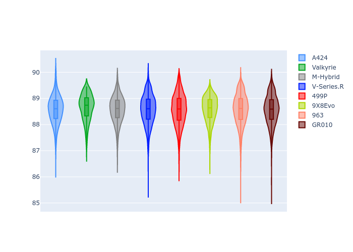
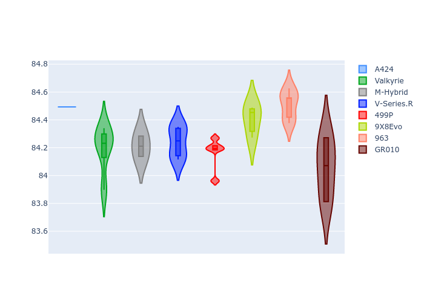

# Combined Plots

## Metadata

- BoP Accuracy: 99.73%
- Overall BoP Grade: A1
- Track: INTERLAGOS
- Threshhold: 250.0kph
- Average Laptime: 1:28.58
- Average Quali Laptime: 1:24.28
- Average Topspeed: 283.32kph

## BoP Table
| Manufacturer   | Car        | Weight   | Power   | PINC   | E/Stint   | FDS    | RDP    | QDP    | TDP    |
|:---------------|:-----------|:---------|:--------|:-------|:----------|:-------|:-------|:-------|:-------|
| Alpine         | A424       | 1042kg   | 508.0kw | +2.30% | 912MJ     | -      | 51.64% | 59.31% | 26.80% |
| Aston Martin   | Valkyrie   | 1030kg   | 520.0kw | -      | 911MJ     | -      | 53.50% | 53.33% | 21.51% |
| BMW            | M-Hybrid   | 1043kg   | 511.0kw | +1.70% | 911MJ     | -      | 52.89% | 56.22% | 33.41% |
| Cadillac       | V-Series.R | 1045kg   | 520.0kw | -      | 913MJ     | -      | 48.63% | 60.80% | 19.01% |
| Ferrari        | 499P       | 1059kg   | 520.0kw | -3.10% | 907MJ     | 190kph | 51.38% | 44.98% | 9.83%  |
| Peugeot        | 9X8Evo     | 1030kg   | 520.0kw | -3.10% | 907MJ     | 190kph | 48.87% | 52.78% | 15.41% |
| Porsche        | 963        | 1035kg   | 520.0kw | -2.50% | 907MJ     | -      | 50.70% | 44.30% | 29.51% |
| Toyota         | GR010      | 1058kg   | 520.0kw | -3.40% | 908MJ     | 190kph | 51.09% | 52.71% | 11.46% |

## Performance Table
| Manufacturer   | Car        | RP      | QP      | Vavg      |   RDLC | BOP-Grade   | Match   |
|:---------------|:-----------|:--------|:--------|:----------|-------:|:------------|:--------|
| Alpine         | A424       | 1:28.56 | 1:24.49 | 283.02kph |   1.05 | ~A1         | 98.99%  |
| Aston Martin   | Valkyrie   | 1:28.66 | 1:24.19 | 284.25kph |   1.05 | ~A1         | 100.00% |
| BMW            | M-Hybrid   | 1:28.58 | 1:24.21 | 282.50kph |   1.05 | ~A1         | 99.81%  |
| Cadillac       | V-Series.R | 1:28.57 | 1:24.24 | 280.40kph |   1.05 | ~A1         | 99.68%  |
| Ferrari        | 499P       | 1:28.56 | 1:24.16 | 283.97kph |   1.05 | ~A1         | 99.74%  |
| Peugeot        | 9X8Evo     | 1:28.57 | 1:24.40 | 283.81kph |   1.05 | ~A1         | 100.00% |
| Porsche        | 963        | 1:28.57 | 1:24.51 | 284.14kph |   1.05 | ~A1         | 99.85%  |
| Toyota         | GR010      | 1:28.56 | 1:24.05 | 284.51kph |   1.05 | ~A1         | 99.76%  |

## Race Laptimes

## Quali Laptimes

## Topspeeds

## Laptimes Lineplot

