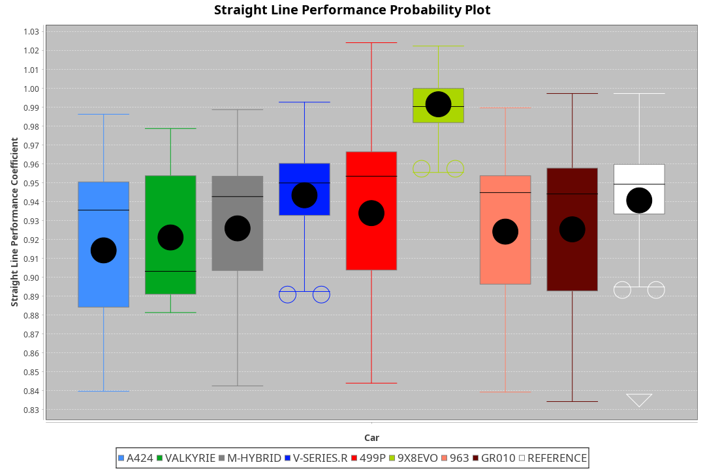
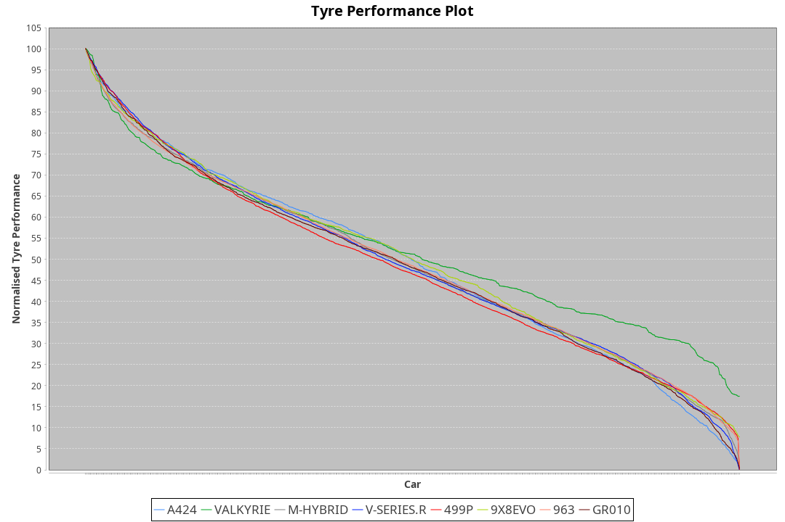

| Manufacturer | Car        | Weight | Power   | PINC    | E/Stint | FDS     |
|:-|:-|:-|:-|:-|:-|:-|
| Alpine       | A424       | 1061kg | 517.0kw | 0.50%   | 917MJ   |    -    |
| Aston Martin | Valkyrie   | 1030kg | 520.0kw |    -    | 911MJ   |    -    |
| BMW          | M-Hybrid   | 1057kg | 519.0kw | 0.10%   | 916MJ   |    -    |
| Cadillac     | V-Series.R | 1056kg | 517.0kw | 0.50%   | 912MJ   |    -    |
| Ferrari      | 499P       | 1082kg | 499.0kw | 4.20%   | 909MJ   | 190kph  |
| Peugeot      | 9X8Evo     | 1032kg | 512.0kw |    -    | 909MJ   | 190kph  |
| Porsche      | 963        | 1060kg | 513.0kw | 1.30%   | 913MJ   |    -    |
| Toyota       | GR010      | 1086kg | 498.0kw | 4.40%   | 911MJ   | 190kph  |

### BoP Accuracy: 94.83%; Overall BoP Grade: A2
| Manufacturer | Car        | Type  | RP      | QP      | Weight | Power¹  | Threshhold | PINC    | Power²   | E/Stint | AVG Vmax  | FDS     | RDLC | L/Stint | BOP-Grade | Model Accuracy | Model Points | Match%  | SimDiff |
|:-|:-|:-|:-|:-|:-|:-|:-|:-|:-|:-|:-|:-|:-|:-|:-|:-|:-|:-|:-|
| Alpine       | A424       | LMDH  | 1:26.50 | 1:23.19 | 1061kg | 517.0kw | 250.0kph   | 0.50%   | 519.60kw |  917MJ  | 269.42kph |    -    | 1.01 | 43      | ~A1       | 98.94%         | 2047         | 97.43%  | +0.26   |
| Aston Martin | Valkyrie   | LMHNH | 1:26.50 | 1:22.95 | 1030kg | 520.0kw | 250.0kph   |    -    | 520.00kw |  911MJ  | 263.77kph |    -    | 1.06 | 43      | +C2       | 100.00%        | 247          | 71.01%  | #       |
| BMW          | M-Hybrid   | LMDH  | 1:26.49 | 1:22.85 | 1057kg | 519.0kw | 250.0kph   | 0.10%   | 519.50kw |  916MJ  | 272.21kph |    -    | 1.01 | 43      | ~A1       | 98.84%         | 3070         | 100.00% | +0.26   |
| Cadillac     | V-Series.R | LMDH  | 1:26.50 | 1:22.88 | 1056kg | 517.0kw | 250.0kph   | 0.50%   | 519.60kw |  912MJ  | 273.74kph |    -    | 1.01 | 43      | +A2       | 98.94%         | 5427         | 94.86%  | +0.26   |
| Ferrari      | 499P       | LMHHU | 1:26.50 | 1:22.98 | 1082kg | 499.0kw | 250.0kph   | 4.20%   | 520.00kw |  909MJ  | 271.09kph | 190kph  | 1.02 | 43      | ~A1       | 100.00%        | 6554         | 100.00% | +0.26   |
| Peugeot      | 9X8Evo     | LMHHU | 1:26.50 | 1:23.20 | 1032kg | 512.0kw | 250.0kph   |    -    | 512.00kw |  909MJ  | 284.18kph | 190kph  | 1.02 | 43      | ~A1       | 100.00%        | 1457         | 96.38%  | +0.39   |
| Porsche      | 963        | LMDH  | 1:26.50 | 1:22.88 | 1060kg | 513.0kw | 250.0kph   | 1.30%   | 519.70kw |  913MJ  | 271.20kph |    -    | 1.01 | 43      | ~A1       | 99.91%         | 14205        | 100.00% | -0.05   |
| Toyota       | GR010      | LMHHU | 1:26.50 | 1:22.86 | 1086kg | 498.0kw | 250.0kph   | 4.40%   | 519.90kw |  911MJ  | 268.72kph | 190kph  | 1.02 | 43      | ~A1       | 99.73%         | 4795         | 98.93%  | +0.26   |

## Power below Threshhold
| N/Nmax    | A424    | VALKYRIE | M-HYBRID | V-SERIES.R | 499P    | 9X8EVO  | 963     | GR010   |
|:-|:-|:-|:-|:-|:-|:-|:-|:-|
|  0.550    |  255    |  256     |  256     |  255       |  246    |  252    |  253    |  245    |
|  0.575    |  278    |  279     |  279     |  278       |  268    |  275    |  276    |  268    |
|  0.600    |  298    |  300     |  299     |  298       |  288    |  296    |  296    |  288    |
|  0.625    |  320    |  322     |  321     |  320       |  308    |  317    |  317    |  308    |
|  0.650    |  341    |  343     |  342     |  341       |  329    |  338    |  338    |  329    |
|  0.675    |  363    |  365     |  364     |  363       |  350    |  359    |  360    |  350    |
|  0.700    |  385    |  387     |  386     |  385       |  371    |  381    |  382    |  371    |
|  0.725    |  407    |  409     |  408     |  407       |  392    |  403    |  403    |  392    |
|  0.750    |  427    |  430     |  429     |  427       |  412    |  423    |  424    |  411    |
|  0.775    |  446    |  449     |  448     |  446       |  431    |  442    |  443    |  430    |
|  0.800    |  464    |  467     |  466     |  464       |  448    |  460    |  461    |  447    |
|  0.825    |  479    |  482     |  481     |  479       |  463    |  475    |  476    |  462    |
|  0.850    |  491    |  494     |  493     |  491       |  474    |  486    |  487    |  473    |
|  0.875    |  502    |  505     |  504     |  502       |  484    |  497    |  498    |  483    |
|  0.900    |  509    |  512     |  511     |  509       |  491    |  504    |  505    |  490    |
|  0.925    |  514    |  517     |  516     |  514       |  496    |  509    |  510    |  495    |
| **0.950** | **517** | **520**  | **519**  | **517**    | **499** | **512** | **513** | **498** |
|  0.975    |  515    |  518     |  517     |  515       |  497    |  510    |  511    |  496    |
|  1.000    |  511    |  514     |  513     |  511       |  494    |  506    |  507    |  493    |
|  1.025    |  441    |  444     |  443     |  441       |  426    |  437    |  438    |  425    |

## Power above Threshhold
| N/Nmax    | A424       | VALKYRIE | M-HYBRID   | V-SERIES.R | 499P       | 9X8EVO  | 963        | GR010      |
|:-|:-|:-|:-|:-|:-|:-|:-|:-|
|  0.550    |  256.29    |  256     |  256.26    |  256.29    |  256.47    |  252    |  256.33    |  256.45    |
|  0.575    |  279.31    |  279     |  279.28    |  279.31    |  279.51    |  275    |  279.36    |  279.49    |
|  0.600    |  299.34    |  300     |  299.30    |  299.34    |  299.55    |  296    |  299.39    |  299.53    |
|  0.625    |  321.36    |  322     |  321.32    |  321.36    |  321.59    |  317    |  321.41    |  321.56    |
|  0.650    |  342.39    |  343     |  342.34    |  342.39    |  342.63    |  338    |  342.44    |  342.60    |
|  0.675    |  364.41    |  365     |  364.36    |  364.41    |  364.67    |  359    |  364.47    |  364.64    |
|  0.700    |  386.44    |  387     |  386.39    |  386.44    |  386.71    |  381    |  386.50    |  386.68    |
|  0.725    |  408.46    |  409     |  408.41    |  408.46    |  408.75    |  403    |  408.53    |  408.72    |
|  0.750    |  429.48    |  430     |  429.43    |  429.48    |  429.79    |  423    |  429.55    |  429.75    |
|  0.775    |  448.50    |  449     |  448.45    |  448.50    |  448.83    |  442    |  448.58    |  448.79    |
|  0.800    |  466.53    |  467     |  466.47    |  466.53    |  466.86    |  460    |  466.60    |  466.82    |
|  0.825    |  481.54    |  482     |  481.48    |  481.54    |  481.89    |  475    |  481.62    |  481.85    |
|  0.850    |  493.56    |  494     |  493.49    |  493.56    |  493.91    |  486    |  493.64    |  493.87    |
|  0.875    |  504.57    |  505     |  504.50    |  504.57    |  504.93    |  497    |  504.65    |  504.89    |
|  0.900    |  511.58    |  512     |  511.51    |  511.58    |  511.94    |  504    |  511.66    |  511.90    |
|  0.925    |  516.58    |  517     |  516.52    |  516.58    |  516.95    |  509    |  516.67    |  516.91    |
| **0.950** | **519.58** | **520**  | **519.52** | **519.58** | **519.96** | **512** | **519.67** | **519.91** |
|  0.975    |  517.58    |  518     |  517.52    |  517.58    |  517.95    |  510    |  517.67    |  517.91    |
|  1.000    |  513.58    |  514     |  513.51    |  513.58    |  513.95    |  506    |  513.66    |  513.90    |
|  1.025    |  443.50    |  444     |  443.44    |  443.50    |  443.82    |  437    |  443.57    |  443.78    |
