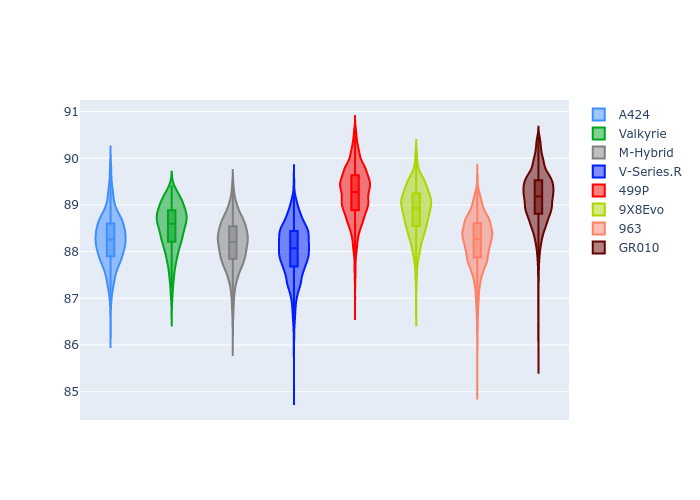
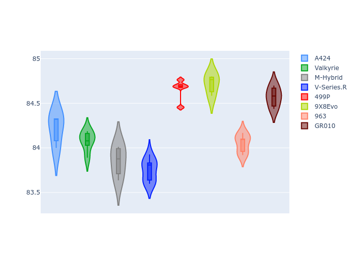
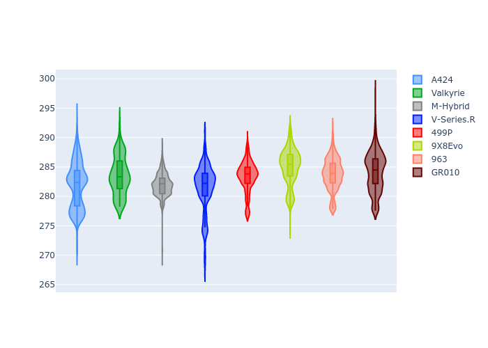
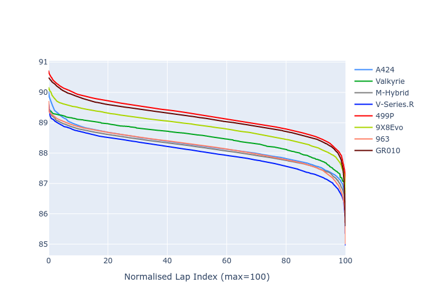

# Combined Plots

## Metadata

- BoP Accuracy: 97.84%
- Overall BoP Grade: A1
- Track: INTERLAGOS
- Threshhold: 250.0kph
- Average Laptime: 1:28.56
- Average Quali Laptime: 1:24.24
- Average Topspeed: 283.05kph

## BoP Table
| Manufacturer   | Car        | Weight   | Power   | PINC   | E/Stint   | FDS    | RDP    | QDP    | TDP    |
|:---------------|:-----------|:---------|:--------|:-------|:----------|:-------|:-------|:-------|:-------|
| Alpine         | A424       | 1048kg   | 515.0kw | +0.70% | 915MJ     | -      | 51.64% | 59.31% | 26.80% |
| Aston Martin   | Valkyrie   | 1030kg   | 520.0kw | -      | 911MJ     | -      | 53.50% | 53.33% | 21.51% |
| BMW            | M-Hybrid   | 1040kg   | 517.0kw | -      | 912MJ     | -      | 52.89% | 56.22% | 33.41% |
| Cadillac       | V-Series.R | 1030kg   | 520.0kw | -      | 911MJ     | -      | 48.63% | 60.80% | 19.01% |
| Ferrari        | 499P       | 1065kg   | 503.0kw | -0.60% | 899MJ     | 190kph | 51.38% | 44.98% | 9.83%  |
| Peugeot        | 9X8Evo     | 1045kg   | 516.0kw | -1.00% | 911MJ     | 190kph | 48.87% | 52.78% | 15.41% |
| Porsche        | 963        | 1043kg   | 514.0kw | +0.40% | 910MJ     | -      | 50.70% | 44.30% | 29.51% |
| Toyota         | GR010      | 1069kg   | 501.0kw | +1.10% | 904MJ     | 190kph | 51.09% | 52.71% | 11.46% |

## Performance Table
| Manufacturer   | Car        | RP      | QP      | Vavg      |   RDLC | BOP-Grade   | Match   |
|:---------------|:-----------|:--------|:--------|:----------|-------:|:------------|:--------|
| Alpine         | A424       | 1:28.24 | 1:24.22 | 282.55kph |   1.05 | ~A1         | 99.94%  |
| Aston Martin   | Valkyrie   | 1:28.52 | 1:24.08 | 284.25kph |   1.05 | ~A1         | 100.00% |
| BMW            | M-Hybrid   | 1:28.18 | 1:23.85 | 282.62kph |   1.05 | ~A1         | 100.00% |
| Cadillac       | V-Series.R | 1:28.03 | 1:23.74 | 281.87kph |   1.05 | ~A1         | 99.84%  |
| Ferrari        | 499P       | 1:29.25 | 1:24.66 | 282.04kph |   1.05 | +A2         | 90.89%  |
| Peugeot        | 9X8Evo     | 1:28.88 | 1:24.72 | 283.27kph |   1.05 | ~A1         | 99.12%  |
| Porsche        | 963        | 1:28.22 | 1:24.05 | 284.53kph |   1.05 | ~A1         | 99.88%  |
| Toyota         | GR010      | 1:29.16 | 1:24.57 | 283.30kph |   1.05 | -A2         | 93.06%  |

## Race Laptimes

## Quali Laptimes

## Topspeeds

## Laptimes Lineplot

