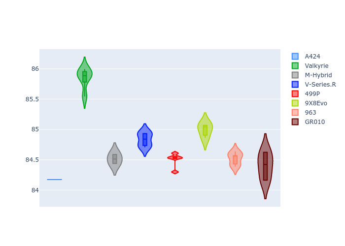

# Combined Plots

## Metadata

- BoP Accuracy: 98.90%
- Overall BoP Grade: A1
- Track: INTERLAGOS
- Threshhold: 210.0kph

## BoP Table
| Manufacturer   | Car        | Weight   | Power   | PINC   | E/Stint   | FDS    | RDP    | QDP    | TDP    |
|:---------------|:-----------|:---------|:--------|:-------|:----------|:-------|:-------|:-------|:-------|
| Alpine         | A424       | 1047kg   | 520.0kw | -      | 917MJ     | -      | 52.35% | 61.85% | 27.84% |
| Aston Martin   | Valkyrie   | 1042kg   | 504.0kw | +0.40% | 899MJ     | -      | 53.59% | 53.33% | 21.51% |
| BMW            | M-Hybrid   | 1041kg   | 512.0kw | -      | 908MJ     | -      | 53.26% | 57.23% | 34.54% |
| Cadillac       | V-Series.R | 1034kg   | 510.0kw | -      | 902MJ     | -      | 47.80% | 56.73% | 19.63% |
| Ferrari        | 499P       | 1063kg   | 508.0kw | -      | 905MJ     | 190kph | 53.02% | 42.32% | 9.88%  |
| Peugeot        | 9X8Evo     | 1050kg   | 510.0kw | -      | 909MJ     | 190kph | 48.47% | 51.26% | 16.02% |
| Porsche        | 963        | 1047kg   | 516.0kw | -      | 911MJ     | -      | 50.87% | 45.25% | 30.77% |
| Toyota         | GR010      | 1080kg   | 512.0kw | -      | 913MJ     | 190kph | 52.43% | 57.12% | 12.82% |

## Performance Table
| Manufacturer   | Car        | RP      | QP      | Vavg      |   RDLC | BOP-Grade   | Match   |
|:---------------|:-----------|:--------|:--------|:----------|-------:|:------------|:--------|
| Alpine         | A424       | 1:26.28 | 1:23.04 | 281.32kph |   1.04 | ~A1         | 98.73%  |
| Aston Martin   | Valkyrie   | 1:27.68 | 1:23.85 | 278.20kph |   1.05 | ~A1         | 97.34%  |
| BMW            | M-Hybrid   | 1:26.64 | 1:23.08 | 279.47kph |   1.04 | ~A1         | 99.82%  |
| Cadillac       | V-Series.R | 1:26.83 | 1:23.28 | 276.47kph |   1.04 | ~A1         | 100.00% |
| Ferrari        | 499P       | 1:26.77 | 1:22.81 | 279.95kph |   1.05 | ~A1         | 99.81%  |
| Peugeot        | 9X8Evo     | 1:27.33 | 1:23.86 | 281.00kph |   1.04 | ~A1         | 95.98%  |
| Porsche        | 963        | 1:26.53 | 1:23.03 | 280.22kph |   1.04 | ~A1         | 99.73%  |
| Toyota         | GR010      | 1:26.85 | 1:22.79 | 280.09kph |   1.05 | ~A1         | 99.78%  |

## Race Laptimes

## Quali Laptimes

## Topspeeds

## Laptimes Lineplot

