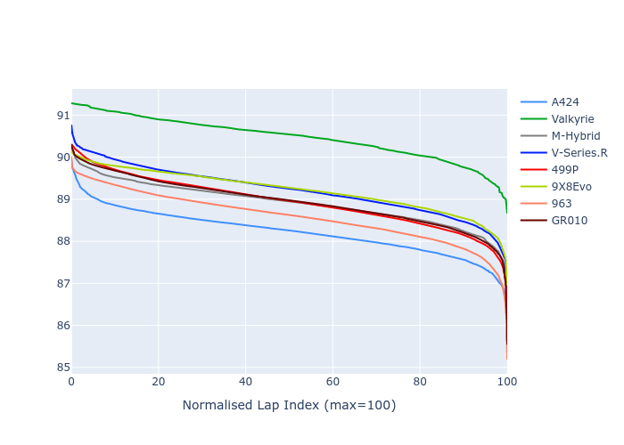

# Combined Plots

## Metadata

- BoP Accuracy: 93.15%
- Overall BoP Grade: A2
- Track: INTERLAGOS
- Threshhold: 210.0kph

## BoP Table
| Manufacturer   | Car        | Weight   | Power   | PINC   | E/Stint   | FDS    |
|:---------------|:-----------|:---------|:--------|:-------|:----------|:-------|
| Alpine         | A424       | 1047kg   | 520.0kw | -      | 917MJ     | -      |
| Aston Martin   | Valkyrie   | 1042kg   | 504.0kw | +0.40% | 899MJ     | -      |
| BMW            | M-Hybrid   | 1041kg   | 512.0kw | -      | 908MJ     | -      |
| Cadillac       | V-Series.R | 1034kg   | 510.0kw | -      | 902MJ     | -      |
| Ferrari        | 499P       | 1063kg   | 508.0kw | -      | 905MJ     | 190kph |
| Peugeot        | 9X8Evo     | 1050kg   | 510.0kw | -      | 909MJ     | 190kph |
| Porsche        | 963        | 1047kg   | 516.0kw | -      | 911MJ     | -      |
| Toyota         | GR010      | 1080kg   | 512.0kw | -      | 913MJ     | 190kph |

## Performance Table
| Manufacturer   | Car        | RP      | QP      | Vavg      |   RDLC | BOP-Grade   | Match   |
|:---------------|:-----------|:--------|:--------|:----------|-------:|:------------|:--------|
| Alpine         | A424       | 1:25.79 | 1:22.69 | 281.51kph |   1.04 | -A2         | 93.21%  |
| Aston Martin   | Valkyrie   | 1:28.21 | 1:24.35 | 278.20kph |   1.05 | +D2         | 60.03%  |
| BMW            | M-Hybrid   | 1:26.74 | 1:23.31 | 279.51kph |   1.04 | ~A1         | 99.96%  |
| Cadillac       | V-Series.R | 1:27.25 | 1:23.85 | 276.69kph |   1.04 | ~A1         | 98.63%  |
| Ferrari        | 499P       | 1:26.75 | 1:23.26 | 280.02kph |   1.04 | ~A1         | 99.86%  |
| Peugeot        | 9X8Evo     | 1:27.26 | 1:23.81 | 281.00kph |   1.04 | ~A1         | 95.15%  |
| Porsche        | 963        | 1:26.27 | 1:22.93 | 279.88kph |   1.04 | ~A1         | 99.20%  |
| Toyota         | GR010      | 1:26.38 | 1:22.83 | 279.69kph |   1.04 | ~A1         | 99.13%  |

## Race Laptimes

## Quali Laptimes

## Topspeeds

## Laptimes Lineplot

