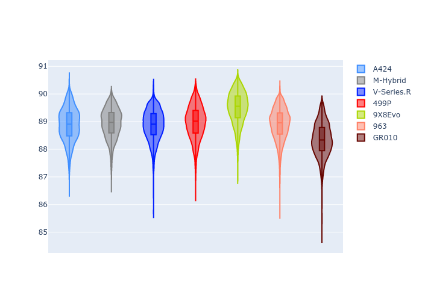
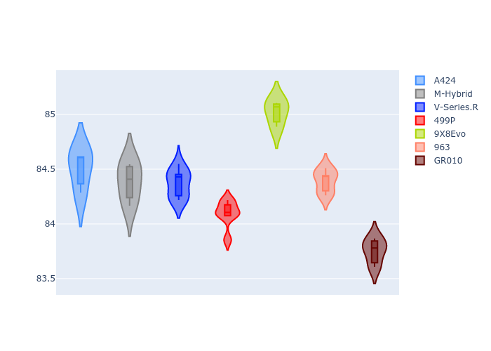
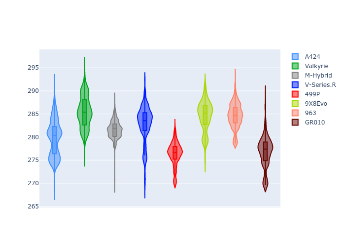
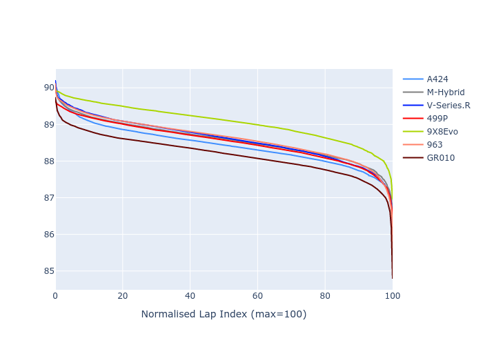

# Combined Plots

## Metadata

- BoP Accuracy: 99.60%
- Overall BoP Grade: A1
- Track: INTERLAGOS
- Threshhold: 250.0kph
- Average Laptime: 1:28.64
- Average Quali Laptime: 1:24.32
- Average Topspeed: 282.67kph

## BoP Table
| Manufacturer   | Car        | Weight   | Power   | PINC   | E/Stint   | FDS    | RDP    | QDP    | TDP    |
|:---------------|:-----------|:---------|:--------|:-------|:----------|:-------|:-------|:-------|:-------|
| Alpine         | A424       | 1044kg   | 516.0kw | -1.30% | 910MJ     | -      | 51.64% | 59.31% | 26.80% |
| BMW            | M-Hybrid   | 1044kg   | 512.0kw | -      | 908MJ     | -      | 52.89% | 56.22% | 33.41% |
| Cadillac       | V-Series.R | 1039kg   | 519.0kw | -1.50% | 907MJ     | -      | 48.63% | 60.80% | 19.01% |
| Ferrari        | 499P       | 1060kg   | 503.0kw | +1.80% | 905MJ     | 190kph | 51.38% | 44.98% | 9.83%  |
| Peugeot        | 9X8Evo     | 1051kg   | 510.0kw | -      | 909MJ     | 190kph | 48.87% | 52.78% | 15.41% |
| Porsche        | 963        | 1051kg   | 512.0kw | -      | 908MJ     | -      | 50.70% | 44.30% | 29.51% |
| Toyota         | GR010      | 1060kg   | 506.0kw | +2.80% | 912MJ     | 190kph | 51.09% | 52.71% | 11.46% |

## Performance Table
| Manufacturer   | Car        | RP      | QP      | Vavg      |   RDLC | BOP-Grade   | Match   |
|:---------------|:-----------|:--------|:--------|:----------|-------:|:------------|:--------|
| Alpine         | A424       | 1:28.41 | 1:24.37 | 281.52kph |   1.05 | ~A1         | 99.94%  |
| BMW            | M-Hybrid   | 1:28.57 | 1:24.21 | 281.24kph |   1.05 | ~A1         | 100.00% |
| Cadillac       | V-Series.R | 1:28.59 | 1:24.26 | 279.58kph |   1.05 | ~A1         | 99.93%  |
| Ferrari        | 499P       | 1:28.70 | 1:24.16 | 284.45kph |   1.05 | ~A1         | 99.98%  |
| Peugeot        | 9X8Evo     | 1:29.22 | 1:25.03 | 282.29kph |   1.05 | ~A1         | 97.75%  |
| Porsche        | 963        | 1:28.62 | 1:24.42 | 283.02kph |   1.05 | ~A1         | 99.94%  |
| Toyota         | GR010      | 1:28.34 | 1:23.82 | 286.57kph |   1.05 | ~A1         | 99.66%  |

## Race Laptimes

## Quali Laptimes

## Topspeeds

## Laptimes Lineplot

