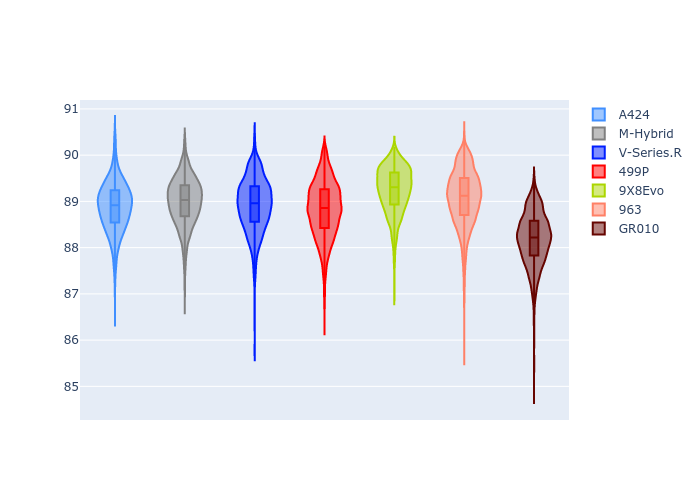
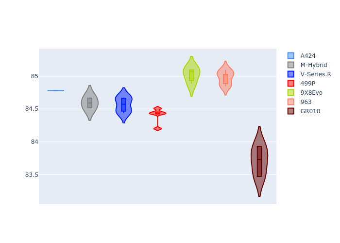
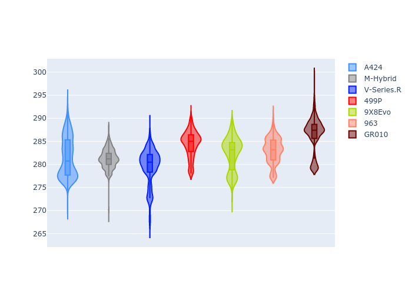
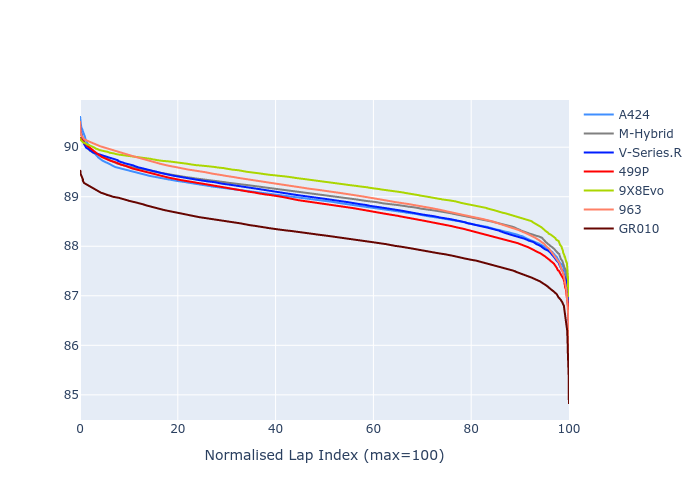

# Combined Plots

## Metadata

- BoP Accuracy: 98.96%
- Overall BoP Grade: A1
- Track: INTERLAGOS
- Threshhold: 250.0kph

## BoP Table
| Manufacturer   | Car        | Weight   | Power   | PINC   | E/Stint   | FDS    |
|:---------------|:-----------|:---------|:--------|:-------|:----------|:-------|
| Alpine         | A424       | 1044kg   | 516.0kw | -1.30% | 910MJ     | -      |
| BMW            | M-Hybrid   | 1044kg   | 512.0kw | -      | 908MJ     | -      |
| Cadillac       | V-Series.R | 1039kg   | 519.0kw | -1.50% | 907MJ     | -      |
| Ferrari        | 499P       | 1060kg   | 503.0kw | +1.80% | 905MJ     | 190kph |
| Peugeot        | 9X8Evo     | 1051kg   | 510.0kw | -      | 909MJ     | 190kph |
| Porsche        | 963        | 1051kg   | 512.0kw | -      | 908MJ     | -      |
| Toyota         | GR010      | 1060kg   | 506.0kw | +2.80% | 912MJ     | 190kph |

## Performance Table
| Manufacturer   | Car        | RP      | QP      | Vavg      |   RDLC | BOP-Grade   | Match   |
|:---------------|:-----------|:--------|:--------|:----------|-------:|:------------|:--------|
| Alpine         | A424       | 1:26.60 | 1:23.45 | 279.99kph |   1.04 | ~A1         | 99.96%  |
| BMW            | M-Hybrid   | 1:26.74 | 1:23.31 | 279.22kph |   1.04 | ~A1         | 100.00% |
| Cadillac       | V-Series.R | 1:26.72 | 1:23.36 | 276.79kph |   1.04 | ~A1         | 99.96%  |
| Ferrari        | 499P       | 1:26.75 | 1:23.26 | 280.71kph |   1.04 | ~A1         | 99.98%  |
| Peugeot        | 9X8Evo     | 1:27.27 | 1:23.81 | 280.91kph |   1.04 | +A2         | 94.10%  |
| Porsche        | 963        | 1:26.71 | 1:23.34 | 278.71kph |   1.04 | ~A1         | 99.90%  |
| Toyota         | GR010      | 1:26.15 | 1:22.62 | 282.58kph |   1.04 | ~A1         | 98.86%  |

## Race Laptimes

## Quali Laptimes

## Topspeeds

## Laptimes Lineplot

