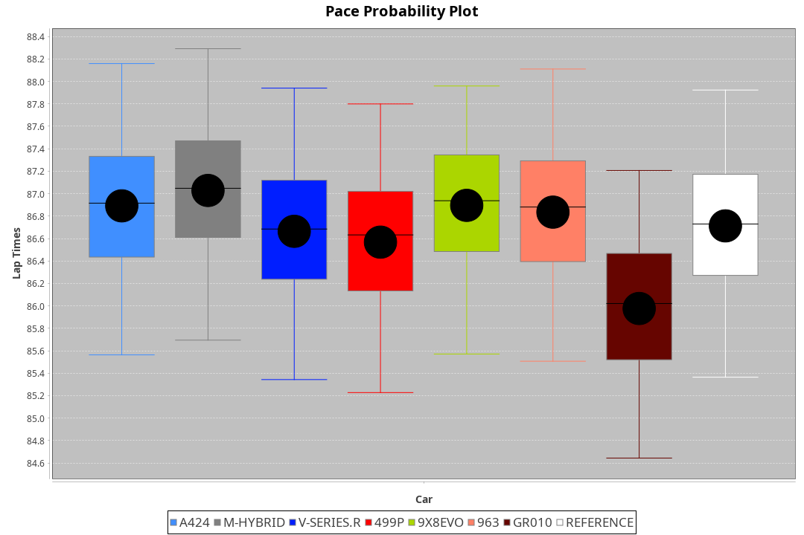
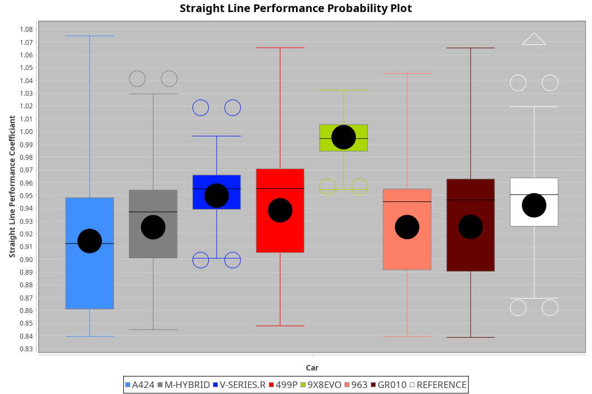
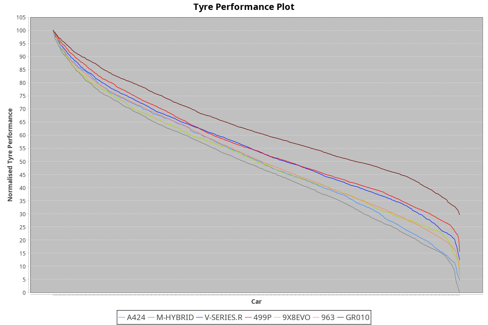

| Manufacturer | Car        | Weight | Power   | PINC    | E/Stint | FDS     |
|:-|:-|:-|:-|:-|:-|:-|
| Alpine       | A424       | 1044kg | 516.0kw | -1.30%  | 910MJ   |    -    |
| BMW          | M-Hybrid   | 1044kg | 512.0kw |    -    | 908MJ   |    -    |
| Cadillac     | V-Series.R | 1039kg | 519.0kw | -1.50%  | 907MJ   |    -    |
| Ferrari      | 499P       | 1060kg | 503.0kw | 1.80%   | 905MJ   | 190kph  |
| Peugeot      | 9X8Evo     | 1051kg | 510.0kw |    -    | 909MJ   | 190kph  |
| Porsche      | 963        | 1051kg | 512.0kw |    -    | 908MJ   |    -    |
| Toyota       | GR010      | 1060kg | 506.0kw | 2.80%   | 912MJ   | 190kph  |

### BoP Accuracy: 86.10%; Overall BoP Grade: B1
| Manufacturer | Car        | Type  | RP      | QP      | Weight | Power¹  | Threshhold | PINC    | Power²   | E/Stint | AVG Vmax  | FDS     | RDLC | L/Stint | BOP-Grade | Model Accuracy | Model Points | Match% | SimDiff |
|:-|:-|:-|:-|:-|:-|:-|:-|:-|:-|:-|:-|:-|:-|:-|:-|:-|:-|:-|:-|
| Alpine       | A424       | LMDH  | 1:26.35 | 1:22.98 | 1044kg | 516.0kw | 250.0kph   | -1.30%  | 509.30kw |  910MJ  | 276.90kph |    -    | 1.02 | 43      | -A2       | 97.47%         | 1810         | 94.06% | +0.36   |
| BMW          | M-Hybrid   | LMDH  | 1:26.79 | 1:23.18 | 1044kg | 512.0kw | 250.0kph   |    -    | 512.00kw |  908MJ  | 273.25kph |    -    | 1.02 | 43      | +B1       | 100.00%        | 3339         | 85.23% | +0.06   |
| Cadillac     | V-Series.R | LMDH  | 1:26.62 | 1:22.94 | 1039kg | 519.0kw | 250.0kph   | -1.50%  | 511.20kw |  907MJ  | 274.48kph |    -    | 1.03 | 43      | +B1       | 99.00%         | 6039         | 86.92% | -0.12   |
| Ferrari      | 499P       | LMHHU | 1:26.40 | 1:22.80 | 1060kg | 503.0kw | 250.0kph   | 1.80%   | 512.10kw |  905MJ  | 272.56kph | 190kph  | 1.04 | 43      | ~A1       | 99.56%         | 7418         | 96.09% | -0.02   |
| Peugeot      | 9X8Evo     | LMHHU | 1:26.77 | 1:23.30 | 1051kg | 510.0kw | 250.0kph   |    -    | 510.00kw |  909MJ  | 281.65kph | 190kph  | 1.00 | 43      | +B2       | 100.00%        | 1889         | 84.69% | +0.07   |
| Porsche      | 963        | LMDH  | 1:26.70 | 1:22.96 | 1051kg | 512.0kw | 250.0kph   |    -    | 512.00kw |  908MJ  | 271.02kph |    -    | 1.02 | 43      | ~A1       | 100.00%        | 14574        | 96.55% | -0.35   |
| Toyota       | GR010      | LMHHU | 1:25.79 | 1:22.20 | 1060kg | 506.0kw | 250.0kph   | 2.80%   | 520.20kw |  912MJ  | 271.97kph | 190kph  | 1.05 | 43      | -E1       | 97.78%         | 5323         | 59.16% | +0.00   |

## Power below Threshhold
| N/Nmax    | A424    | M-HYBRID | V-SERIES.R | 499P    | 9X8EVO  | 963     | GR010   |
|:-|:-|:-|:-|:-|:-|:-|:-|
|  0.550    |  254    |  252     |  256       |  248    |  251    |  252    |  249    |
|  0.575    |  277    |  275     |  279       |  271    |  274    |  275    |  272    |
|  0.600    |  298    |  296     |  299       |  291    |  295    |  296    |  292    |
|  0.625    |  319    |  317     |  321       |  311    |  316    |  317    |  313    |
|  0.650    |  340    |  338     |  342       |  332    |  337    |  338    |  334    |
|  0.675    |  362    |  359     |  364       |  353    |  358    |  359    |  355    |
|  0.700    |  384    |  381     |  386       |  374    |  380    |  381    |  377    |
|  0.725    |  406    |  403     |  408       |  395    |  401    |  403    |  398    |
|  0.750    |  427    |  423     |  429       |  416    |  422    |  423    |  418    |
|  0.775    |  446    |  442     |  448       |  435    |  441    |  442    |  437    |
|  0.800    |  463    |  460     |  466       |  452    |  458    |  460    |  454    |
|  0.825    |  478    |  475     |  481       |  467    |  473    |  475    |  469    |
|  0.850    |  490    |  486     |  493       |  478    |  485    |  486    |  481    |
|  0.875    |  501    |  497     |  504       |  488    |  495    |  497    |  491    |
|  0.900    |  508    |  504     |  511       |  495    |  502    |  504    |  498    |
|  0.925    |  513    |  509     |  516       |  500    |  507    |  509    |  503    |
| **0.950** | **516** | **512**  | **519**    | **503** | **510** | **512** | **506** |
|  0.975    |  514    |  510     |  517       |  501    |  508    |  510    |  504    |
|  1.000    |  510    |  506     |  513       |  498    |  505    |  506    |  501    |
|  1.025    |  441    |  437     |  443       |  430    |  436    |  437    |  432    |

## Power above Threshhold
| N/Nmax    | A424       | M-HYBRID | V-SERIES.R | 499P       | 9X8EVO  | 963     | GR010      |
|:-|:-|:-|:-|:-|:-|:-|:-|
|  0.550    |  251.14    |  252     |  252.11    |  252.03    |  251    |  252    |  256.08    |
|  0.575    |  274.16    |  275     |  275.12    |  275.03    |  274    |  275    |  279.09    |
|  0.600    |  294.17    |  296     |  295.12    |  296.03    |  295    |  296    |  300.10    |
|  0.625    |  315.18    |  317     |  316.13    |  317.03    |  316    |  317    |  322.10    |
|  0.650    |  336.19    |  338     |  337.14    |  338.04    |  337    |  338    |  343.11    |
|  0.675    |  357.20    |  359     |  359.15    |  359.04    |  358    |  359    |  365.12    |
|  0.700    |  379.22    |  381     |  380.16    |  381.04    |  380    |  381    |  387.13    |
|  0.725    |  400.23    |  403     |  402.17    |  403.04    |  401    |  403    |  409.13    |
|  0.750    |  421.24    |  423     |  422.18    |  423.04    |  422    |  423    |  430.14    |
|  0.775    |  440.25    |  442     |  441.19    |  442.05    |  441    |  442    |  449.15    |
|  0.800    |  457.26    |  460     |  459.19    |  460.05    |  458    |  460    |  467.15    |
|  0.825    |  472.27    |  475     |  474.20    |  475.05    |  473    |  475    |  482.16    |
|  0.850    |  484.28    |  486     |  485.20    |  486.05    |  485    |  486    |  494.16    |
|  0.875    |  494.28    |  497     |  496.21    |  497.05    |  495    |  497    |  505.16    |
|  0.900    |  501.29    |  504     |  503.21    |  504.05    |  502    |  504    |  512.17    |
|  0.925    |  506.29    |  509     |  508.21    |  509.05    |  507    |  509    |  517.17    |
| **0.950** | **509.29** | **512**  | **511.22** | **512.05** | **510** | **512** | **520.17** |
|  0.975    |  507.29    |  510     |  509.21    |  510.05    |  508    |  510    |  518.17    |
|  1.000    |  504.29    |  506     |  505.21    |  506.05    |  505    |  506    |  514.17    |
|  1.025    |  435.25    |  437     |  436.18    |  437.05    |  436    |  437    |  444.14    |
