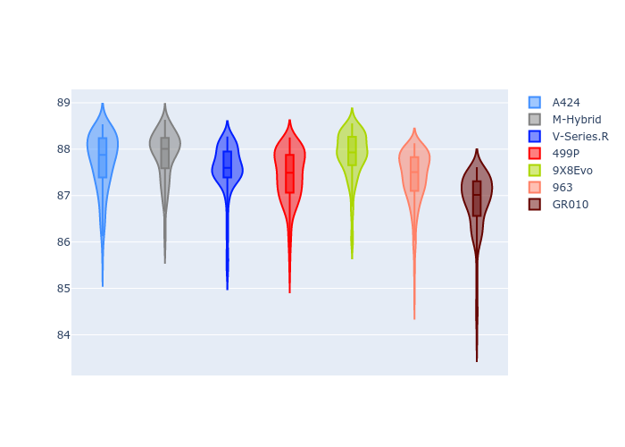
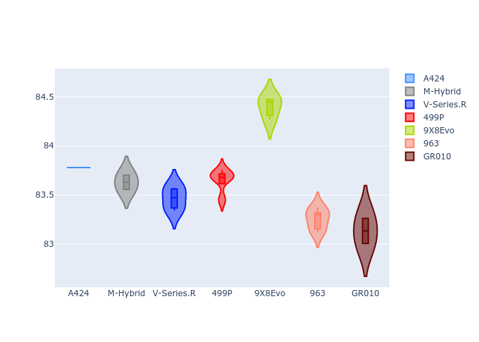
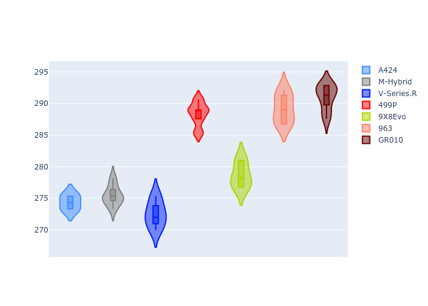
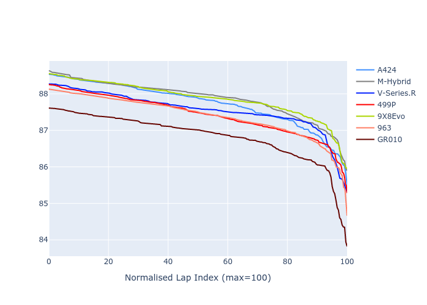

# Combined Plots

## Metadata

- BoP Accuracy: 90.22%
- Overall BoP Grade: A2
- Track: INTERLAGOS
- Threshhold: 250.0kph
- Average Laptime: 1:27.53
- Average Quali Laptime: 1:23.25
- Laptime Std Dev: 0.34 seconds
- Filtered Average Topspeed: 281.34kph

## BoP Table
| Manufacturer   | Car        | Weight   | Power   | PINC   | E/Stint   | FDS    | RDP    | QDP    | TDP   |
|:---------------|:-----------|:---------|:--------|:-------|:----------|:-------|:-------|:-------|:------|
| Alpine         | A424       | 1044kg   | 516.0kw | -1.30% | 910MJ     | -      | 47.65% | 25.00% | 0.83% |
| BMW            | M-Hybrid   | 1044kg   | 512.0kw | -      | 908MJ     | -      | 52.03% | 40.00% | 1.43% |
| Cadillac       | V-Series.R | 1039kg   | 519.0kw | -1.50% | 907MJ     | -      | 52.99% | 80.00% | 3.59% |
| Ferrari        | 499P       | 1060kg   | 503.0kw | +1.80% | 905MJ     | 190kph | 52.91% | 62.50% | 1.33% |
| Peugeot        | 9X8Evo     | 1051kg   | 510.0kw | -      | 909MJ     | 190kph | 49.25% | 75.00% | 1.24% |
| Porsche        | 963        | 1051kg   | 512.0kw | -      | 908MJ     | -      | 51.62% | 41.67% | 0.96% |
| Toyota         | GR010      | 1060kg   | 506.0kw | +2.80% | 912MJ     | 190kph | 51.27% | 25.00% | 3.54% |

## Performance Table
| Manufacturer   | Car        | RP      | QP      | Vavg      |   RDLC | BOP-Grade   | Match   |
|:---------------|:-----------|:--------|:--------|:----------|-------:|:------------|:--------|
| Alpine         | A424       | 1:27.74 | 1:23.43 | 274.32kph |   1.05 | +C1         | 78.92%  |
| BMW            | M-Hybrid   | 1:27.87 | 1:23.28 | 275.45kph |   1.06 | +C1         | 79.92%  |
| Cadillac       | V-Series.R | 1:27.55 | 1:23.11 | 272.50kph |   1.05 | ~A1         | 100.00% |
| Ferrari        | 499P       | 1:27.43 | 1:23.26 | 288.31kph |   1.05 | ~A1         | 100.00% |
| Peugeot        | 9X8Evo     | 1:27.87 | 1:24.07 | 278.64kph |   1.05 | +C1         | 77.49%  |
| Porsche        | 963        | 1:27.39 | 1:22.89 | 289.19kph |   1.05 | ~A1         | 99.34%  |
| Toyota         | GR010      | 1:26.83 | 1:22.73 | 291.00kph |   1.05 | ~A1         | 95.87%  |

## Race Laptimes

## Quali Laptimes

## Topspeeds

## Laptimes Lineplot

