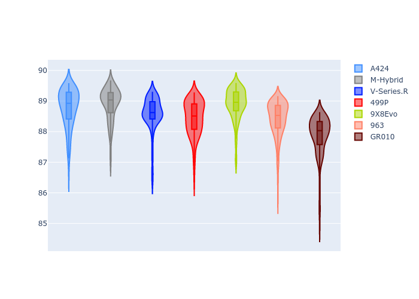
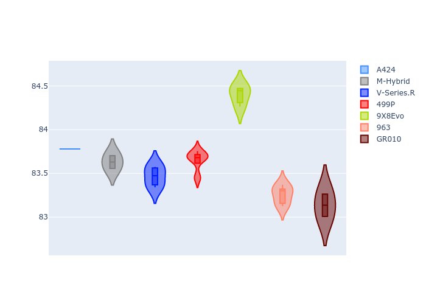
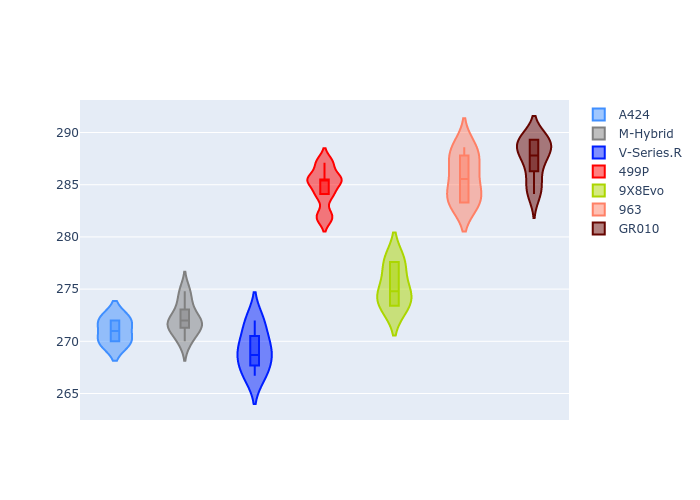
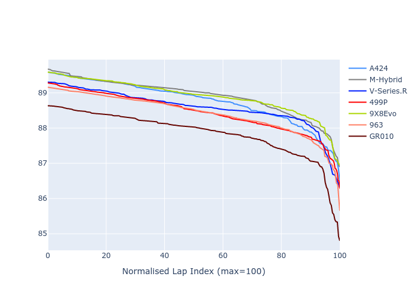

# Combined Plots

## Metadata

- BoP Accuracy: 90.07%
- Overall BoP Grade: A2
- Track: INTERLAGOS
- Threshhold: 250.0kph
- Average Laptime: 1:28.55
- Average Quali Laptime: 1:23.61
- Average Topspeed: 277.94kph

## BoP Table
| Manufacturer   | Car        | Weight   | Power   | PINC   | E/Stint   | FDS    | RDP    | QDP    | TDP   |
|:---------------|:-----------|:---------|:--------|:-------|:----------|:-------|:-------|:-------|:------|
| Alpine         | A424       | 1044kg   | 516.0kw | -1.30% | 910MJ     | -      | 48.08% | 25.00% | 0.83% |
| BMW            | M-Hybrid   | 1044kg   | 512.0kw | -      | 908MJ     | -      | 52.24% | 40.00% | 1.43% |
| Cadillac       | V-Series.R | 1039kg   | 519.0kw | -1.50% | 907MJ     | -      | 52.99% | 80.00% | 3.59% |
| Ferrari        | 499P       | 1060kg   | 503.0kw | +1.80% | 905MJ     | 190kph | 52.77% | 62.50% | 1.33% |
| Peugeot        | 9X8Evo     | 1051kg   | 510.0kw | -      | 909MJ     | 190kph | 49.25% | 75.00% | 1.24% |
| Porsche        | 963        | 1051kg   | 512.0kw | -      | 908MJ     | -      | 51.62% | 41.67% | 0.96% |
| Toyota         | GR010      | 1060kg   | 506.0kw | +2.80% | 912MJ     | 190kph | 51.27% | 25.00% | 3.54% |

## Performance Table
| Manufacturer   | Car        | RP      | QP      | Vavg      |   RDLC | BOP-Grade   | Match   |
|:---------------|:-----------|:--------|:--------|:----------|-------:|:------------|:--------|
| Alpine         | A424       | 1:28.77 | 1:23.79 | 271.00kph |   1.06 | +C1         | 78.22%  |
| BMW            | M-Hybrid   | 1:28.90 | 1:23.64 | 272.11kph |   1.06 | +C1         | 79.59%  |
| Cadillac       | V-Series.R | 1:28.58 | 1:23.47 | 269.20kph |   1.06 | ~A1         | 100.00% |
| Ferrari        | 499P       | 1:28.45 | 1:23.61 | 284.82kph |   1.06 | ~A1         | 100.00% |
| Peugeot        | 9X8Evo     | 1:28.90 | 1:24.43 | 275.27kph |   1.05 | +C1         | 77.49%  |
| Porsche        | 963        | 1:28.41 | 1:23.25 | 285.68kph |   1.06 | ~A1         | 99.34%  |
| Toyota         | GR010      | 1:27.85 | 1:23.09 | 287.48kph |   1.06 | ~A1         | 95.87%  |

## Race Laptimes

## Quali Laptimes

## Topspeeds

## Laptimes Lineplot

