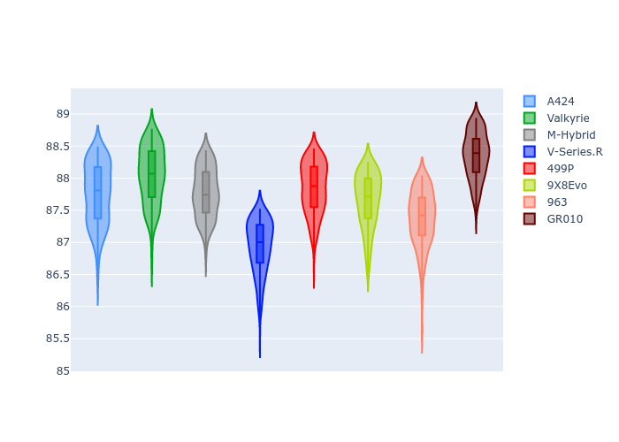
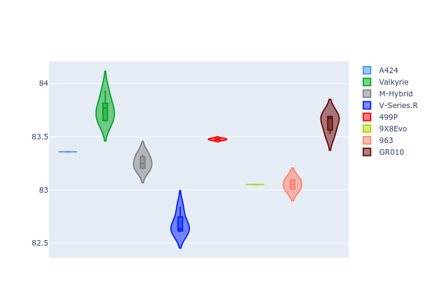
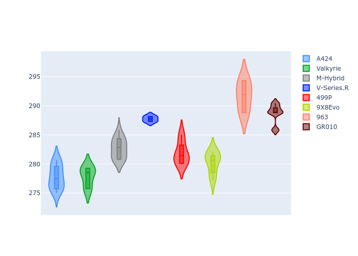
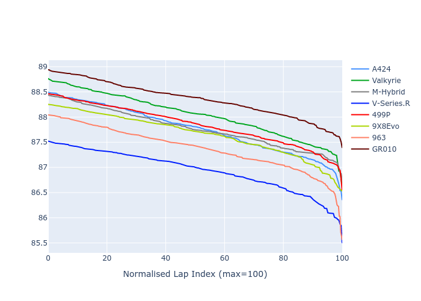

# Combined Plots

## Metadata

- BoP Accuracy: 85.14%
- Overall BoP Grade: B1
- Track: INTERLAGOS
- Threshhold: 250.0kph
- Average Laptime: 1:27.72
- Average Quali Laptime: 1:24.26
- Laptime Std Dev: 0.40 seconds
- Filtered Average Topspeed: 283.58kph

## BoP Table
| Manufacturer   | Car        | Weight   | Power   | PINC   | E/Stint   | FDS    | RDP    | QDP     | TDP   |
|:---------------|:-----------|:---------|:--------|:-------|:----------|:-------|:-------|:--------|:------|
| Alpine         | A424       | 1051kg   | 512.0kw | -5.50% | 892MJ     | -      | 60.91% | 33.33%  | 3.52% |
| Aston Martin   | Valkyrie   | 1030kg   | 520.0kw | -      | 919MJ     | -      | 54.72% | 71.43%  | 1.22% |
| BMW            | M-Hybrid   | 1058kg   | 505.0kw | -0.40% | 904MJ     | -      | 62.20% | 60.00%  | 3.07% |
| Cadillac       | V-Series.R | 1040kg   | 516.0kw | -1.70% | 904MJ     | -      | 55.17% | 100.00% | 0.77% |
| Ferrari        | 499P       | 1069kg   | 480.0kw | -5.60% | 893MJ     | 190kph | 57.80% | 50.00%  | 1.47% |
| Peugeot        | 9X8Evo     | 1030kg   | 520.0kw | -6.00% | 897MJ     | 190kph | 59.38% | 16.67%  | 1.95% |
| Porsche        | 963        | 1053kg   | 501.0kw | +0.40% | 905MJ     | -      | 54.91% | 18.18%  | 0.78% |
| Toyota         | GR010      | 1069kg   | 485.0kw | -7.20% | 903MJ     | 190kph | 61.30% | 42.86%  | 2.00% |

## Performance Table
| Manufacturer   | Car        | RP      | QP      | Vavg      |   RDLC | BOP-Grade   | Match   |
|:---------------|:-----------|:--------|:--------|:----------|-------:|:------------|:--------|
| Alpine         | A424       | 1:27.76 | 1:24.48 | 277.81kph |   1.04 | -A2         | 90.67%  |
| Aston Martin   | Valkyrie   | 1:28.04 | 1:24.74 | 277.85kph |   1.04 | +C2         | 71.26%  |
| BMW            | M-Hybrid   | 1:27.77 | 1:24.20 | 282.67kph |   1.04 | +A2         | 92.71%  |
| Cadillac       | V-Series.R | 1:26.94 | 1:23.66 | 287.73kph |   1.04 | -B1         | 89.14%  |
| Ferrari        | 499P       | 1:27.84 | 1:24.43 | 281.88kph |   1.04 | +A2         | 92.53%  |
| Peugeot        | 9X8Evo     | 1:27.66 | 1:23.94 | 280.27kph |   1.04 | ~A1         | 100.00% |
| Porsche        | 963        | 1:27.37 | 1:23.99 | 291.69kph |   1.04 | ~A1         | 97.73%  |
| Toyota         | GR010      | 1:28.35 | 1:24.61 | 288.71kph |   1.04 | +Ω1         | 47.10%  |

## Race Laptimes

## Quali Laptimes

## Topspeeds

## Laptimes Lineplot

