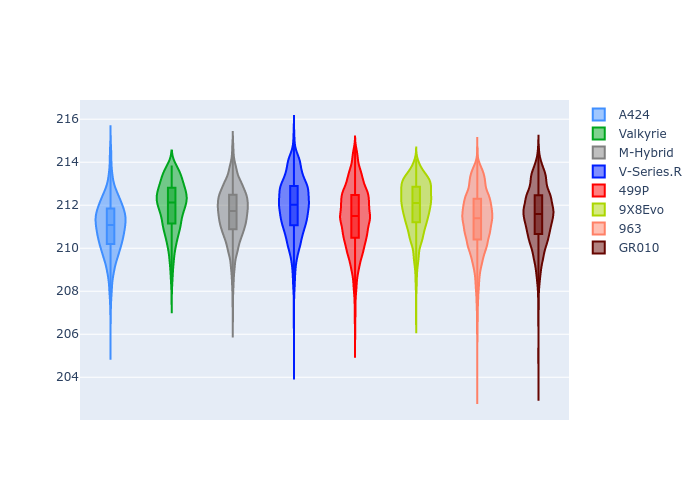
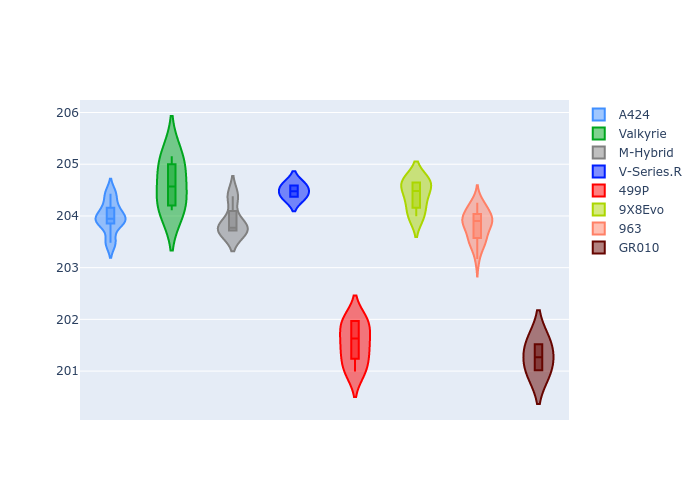
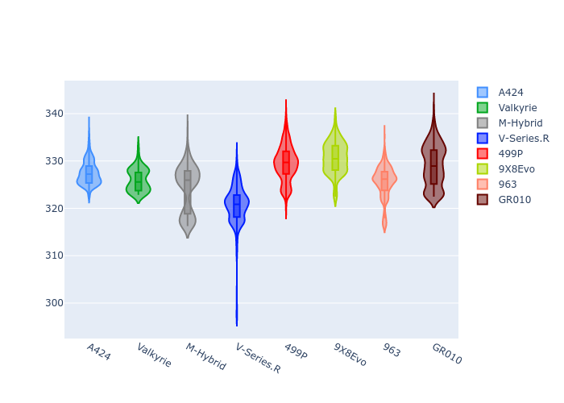
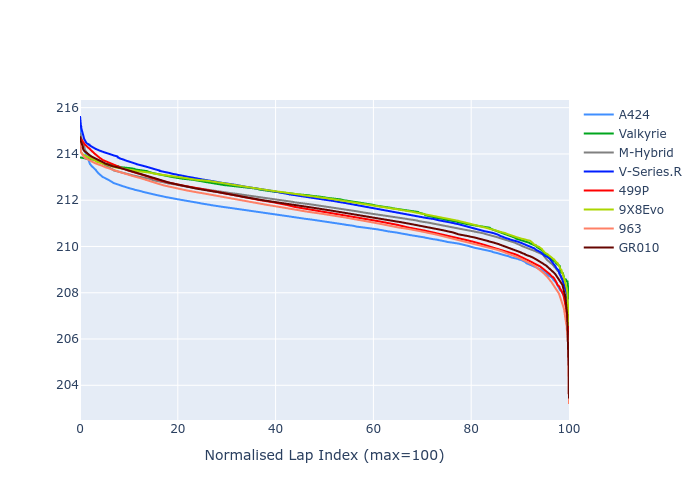

# Combined Plots

## Metadata

- BoP Accuracy: 99.55%
- Overall BoP Grade: A1
- Track: LEMANS
- Threshhold: 210.0kph

## BoP Table
| Manufacturer   | Car        | Weight   | Power   | PINC   | E/Stint   | FDS    |
|:---------------|:-----------|:---------|:--------|:-------|:----------|:-------|
| Alpine         | A424       | 1067kg   | 520.0kw | -1.00% | 915MJ     | -      |
| Aston Martin   | Valkyrie   | 1040kg   | 506.0kw | +0.40% | 900MJ     | -      |
| BMW            | M-Hybrid   | 1061kg   | 512.0kw | +1.00% | 910MJ     | -      |
| Cadillac       | V-Series.R | 1054kg   | 510.0kw | +1.00% | 904MJ     | -      |
| Ferrari        | 499P       | 1083kg   | 508.0kw | -1.00% | 895MJ     | 190kph |
| Peugeot        | 9X8Evo     | 1070kg   | 510.0kw | -1.00% | 899MJ     | 190kph |
| Porsche        | 963        | 1067kg   | 516.0kw | -1.00% | 910MJ     | -      |
| Toyota         | GR010      | 1100kg   | 512.0kw | +1.00% | 914MJ     | 190kph |

## Performance Table
| Manufacturer   | Car        | RP      | QP      | Vavg      |   RDLC | BOP-Grade   | Match   |
|:---------------|:-----------|:--------|:--------|:----------|-------:|:------------|:--------|
| Alpine         | A424       | 3:29.83 | 3:25.14 | 332.86kph |   1.02 | ~A1         | 99.77%  |
| Aston Martin   | Valkyrie   | 3:31.68 | 3:25.44 | 332.59kph |   1.03 | ~A1         | 100.00% |
| BMW            | M-Hybrid   | 3:30.45 | 3:25.05 | 331.96kph |   1.03 | ~A1         | 99.96%  |
| Cadillac       | V-Series.R | 3:30.97 | 3:25.72 | 328.59kph |   1.03 | ~A1         | 99.92%  |
| Ferrari        | 499P       | 3:30.68 | 3:25.12 | 331.14kph |   1.03 | ~A1         | 99.94%  |
| Peugeot        | 9X8Evo     | 3:31.55 | 3:26.13 | 332.27kph |   1.03 | ~A1         | 96.95%  |
| Porsche        | 963        | 3:30.50 | 3:25.25 | 330.94kph |   1.03 | ~A1         | 99.87%  |
| Toyota         | GR010      | 3:31.00 | 3:25.22 | 332.26kph |   1.03 | ~A1         | 99.97%  |

## Race Laptimes

## Quali Laptimes

## Topspeeds

## Laptimes Lineplot

