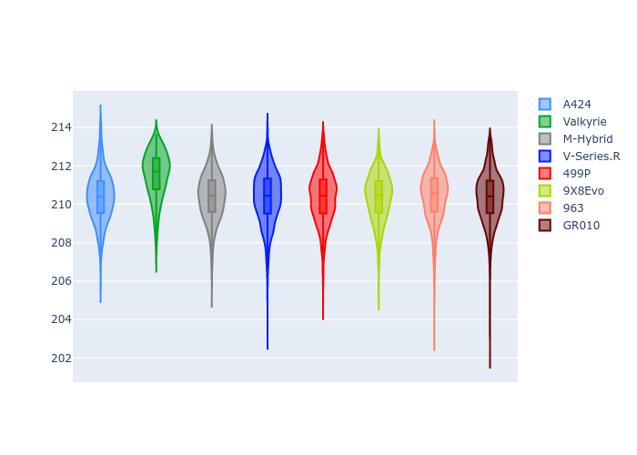
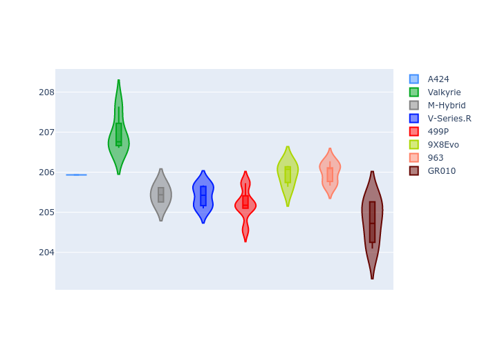
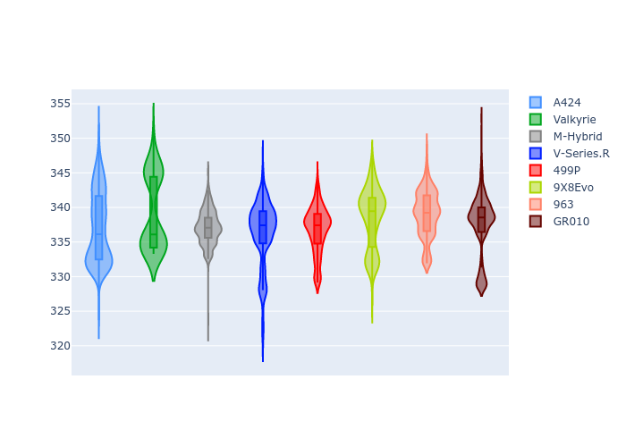
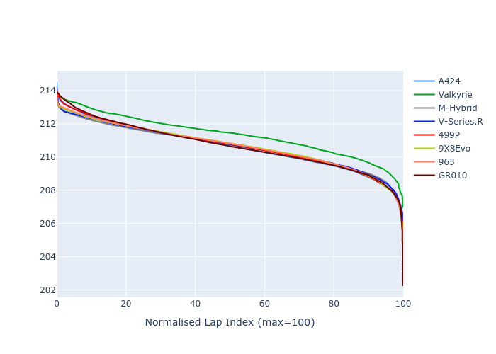

# Combined Plots

## Metadata

- BoP Accuracy: 99.74%
- Overall BoP Grade: A1
- Track: LEMANS
- Threshhold: 250.0kph
- Average Laptime: 3:31.11
- Average Quali Laptime: 3:25.63
- Laptime Std Dev: 0.17 seconds
- Filtered Average Topspeed: 336.98kph

## BoP Table
| Manufacturer   | Car        | Weight   | Power   | PINC   | E/Stint   | FDS    | RDP    | QDP    | TDP    |
|:---------------|:-----------|:---------|:--------|:-------|:----------|:-------|:-------|:-------|:-------|
| Alpine         | A424       | 1052kg   | 511.0kw | +0.10% | 896MJ     | -      | 51.38% | 57.54% | 26.10% |
| Aston Martin   | Valkyrie   | 1030kg   | 520.0kw | -      | 911MJ     | -      | 52.56% | 51.11% | 27.23% |
| BMW            | M-Hybrid   | 1048kg   | 514.0kw | -      | 920MJ     | -      | 52.62% | 53.36% | 32.99% |
| Cadillac       | V-Series.R | 1045kg   | 519.0kw | -      | 909MJ     | -      | 48.29% | 59.47% | 18.65% |
| Ferrari        | 499P       | 1062kg   | 503.0kw | -0.10% | 892MJ     | 190kph | 51.25% | 43.28% | 10.17% |
| Peugeot        | 9X8Evo     | 1049kg   | 518.0kw | -0.10% | 902MJ     | 190kph | 48.70% | 50.83% | 18.68% |
| Porsche        | 963        | 1051kg   | 511.0kw | -0.10% | 915MJ     | -      | 50.57% | 42.80% | 29.05% |
| Toyota         | GR010      | 1061kg   | 502.0kw | -0.10% | 901MJ     | 190kph | 51.03% | 51.78% | 14.64% |

## Performance Table
| Manufacturer   | Car        | RP      | QP      | Vavg      |   RDLC | BOP-Grade   | Match   |
|:---------------|:-----------|:--------|:--------|:----------|-------:|:------------|:--------|
| Alpine         | A424       | 3:31.05 | 3:26.13 | 335.22kph |   1.02 | ~A1         | 99.02%  |
| Aston Martin   | Valkyrie   | 3:31.57 | 3:27.12 | 338.57kph |   1.02 | ~A1         | 99.85%  |
| BMW            | M-Hybrid   | 3:30.99 | 3:25.40 | 335.75kph |   1.03 | ~A1         | 100.00% |
| Cadillac       | V-Series.R | 3:31.08 | 3:25.40 | 334.73kph |   1.03 | ~A1         | 99.70%  |
| Ferrari        | 499P       | 3:31.03 | 3:24.84 | 337.38kph |   1.03 | ~A1         | 100.00% |
| Peugeot        | 9X8Evo     | 3:31.05 | 3:25.94 | 338.90kph |   1.02 | ~A1         | 100.00% |
| Porsche        | 963        | 3:31.08 | 3:25.41 | 337.46kph |   1.03 | ~A1         | 99.92%  |
| Toyota         | GR010      | 3:31.06 | 3:24.83 | 337.84kph |   1.03 | ~A1         | 99.45%  |

## Race Laptimes

## Quali Laptimes

## Topspeeds

## Laptimes Lineplot

