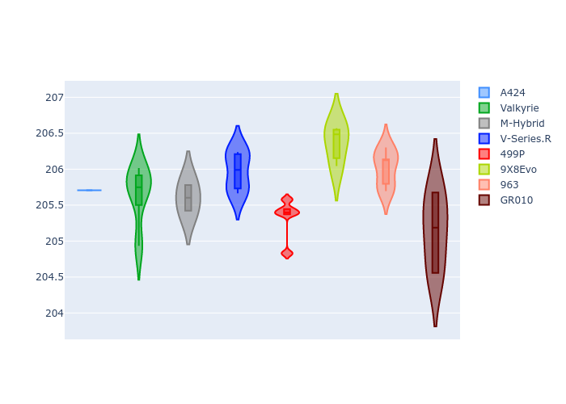
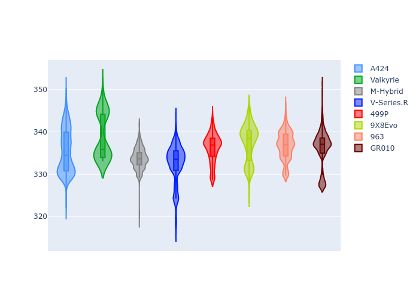

# Combined Plots

## Metadata

- BoP Accuracy: 99.38%
- Overall BoP Grade: A1
- Track: LEMANS
- Threshhold: 250.0kph

## BoP Table
| Manufacturer   | Car        | Weight   | Power   | PINC   | E/Stint   | FDS    | RDP    | QDP    | TDP    |
|:---------------|:-----------|:---------|:--------|:-------|:----------|:-------|:-------|:-------|:-------|
| Alpine         | A424       | 1067kg   | 520.0kw | -0.10% | 916MJ     | -      | 52.35% | 61.85% | 27.84% |
| Aston Martin   | Valkyrie   | 1040kg   | 506.0kw | +0.40% | 900MJ     | -      | 53.59% | 53.33% | 21.51% |
| BMW            | M-Hybrid   | 1061kg   | 512.0kw | +0.10% | 909MJ     | -      | 53.26% | 57.23% | 34.54% |
| Cadillac       | V-Series.R | 1054kg   | 510.0kw | +0.10% | 903MJ     | -      | 47.80% | 56.73% | 19.63% |
| Ferrari        | 499P       | 1083kg   | 508.0kw | -0.10% | 896MJ     | 190kph | 53.02% | 42.32% | 9.88%  |
| Peugeot        | 9X8Evo     | 1070kg   | 510.0kw | -0.10% | 900MJ     | 190kph | 48.47% | 51.26% | 16.02% |
| Porsche        | 963        | 1067kg   | 516.0kw | -0.10% | 911MJ     | -      | 50.87% | 45.25% | 30.77% |
| Toyota         | GR010      | 1100kg   | 512.0kw | -0.10% | 913MJ     | 190kph | 52.43% | 57.12% | 12.82% |

## Performance Table
| Manufacturer   | Car        | RP      | QP      | Vavg      |   RDLC | BOP-Grade   | Match   |
|:---------------|:-----------|:--------|:--------|:----------|-------:|:------------|:--------|
| Alpine         | A424       | 3:28.89 | 3:23.97 | 333.30kph |   1.02 | ~A1         | 99.86%  |
| Aston Martin   | Valkyrie   | 3:30.82 | 3:24.60 | 332.62kph |   1.03 | ~A1         | 99.37%  |
| BMW            | M-Hybrid   | 3:29.59 | 3:23.91 | 331.25kph |   1.03 | ~A1         | 100.00% |
| Cadillac       | V-Series.R | 3:30.13 | 3:24.48 | 327.69kph |   1.03 | ~A1         | 99.53%  |
| Ferrari        | 499P       | 3:28.04 | 3:21.52 | 331.72kph |   1.03 | ~A1         | 98.40%  |
| Peugeot        | 9X8Evo     | 3:29.75 | 3:24.40 | 332.93kph |   1.03 | ~A1         | 99.00%  |
| Porsche        | 963        | 3:29.36 | 3:23.82 | 331.99kph |   1.03 | ~A1         | 99.86%  |
| Toyota         | GR010      | 3:28.00 | 3:21.27 | 331.91kph |   1.03 | ~A1         | 99.01%  |

## Race Laptimes

## Quali Laptimes

## Topspeeds

## Laptimes Lineplot

