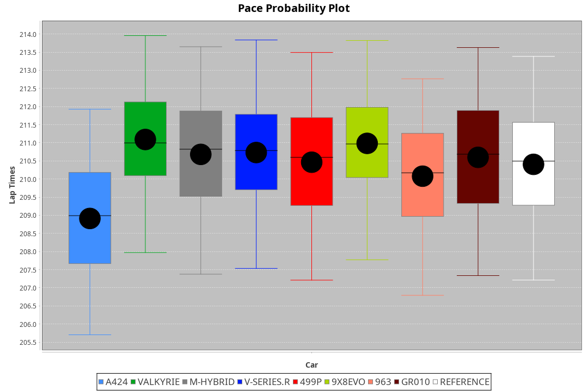
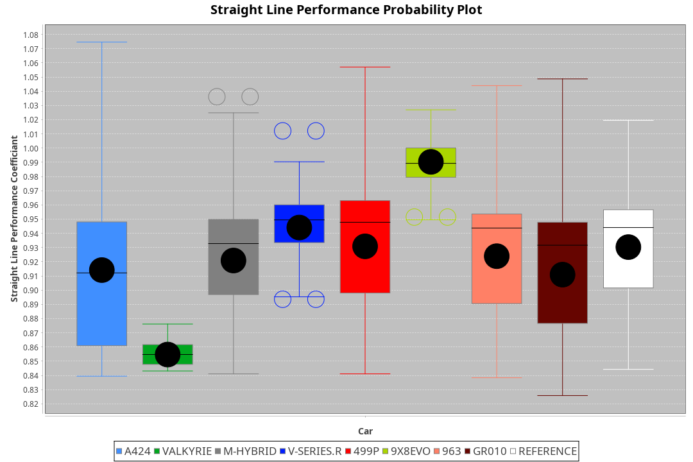
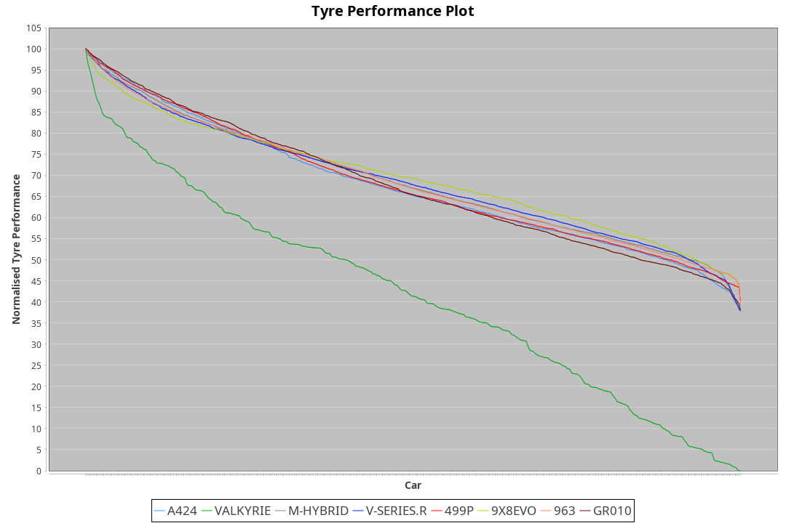

| Manufacturer | Car        | Weight | Power   | PINC    | E/Stint | FDS     |
|:-|:-|:-|:-|:-|:-|:-|
| Alpine       | A424       | 1054kg | 517.0kw | 0.50%   | 913MJ   |    -    |
| Aston Martin | Valkyrie   | 1031kg | 520.0kw |    -    | 911MJ   |    -    |
| BMW          | M-Hybrid   | 1051kg | 519.0kw | 0.10%   | 914MJ   |    -    |
| Cadillac     | V-Series.R | 1047kg | 519.0kw | -1.00%  | 909MJ   |    -    |
| Ferrari      | 499P       | 1076kg | 518.0kw | 0.50%   | 904MJ   | 200kph  |
| Peugeot      | 9X8Evo     | 1030kg | 516.0kw | -6.90%  | 895MJ   | 190kph  |
| Porsche      | 963        | 1051kg | 515.0kw | 0.90%   | 909MJ   |    -    |
| Toyota       | GR010      | 1078kg | 516.0kw | 0.70%   | 915MJ   | 200kph  |

### BoP Accuracy: 94.31%; Overall BoP Grade: A2
| Manufacturer | Car        | Type  | RP      | QP      | Weight | Power¹  | Threshhold | PINC    | Power²   | E/Stint | AVG Vmax  | FDS     | RDLC | L/Stint | BOP-Grade | Model Accuracy | Model Points | Match%  | SimDiff |
|:-|:-|:-|:-|:-|:-|:-|:-|:-|:-|:-|:-|:-|:-|:-|:-|:-|:-|:-|:-|
| Alpine       | A424       | LMDH  | 3:29.24 | 3:24.18 | 1054kg | 517.0kw | 210.0kph   | 0.50%   | 519.60kw |  913MJ  | 320.11kph |    -    | 1.02 | 12      | ~A1       | 98.45%         | 2220         | 99.03%  | +0.05   |
| Aston Martin | Valkyrie   | LMHNH | 3:29.25 | 3:23.10 | 1031kg | 520.0kw | 210.0kph   |    -    | 520.00kw |  911MJ  | 322.44kph |    -    | 1.05 | 12      | +C2       | 100.00%        | 466          | 72.99%  | #       |
| BMW          | M-Hybrid   | LMDH  | 3:29.26 | 3:23.56 | 1051kg | 519.0kw | 210.0kph   | 0.10%   | 519.50kw |  914MJ  | 322.61kph |    -    | 1.02 | 12      | ~A1       | 100.00%        | 3339         | 100.00% | +0.16   |
| Cadillac     | V-Series.R | LMDH  | 3:29.38 | 3:23.54 | 1047kg | 519.0kw | 210.0kph   | -1.00%  | 513.80kw |  909MJ  | 323.89kph |    -    | 1.02 | 12      | ~A1       | 99.03%         | 6041         | 96.63%  | +0.09   |
| Ferrari      | 499P       | LMHHU | 3:29.25 | 3:23.21 | 1076kg | 518.0kw | 210.0kph   | 0.50%   | 520.60kw |  904MJ  | 322.91kph | 200kph  | 1.03 | 12      | ~A1       | 99.97%         | 7286         | 100.00% | +0.41   |
| Peugeot      | 9X8Evo     | LMHHU | 3:29.23 | 3:23.81 | 1030kg | 516.0kw | 210.0kph   | -6.90%  | 480.40kw |  895MJ  | 329.32kph | 190kph  | 1.03 | 12      | +B1       | 100.00%        | 1890         | 87.12%  | +0.32   |
| Porsche      | 963        | LMDH  | 3:29.23 | 3:23.48 | 1051kg | 515.0kw | 210.0kph   | 0.90%   | 519.60kw |  909MJ  | 322.17kph |    -    | 1.02 | 12      | ~A1       | 99.89%         | 15174        | 100.00% | +0.60   |
| Toyota       | GR010      | LMHHU | 3:29.48 | 3:23.63 | 1078kg | 516.0kw | 210.0kph   | 0.70%   | 519.60kw |  915MJ  | 321.32kph | 200kph  | 1.02 | 12      | ~A1       | 99.82%         | 5457         | 98.69%  | +0.22   |

## Power below Threshhold
| N/Nmax    | A424    | VALKYRIE | M-HYBRID | V-SERIES.R | 499P    | 9X8EVO  | 963     | GR010   |
|:-|:-|:-|:-|:-|:-|:-|:-|:-|
|  0.550    |  255    |  256     |  256     |  256       |  255    |  254    |  254    |  254    |
|  0.575    |  278    |  279     |  279     |  279       |  278    |  277    |  277    |  277    |
|  0.600    |  298    |  300     |  299     |  299       |  299    |  298    |  297    |  298    |
|  0.625    |  320    |  322     |  321     |  321       |  321    |  319    |  319    |  319    |
|  0.650    |  341    |  343     |  342     |  342       |  342    |  340    |  340    |  340    |
|  0.675    |  363    |  365     |  364     |  364       |  364    |  362    |  362    |  362    |
|  0.700    |  385    |  387     |  386     |  386       |  386    |  384    |  383    |  384    |
|  0.725    |  407    |  409     |  408     |  408       |  407    |  406    |  405    |  406    |
|  0.750    |  427    |  430     |  429     |  429       |  428    |  427    |  426    |  427    |
|  0.775    |  446    |  449     |  448     |  448       |  447    |  446    |  445    |  446    |
|  0.800    |  464    |  467     |  466     |  466       |  465    |  463    |  463    |  463    |
|  0.825    |  479    |  482     |  481     |  481       |  480    |  478    |  478    |  478    |
|  0.850    |  491    |  494     |  493     |  493       |  492    |  490    |  489    |  490    |
|  0.875    |  502    |  505     |  504     |  504       |  503    |  501    |  500    |  501    |
|  0.900    |  509    |  512     |  511     |  511       |  510    |  508    |  507    |  508    |
|  0.925    |  514    |  517     |  516     |  516       |  515    |  513    |  512    |  513    |
| **0.950** | **517** | **520**  | **519**  | **519**    | **518** | **516** | **515** | **516** |
|  0.975    |  515    |  518     |  517     |  517       |  516    |  514    |  513    |  514    |
|  1.000    |  511    |  514     |  513     |  513       |  512    |  510    |  509    |  510    |
|  1.025    |  441    |  444     |  443     |  443       |  442    |  441    |  440    |  441    |

## Power above Threshhold
| N/Nmax    | A424       | VALKYRIE | M-HYBRID   | V-SERIES.R | 499P       | 9X8EVO     | 963        | GR010      |
|:-|:-|:-|:-|:-|:-|:-|:-|:-|
|  0.550    |  256.29    |  256     |  256.26    |  253.40    |  256.29    |  236.19    |  256.31    |  256.30    |
|  0.575    |  279.31    |  279     |  279.28    |  276.44    |  279.32    |  258.21    |  279.34    |  279.33    |
|  0.600    |  299.34    |  300     |  299.30    |  296.47    |  300.34    |  277.23    |  299.37    |  299.35    |
|  0.625    |  321.36    |  322     |  321.32    |  317.50    |  322.37    |  297.25    |  321.39    |  321.38    |
|  0.650    |  342.39    |  343     |  342.34    |  338.53    |  343.39    |  317.26    |  342.42    |  342.40    |
|  0.675    |  364.41    |  365     |  364.36    |  360.57    |  365.41    |  337.28    |  364.45    |  364.43    |
|  0.700    |  386.44    |  387     |  386.39    |  382.60    |  387.44    |  358.30    |  386.47    |  386.46    |
|  0.725    |  408.46    |  409     |  408.41    |  403.64    |  409.46    |  378.31    |  408.50    |  408.48    |
|  0.750    |  429.48    |  430     |  429.43    |  424.67    |  430.49    |  397.33    |  429.52    |  429.51    |
|  0.775    |  448.50    |  449     |  448.45    |  443.70    |  449.51    |  415.34    |  448.55    |  448.53    |
|  0.800    |  466.53    |  467     |  466.47    |  461.73    |  467.53    |  431.36    |  466.57    |  466.55    |
|  0.825    |  481.54    |  482     |  481.48    |  476.75    |  482.55    |  445.37    |  481.59    |  481.57    |
|  0.850    |  493.56    |  494     |  493.49    |  487.77    |  494.56    |  456.38    |  493.60    |  493.58    |
|  0.875    |  504.57    |  505     |  504.50    |  498.79    |  505.57    |  466.38    |  504.62    |  504.59    |
|  0.900    |  511.58    |  512     |  511.51    |  505.80    |  512.58    |  472.39    |  511.63    |  511.60    |
|  0.925    |  516.58    |  517     |  516.52    |  510.81    |  517.59    |  477.39    |  516.63    |  516.61    |
| **0.950** | **519.58** | **520**  | **519.52** | **513.81** | **520.59** | **480.40** | **519.64** | **519.61** |
|  0.975    |  517.58    |  518     |  517.52    |  511.81    |  518.59    |  478.39    |  517.63    |  517.61    |
|  1.000    |  513.58    |  514     |  513.51    |  507.80    |  514.58    |  475.39    |  513.63    |  513.60    |
|  1.025    |  443.50    |  444     |  443.44    |  438.69    |  444.50    |  410.34    |  443.54    |  443.52    |
