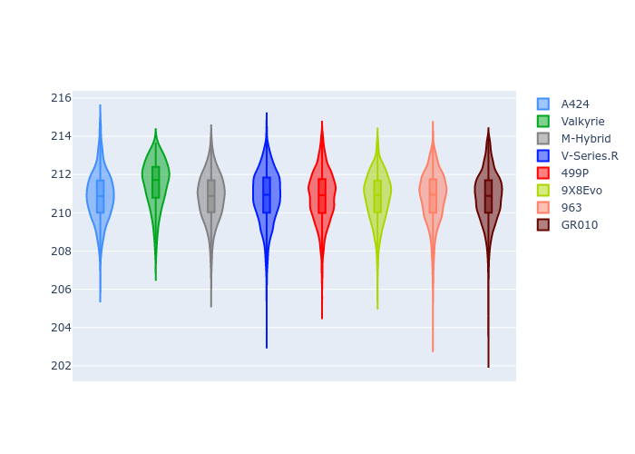
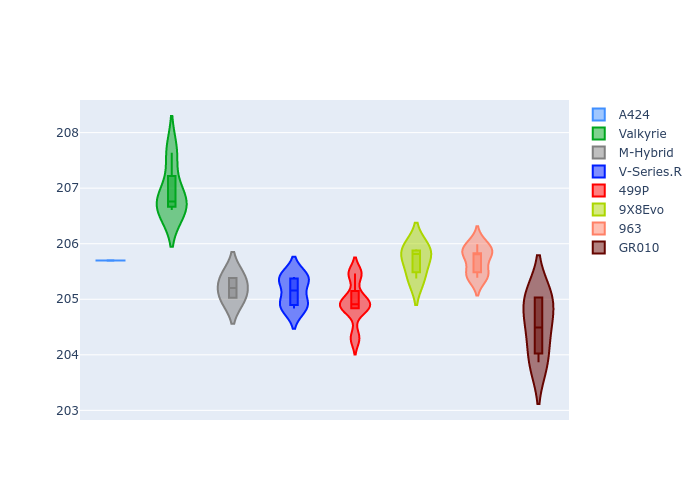
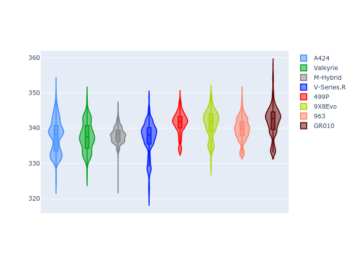
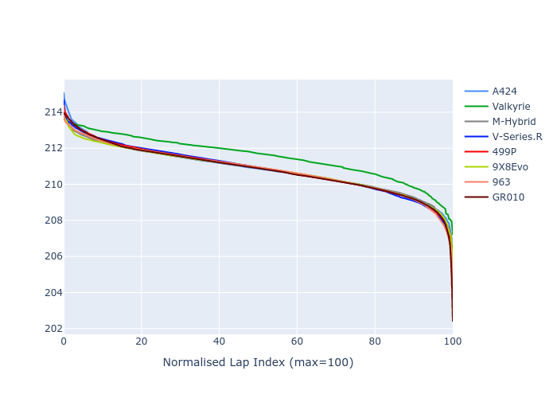

# Combined Plots

## Metadata

- BoP Accuracy: 99.60%
- Overall BoP Grade: A1
- Track: LEMANS
- Threshhold: 0.0kph
- Average Laptime: 3:30.41
- Average Quali Laptime: 3:25.31
- Laptime Std Dev: 0.42 seconds
- Filtered Average Topspeed: 339.34kph

## BoP Table
| Manufacturer   | Car        | Weight   | Power   | PINC   | E/Stint   | FDS    | RDP    | QDP    | TDP    |
|:---------------|:-----------|:---------|:--------|:-------|:----------|:-------|:-------|:-------|:-------|
| Alpine         | A424       | 1035kg   | 510.0kw | -      | 893MJ     | -      | 52.20% | 54.51% | 24.58% |
| Aston Martin   | Valkyrie   | 1030kg   | 520.0kw | -      | 911MJ     | -      | 53.39% | 54.11% | 23.71% |
| BMW            | M-Hybrid   | 1036kg   | 513.0kw | -      | 918MJ     | -      | 53.47% | 52.95% | 33.73% |
| Cadillac       | V-Series.R | 1039kg   | 520.0kw | -      | 909MJ     | -      | 49.22% | 60.31% | 18.04% |
| Ferrari        | 499P       | 1068kg   | 517.0kw | -      | 906MJ     | 200kph | 51.56% | 44.72% | 9.86%  |
| Peugeot        | 9X8Evo     | 1033kg   | 516.0kw | -      | 898MJ     | 200kph | 50.17% | 49.36% | 17.73% |
| Porsche        | 963        | 1030kg   | 504.0kw | -      | 907MJ     | -      | 50.78% | 41.25% | 27.61% |
| Toyota         | GR010      | 1067kg   | 515.0kw | -      | 913MJ     | 190kph | 51.68% | 51.25% | 14.48% |

## Performance Table
| Manufacturer   | Car        | RP      | QP      | Vavg      |   RDLC | BOP-Grade   | Match   |
|:---------------|:-----------|:--------|:--------|:----------|-------:|:------------|:--------|
| Alpine         | A424       | 3:30.27 | 3:25.53 | 337.68kph |   1.02 | ~A1         | 99.94%  |
| Aston Martin   | Valkyrie   | 3:31.51 | 3:26.74 | 337.61kph |   1.02 | ~A1         | 97.43%  |
| BMW            | M-Hybrid   | 3:30.24 | 3:24.99 | 337.99kph |   1.03 | ~A1         | 100.00% |
| Cadillac       | V-Series.R | 3:30.27 | 3:25.05 | 337.20kph |   1.03 | ~A1         | 99.84%  |
| Ferrari        | 499P       | 3:30.22 | 3:24.88 | 341.42kph |   1.03 | ~A1         | 99.82%  |
| Peugeot        | 9X8Evo     | 3:30.24 | 3:25.40 | 341.21kph |   1.02 | ~A1         | 100.00% |
| Porsche        | 963        | 3:30.24 | 3:25.19 | 339.68kph |   1.02 | ~A1         | 99.93%  |
| Toyota         | GR010      | 3:30.25 | 3:24.68 | 341.91kph |   1.03 | ~A1         | 99.85%  |

## Race Laptimes

## Quali Laptimes

## Topspeeds

## Laptimes Lineplot

