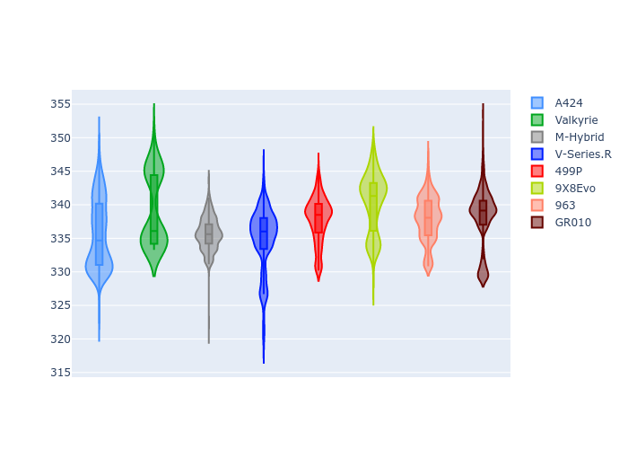
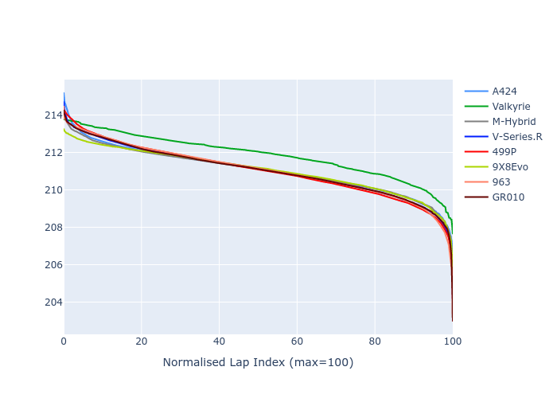

# Combined Plots

## Metadata

- BoP Accuracy: 99.91%
- Overall BoP Grade: A1
- Track: LEMANS
- Threshhold: 0.0kph

## BoP Table
| Manufacturer   | Car        | Weight   | Power   | PINC   | E/Stint   | FDS    | RDP    | QDP    | TDP    |
|:---------------|:-----------|:---------|:--------|:-------|:----------|:-------|:-------|:-------|:-------|
| Alpine         | A424       | 1041kg   | 507.0kw | -      | 902MJ     | -      | 52.35% | 61.85% | 27.84% |
| Aston Martin   | Valkyrie   | 1031kg   | 520.0kw | -      | 911MJ     | -      | 53.59% | 53.33% | 21.51% |
| BMW            | M-Hybrid   | 1041kg   | 509.0kw | -      | 904MJ     | -      | 53.26% | 57.23% | 34.54% |
| Cadillac       | V-Series.R | 1048kg   | 518.0kw | -      | 909MJ     | -      | 47.80% | 56.73% | 19.63% |
| Ferrari        | 499P       | 1066kg   | 491.0kw | -      | 879MJ     | 190kph | 53.02% | 42.32% | 9.88%  |
| Peugeot        | 9X8Evo     | 1031kg   | 501.0kw | -      | 888MJ     | 190kph | 48.47% | 51.26% | 16.02% |
| Porsche        | 963        | 1041kg   | 508.0kw | -      | 901MJ     | -      | 50.87% | 45.25% | 30.77% |
| Toyota         | GR010      | 1065kg   | 488.0kw | -      | 888MJ     | 190kph | 52.43% | 57.12% | 12.82% |

## Performance Table
| Manufacturer   | Car        | RP      | QP      | Vavg      |   RDLC | BOP-Grade   | Match   |
|:---------------|:-----------|:--------|:--------|:----------|-------:|:------------|:--------|
| Alpine         | A424       | 3:29.12 | 3:24.19 | 333.30kph |   1.02 | ~A1         | 99.79%  |
| Aston Martin   | Valkyrie   | 3:29.12 | 3:23.01 | 336.66kph |   1.03 | ~A1         | 100.00% |
| BMW            | M-Hybrid   | 3:29.12 | 3:23.47 | 332.75kph |   1.03 | ~A1         | 100.00% |
| Cadillac       | V-Series.R | 3:29.12 | 3:23.53 | 330.15kph |   1.03 | ~A1         | 100.00% |
| Ferrari        | 499P       | 3:29.13 | 3:22.53 | 329.61kph |   1.03 | ~A1         | 99.83%  |
| Peugeot        | 9X8Evo     | 3:29.11 | 3:23.80 | 335.35kph |   1.03 | ~A1         | 100.00% |
| Porsche        | 963        | 3:29.11 | 3:23.59 | 333.17kph |   1.03 | ~A1         | 99.87%  |
| Toyota         | GR010      | 3:29.11 | 3:22.31 | 330.11kph |   1.03 | ~A1         | 99.76%  |

## Race Laptimes

## Quali Laptimes

## Topspeeds

## Laptimes Lineplot

