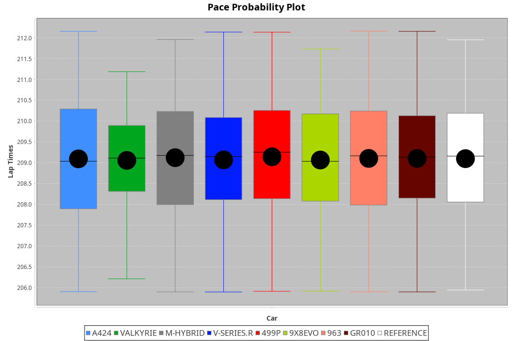
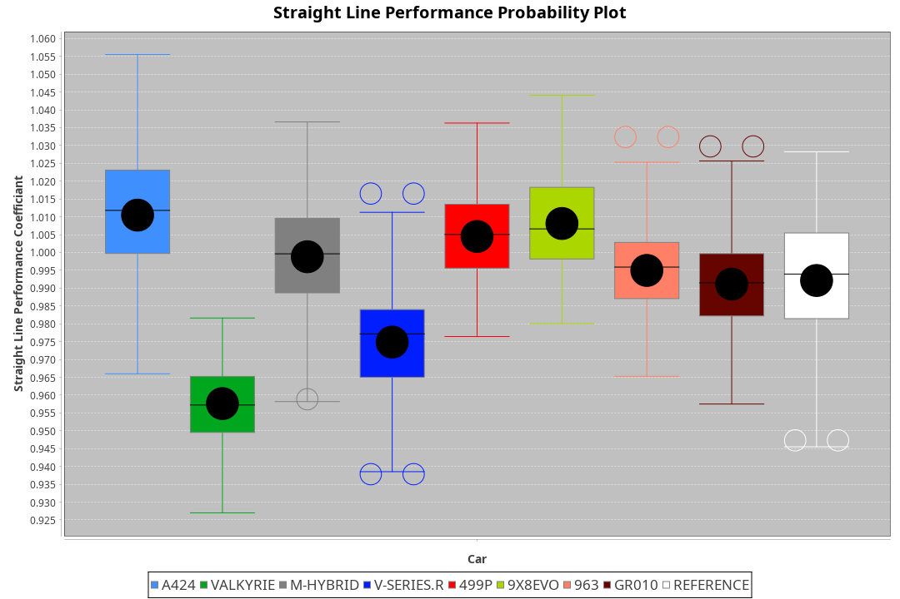
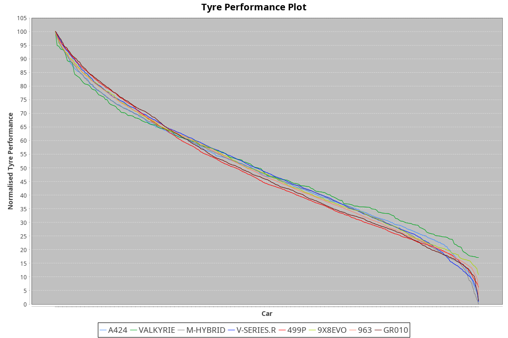

| Manufacturer | Car        | Weight | Power   | PINC    | E/Stint | FDS     |
|:-|:-|:-|:-|:-|:-|:-|
| Toyota       | GR010      | 1080kg | 517.0kw |    -    | 916MJ   | 190kph  |
| Ferrari      | 499P       | 1078kg | 517.0kw |    -    | 903MJ   | 190kph  |
| Cadillac     | V-Series.R | 1047kg | 520.0kw |    -    | 911MJ   |    -    |
| Porsche      | 963        | 1051kg | 518.0kw |    -    | 911MJ   |    -    |
| BMW          | M-Hybrid   | 1050kg | 519.0kw |    -    | 914MJ   |    -    |
| Alpine       | A424       | 1052kg | 517.0kw |    -    | 912MJ   |    -    |
| Aston Martin | Valkyrie   | 1030kg | 518.0kw |    -    | 909MJ   |    -    |
| Peugeot      | 9X8Evo     | 1031kg | 510.0kw |    -    | 896MJ   | 190kph  |

### BoP Accuracy: 94.64%; Overall BoP Grade: A2
| Manufacturer | Car        | Type  | RP      | QP      | Weight | Power¹  | Threshhold | PINC    | Power²   | E/Stint | AVG Vmax  | FDS     | RDLC | L/Stint | BOP-Grade | Model Accuracy | Model Points | Match%  | SimDiff |
|:-|:-|:-|:-|:-|:-|:-|:-|:-|:-|:-|:-|:-|:-|:-|:-|:-|:-|:-|:-|
| Alpine       | A424       | LMDH  | 3:29.02 | 3:23.49 | 1052kg | 517.0kw | 0.0kph     |    -    | 517.00kw |  912MJ  | 320.14kph |    -    | 1.02 | 12      | ~A1       | 96.10%         | 2390         | 97.10%  | +0.07   |
| Aston Martin | Valkyrie   | LMHNH | 3:29.03 | 3:22.54 | 1030kg | 518.0kw | 0.0kph     |    -    | 518.00kw |  909MJ  | 322.11kph |    -    | 1.05 | 12      | +C2       | 100.00%        | 466          | 73.44%  | #       |
| BMW          | M-Hybrid   | LMDH  | 3:29.02 | 3:22.97 | 1050kg | 519.0kw | 0.0kph     |    -    | 519.00kw |  914MJ  | 322.61kph |    -    | 1.02 | 12      | ~A1       | 100.00%        | 3339         | 100.00% | +0.19   |
| Cadillac     | V-Series.R | LMDH  | 3:29.02 | 3:23.25 | 1047kg | 520.0kw | 0.0kph     |    -    | 520.00kw |  911MJ  | 325.02kph |    -    | 1.02 | 12      | ~A1       | 99.56%         | 5841         | 99.12%  | -0.01   |
| Ferrari      | 499P       | LMHHU | 3:29.04 | 3:22.90 | 1078kg | 517.0kw | 0.0kph     |    -    | 517.00kw |  903MJ  | 321.80kph | 190kph  | 1.03 | 12      | ~A1       | 99.57%         | 7417         | 100.00% | +0.42   |
| Peugeot      | 9X8Evo     | LMHHU | 3:29.04 | 3:23.38 | 1031kg | 510.0kw | 0.0kph     |    -    | 510.00kw |  896MJ  | 332.82kph | 190kph  | 1.03 | 12      | +B1       | 100.00%        | 1891         | 87.48%  | +0.36   |
| Porsche      | 963        | LMDH  | 3:29.03 | 3:22.72 | 1051kg | 518.0kw | 0.0kph     |    -    | 518.00kw |  911MJ  | 322.41kph |    -    | 1.02 | 12      | ~A1       | 98.39%         | 16118        | 100.00% | +0.42   |
| Toyota       | GR010      | LMHHU | 3:29.02 | 3:23.10 | 1080kg | 517.0kw | 0.0kph     |    -    | 517.00kw |  916MJ  | 320.50kph | 190kph  | 1.02 | 12      | ~A1       | 99.90%         | 5196         | 100.00% | +0.36   |

## Power below Threshhold
| N/Nmax    | A424    | VALKYRIE | M-HYBRID | V-SERIES.R | 499P    | 9X8EVO  | 963     | GR010   |
|:-|:-|:-|:-|:-|:-|:-|:-|:-|
|  0.550    |  255    |  255     |  256     |  256       |  255    |  251    |  255    |  255    |
|  0.575    |  278    |  278     |  279     |  279       |  278    |  274    |  278    |  278    |
|  0.600    |  298    |  299     |  299     |  300       |  298    |  295    |  299    |  298    |
|  0.625    |  320    |  321     |  321     |  322       |  320    |  316    |  321    |  320    |
|  0.650    |  341    |  342     |  342     |  343       |  341    |  337    |  342    |  341    |
|  0.675    |  363    |  364     |  364     |  365       |  363    |  358    |  364    |  363    |
|  0.700    |  385    |  386     |  386     |  387       |  385    |  380    |  386    |  385    |
|  0.725    |  407    |  407     |  408     |  409       |  407    |  401    |  407    |  407    |
|  0.750    |  427    |  428     |  429     |  430       |  427    |  422    |  428    |  427    |
|  0.775    |  446    |  447     |  448     |  449       |  446    |  441    |  447    |  446    |
|  0.800    |  464    |  465     |  466     |  467       |  464    |  458    |  465    |  464    |
|  0.825    |  479    |  480     |  481     |  482       |  479    |  473    |  480    |  479    |
|  0.850    |  491    |  492     |  493     |  494       |  491    |  485    |  492    |  491    |
|  0.875    |  502    |  503     |  504     |  505       |  502    |  495    |  503    |  502    |
|  0.900    |  509    |  510     |  511     |  512       |  509    |  502    |  510    |  509    |
|  0.925    |  514    |  515     |  516     |  517       |  514    |  507    |  515    |  514    |
| **0.950** | **517** | **518**  | **519**  | **520**    | **517** | **510** | **518** | **517** |
|  0.975    |  515    |  516     |  517     |  518       |  515    |  508    |  516    |  515    |
|  1.000    |  511    |  512     |  513     |  514       |  511    |  505    |  512    |  511    |
|  1.025    |  441    |  442     |  443     |  444       |  441    |  436    |  442    |  441    |

## Power above Threshhold
| N/Nmax    | A424    | VALKYRIE | M-HYBRID | V-SERIES.R | 499P    | 9X8EVO  | 963     | GR010   |
|:-|:-|:-|:-|:-|:-|:-|:-|:-|
|  0.550    |  255    |  255     |  256     |  256       |  255    |  251    |  255    |  255    |
|  0.575    |  278    |  278     |  279     |  279       |  278    |  274    |  278    |  278    |
|  0.600    |  298    |  299     |  299     |  300       |  298    |  295    |  299    |  298    |
|  0.625    |  320    |  321     |  321     |  322       |  320    |  316    |  321    |  320    |
|  0.650    |  341    |  342     |  342     |  343       |  341    |  337    |  342    |  341    |
|  0.675    |  363    |  364     |  364     |  365       |  363    |  358    |  364    |  363    |
|  0.700    |  385    |  386     |  386     |  387       |  385    |  380    |  386    |  385    |
|  0.725    |  407    |  407     |  408     |  409       |  407    |  401    |  407    |  407    |
|  0.750    |  427    |  428     |  429     |  430       |  427    |  422    |  428    |  427    |
|  0.775    |  446    |  447     |  448     |  449       |  446    |  441    |  447    |  446    |
|  0.800    |  464    |  465     |  466     |  467       |  464    |  458    |  465    |  464    |
|  0.825    |  479    |  480     |  481     |  482       |  479    |  473    |  480    |  479    |
|  0.850    |  491    |  492     |  493     |  494       |  491    |  485    |  492    |  491    |
|  0.875    |  502    |  503     |  504     |  505       |  502    |  495    |  503    |  502    |
|  0.900    |  509    |  510     |  511     |  512       |  509    |  502    |  510    |  509    |
|  0.925    |  514    |  515     |  516     |  517       |  514    |  507    |  515    |  514    |
| **0.950** | **517** | **518**  | **519**  | **520**    | **517** | **510** | **518** | **517** |
|  0.975    |  515    |  516     |  517     |  518       |  515    |  508    |  516    |  515    |
|  1.000    |  511    |  512     |  513     |  514       |  511    |  505    |  512    |  511    |
|  1.025    |  441    |  442     |  443     |  444       |  441    |  436    |  442    |  441    |
