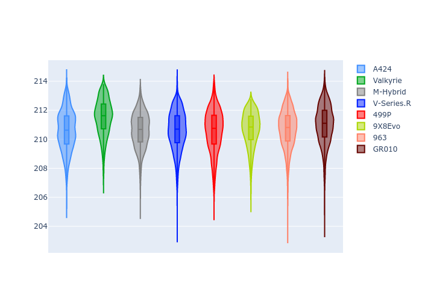
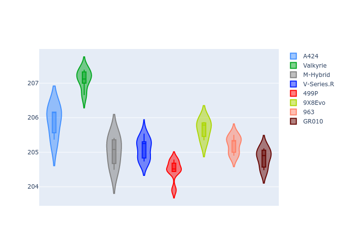
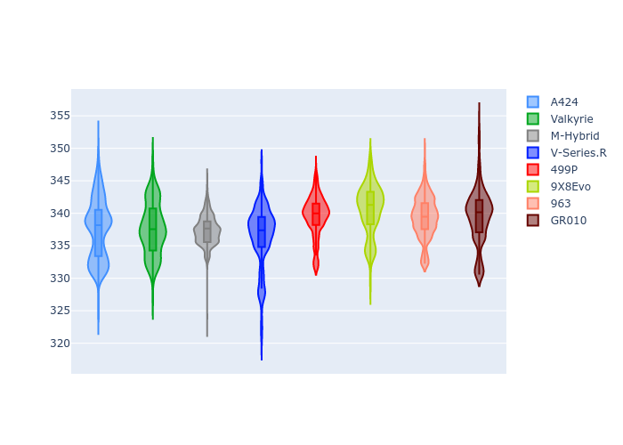
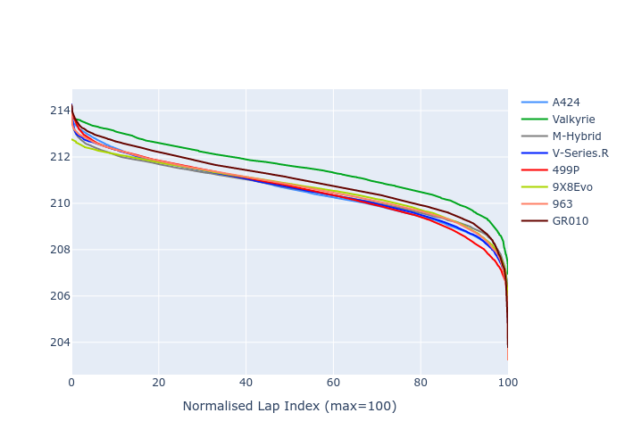

# Combined Plots

## Metadata

- BoP Accuracy: 99.91%
- Overall BoP Grade: A1
- Track: LEMANS
- Threshhold: 250.0kph
- Average Laptime: 3:30.79
- Average Quali Laptime: 3:25.67
- Laptime Std Dev: 0.30 seconds
- Filtered Average Topspeed: 338.48kph

## BoP Table
| Manufacturer   | Car        | Weight   | Power   | PINC   | E/Stint   | FDS    | RDP    | QDP    | TDP    |
|:---------------|:-----------|:---------|:--------|:-------|:----------|:-------|:-------|:-------|:-------|
| Alpine         | A424       | 1044kg   | 512.0kw | +0.50% | 897MJ     | -      | 52.20% | 54.51% | 24.58% |
| Aston Martin   | Valkyrie   | 1030kg   | 520.0kw | -      | 911MJ     | -      | 53.39% | 54.11% | 23.71% |
| BMW            | M-Hybrid   | 1042kg   | 513.0kw | +0.10% | 919MJ     | -      | 53.47% | 52.95% | 33.73% |
| Cadillac       | V-Series.R | 1043kg   | 519.0kw | -      | 909MJ     | -      | 49.22% | 60.31% | 18.04% |
| Ferrari        | 499P       | 1054kg   | 503.0kw | -0.10% | 892MJ     | 190kph | 51.56% | 44.72% | 9.86%  |
| Peugeot        | 9X8Evo     | 1042kg   | 518.0kw | -0.10% | 901MJ     | 190kph | 50.17% | 49.36% | 17.73% |
| Porsche        | 963        | 1046kg   | 511.0kw | -0.10% | 915MJ     | -      | 50.78% | 41.25% | 27.61% |
| Toyota         | GR010      | 1061kg   | 502.0kw | -0.10% | 901MJ     | 190kph | 51.68% | 51.25% | 14.48% |

## Performance Table
| Manufacturer   | Car        | RP      | QP      | Vavg      |   RDLC | BOP-Grade   | Match   |
|:---------------|:-----------|:--------|:--------|:----------|-------:|:------------|:--------|
| Alpine         | A424       | 3:30.60 | 3:25.85 | 337.52kph |   1.02 | ~A1         | 99.94%  |
| Aston Martin   | Valkyrie   | 3:31.51 | 3:26.74 | 337.61kph |   1.02 | ~A1         | 100.00% |
| BMW            | M-Hybrid   | 3:30.62 | 3:25.34 | 337.37kph |   1.03 | ~A1         | 100.00% |
| Cadillac       | V-Series.R | 3:30.61 | 3:25.37 | 336.50kph |   1.03 | ~A1         | 99.86%  |
| Ferrari        | 499P       | 3:30.58 | 3:25.22 | 339.57kph |   1.03 | ~A1         | 99.91%  |
| Peugeot        | 9X8Evo     | 3:30.69 | 3:25.82 | 340.53kph |   1.02 | ~A1         | 100.00% |
| Porsche        | 963        | 3:30.70 | 3:25.63 | 339.40kph |   1.02 | ~A1         | 99.92%  |
| Toyota         | GR010      | 3:31.01 | 3:25.40 | 339.37kph |   1.03 | ~A1         | 99.64%  |

## Race Laptimes

## Quali Laptimes

## Topspeeds

## Laptimes Lineplot

