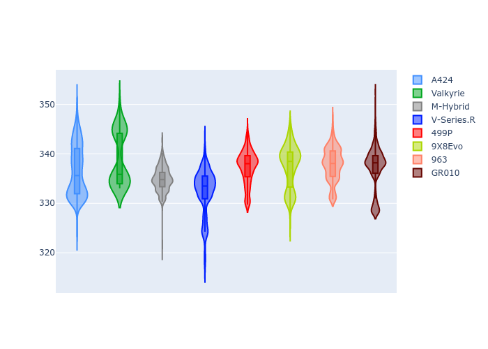

# Combined Plots

## Metadata

- BoP Accuracy: 99.19%
- Overall BoP Grade: A1
- Track: LEMANS
- Threshhold: 210.0kph

## BoP Table
| Manufacturer   | Car        | Weight   | Power   | PINC   | E/Stint   | FDS    |
|:---------------|:-----------|:---------|:--------|:-------|:----------|:-------|
| Alpine         | A424       | 1057kg   | 520.0kw | -1.00% | 914MJ     | -      |
| Aston Martin   | Valkyrie   | 1040kg   | 505.0kw | +0.40% | 899MJ     | -      |
| BMW            | M-Hybrid   | 1051kg   | 512.0kw | +1.00% | 908MJ     | -      |
| Cadillac       | V-Series.R | 1044kg   | 510.0kw | +1.00% | 903MJ     | -      |
| Ferrari        | 499P       | 1073kg   | 508.0kw | -1.00% | 894MJ     | 190kph |
| Peugeot        | 9X8Evo     | 1060kg   | 510.0kw | -1.00% | 898MJ     | 190kph |
| Porsche        | 963        | 1057kg   | 516.0kw | -1.00% | 909MJ     | -      |
| Toyota         | GR010      | 1090kg   | 512.0kw | +1.00% | 913MJ     | 190kph |

## Performance Table
| Manufacturer   | Car        | RP      | QP      | Vavg      |   RDLC | BOP-Grade   | Match   |
|:---------------|:-----------|:--------|:--------|:----------|-------:|:------------|:--------|
| Alpine         | A424       | 3:29.16 | 3:24.51 | 334.00kph |   1.02 | ~A1         | 99.77%  |
| Aston Martin   | Valkyrie   | 3:31.82 | 3:25.57 | 332.35kph |   1.03 | ~A1         | 97.02%  |
| BMW            | M-Hybrid   | 3:29.79 | 3:24.43 | 333.10kph |   1.03 | ~A1         | 99.84%  |
| Cadillac       | V-Series.R | 3:30.30 | 3:25.09 | 329.73kph |   1.03 | ~A1         | 99.96%  |
| Ferrari        | 499P       | 3:30.05 | 3:24.52 | 332.26kph |   1.03 | ~A1         | 99.86%  |
| Peugeot        | 9X8Evo     | 3:30.88 | 3:25.50 | 333.41kph |   1.03 | ~A1         | 97.20%  |
| Porsche        | 963        | 3:29.83 | 3:24.61 | 332.07kph |   1.03 | ~A1         | 99.87%  |
| Toyota         | GR010      | 3:30.36 | 3:24.61 | 333.36kph |   1.03 | ~A1         | 99.97%  |

## Race Laptimes

## Quali Laptimes

## Topspeeds

## Laptimes Lineplot

