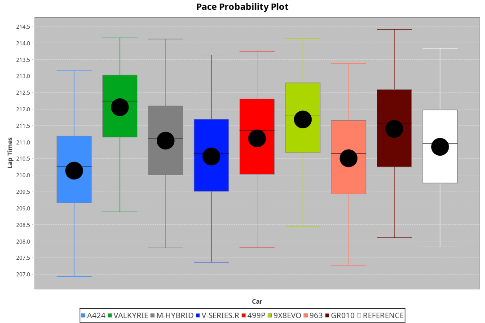
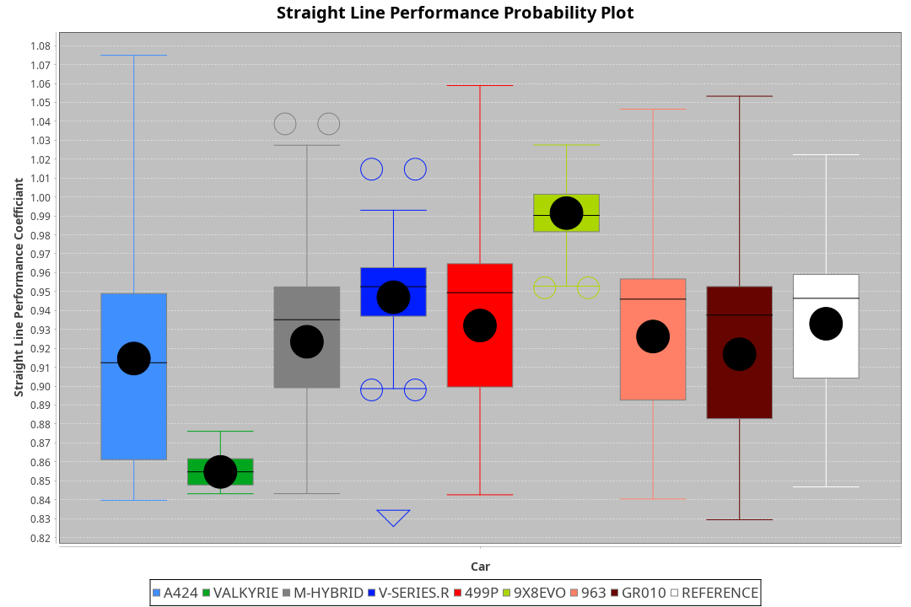
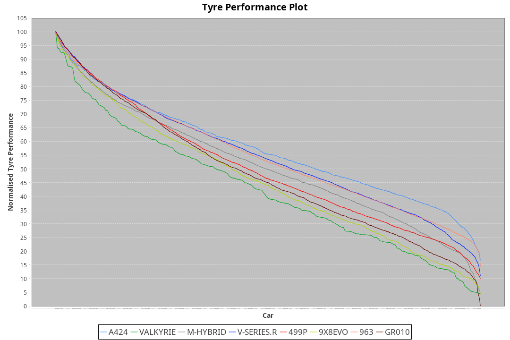

| Manufacturer | Car        | Weight | Power   | PINC    | E/Stint | FDS     |
|:-|:-|:-|:-|:-|:-|:-|
| Alpine       | A424       | 1050kg | 517.0kw | -1.00%  | 911MJ   |    -    |
| Aston Martin | Valkyrie   | 1032kg | 520.0kw |    -    | 911MJ   |    -    |
| BMW          | M-Hybrid   | 1039kg | 512.0kw |    -    | 906MJ   |    -    |
| Cadillac     | V-Series.R | 1038kg | 507.0kw | 1.00%   | 899MJ   |    -    |
| Ferrari      | 499P       | 1063kg | 506.0kw | -1.00%  | 891MJ   | 190kph  |
| Peugeot      | 9X8Evo     | 1050kg | 510.0kw | -1.00%  | 897MJ   | 190kph  |
| Porsche      | 963        | 1053kg | 513.0kw | -1.00%  | 906MJ   |    -    |
| Toyota       | GR010      | 1082kg | 509.0kw | 1.00%   | 910MJ   | 190kph  |

### BoP Accuracy: 78.40%; Overall BoP Grade: C1
| Manufacturer | Car        | Type  | RP      | QP      | Weight | Power¹  | Threshhold | PINC    | Power²   | E/Stint | AVG Vmax  | FDS     | RDLC | L/Stint | BOP-Grade | Model Accuracy | Model Points | Match% | SimDiff |
|:-|:-|:-|:-|:-|:-|:-|:-|:-|:-|:-|:-|:-|:-|:-|:-|:-|:-|:-|:-|
| Alpine       | A424       | LMDH  | 3:30.02 | 3:26.02 | 1050kg | 517.0kw | 210.0kph   | -1.00%  | 511.80kw |  911MJ  | 335.94kph |    -    | 1.00 | 12      | -B1       | 99.49%         | 1360         | 87.92% | -0.81   |
| Aston Martin | Valkyrie   | LMHNH | 3:34.50 | 3:28.83 | 1032kg | 520.0kw | 210.0kph   |    -    | 520.00kw |  911MJ  | 328.62kph |    -    | 1.04 | 12      | +Ω1       | 100.00%        | 312          | 18.89% | #       |
| BMW          | M-Hybrid   | LMDH  | 3:30.04 | 3:24.23 | 1039kg | 512.0kw | 210.0kph   |    -    | 512.00kw |  906MJ  | 335.37kph |    -    | 1.01 | 12      | -B1       | 98.62%         | 2363         | 88.45% | -0.27   |
| Cadillac     | V-Series.R | LMDH  | 3:30.02 | 3:24.94 | 1038kg | 507.0kw | 210.0kph   | 1.00%   | 512.10kw |  899MJ  | 329.99kph |    -    | 1.02 | 12      | -B1       | 98.50%         | 4201         | 88.32% | +0.44   |
| Ferrari      | 499P       | LMHHU | 3:30.16 | 3:24.76 | 1063kg | 506.0kw | 210.0kph   | -1.00%  | 500.90kw |  891MJ  | 332.67kph | 190kph  | 1.03 | 12      | -B1       | 100.00%        | 4441         | 88.15% | +0.46   |
| Peugeot      | 9X8Evo     | LMHHU | 3:30.20 | 3:25.56 | 1050kg | 510.0kw | 210.0kph   | -1.00%  | 504.90kw |  897MJ  | 334.72kph | 190kph  | 1.00 | 12      | +B2       | 100.00%        | 808          | 81.69% | +0.62   |
| Porsche      | 963        | LMDH  | 3:30.04 | 3:24.17 | 1053kg | 513.0kw | 210.0kph   | -1.00%  | 507.90kw |  906MJ  | 332.05kph |    -    | 1.00 | 12      | -B1       | 99.87%         | 12613        | 86.35% | +0.58   |
| Toyota       | GR010      | LMHHU | 3:30.04 | 3:24.27 | 1082kg | 509.0kw | 210.0kph   | 1.00%   | 514.10kw |  910MJ  | 329.96kph | 190kph  | 1.00 | 12      | -B1       | 99.73%         | 2956         | 87.45% | +0.61   |

## Power below Threshhold
| N/Nmax    | A424    | VALKYRIE | M-HYBRID | V-SERIES.R | 499P    | 9X8EVO  | 963     | GR010   |
|:-|:-|:-|:-|:-|:-|:-|:-|:-|
|  0.550    |  255    |  256     |  252     |  250       |  249    |  251    |  253    |  251    |
|  0.575    |  278    |  279     |  275     |  273       |  272    |  274    |  276    |  274    |
|  0.600    |  298    |  300     |  296     |  293       |  292    |  295    |  296    |  294    |
|  0.625    |  320    |  322     |  317     |  314       |  313    |  316    |  317    |  315    |
|  0.650    |  341    |  343     |  338     |  335       |  334    |  337    |  338    |  336    |
|  0.675    |  363    |  365     |  359     |  356       |  355    |  358    |  360    |  357    |
|  0.700    |  385    |  387     |  381     |  377       |  377    |  380    |  382    |  379    |
|  0.725    |  407    |  409     |  403     |  399       |  398    |  401    |  403    |  400    |
|  0.750    |  427    |  430     |  423     |  419       |  418    |  422    |  424    |  421    |
|  0.775    |  446    |  449     |  442     |  438       |  437    |  441    |  443    |  440    |
|  0.800    |  464    |  467     |  460     |  455       |  454    |  458    |  461    |  457    |
|  0.825    |  479    |  482     |  475     |  470       |  469    |  473    |  476    |  472    |
|  0.850    |  491    |  494     |  486     |  482       |  481    |  485    |  487    |  484    |
|  0.875    |  502    |  505     |  497     |  492       |  491    |  495    |  498    |  494    |
|  0.900    |  509    |  512     |  504     |  499       |  498    |  502    |  505    |  501    |
|  0.925    |  514    |  517     |  509     |  504       |  503    |  507    |  510    |  506    |
| **0.950** | **517** | **520**  | **512**  | **507**    | **506** | **510** | **513** | **509** |
|  0.975    |  515    |  518     |  510     |  505       |  504    |  508    |  511    |  507    |
|  1.000    |  511    |  514     |  506     |  502       |  501    |  505    |  507    |  504    |
|  1.025    |  441    |  444     |  437     |  433       |  432    |  436    |  438    |  435    |

## Power above Threshhold
| N/Nmax    | A424       | VALKYRIE | M-HYBRID | V-SERIES.R | 499P       | 9X8EVO     | 963        | GR010      |
|:-|:-|:-|:-|:-|:-|:-|:-|:-|
|  0.550    |  252.41    |  256     |  252     |  252.03    |  246.46    |  248.44    |  250.43    |  253.04    |
|  0.575    |  275.45    |  279     |  275     |  275.04    |  269.51    |  271.48    |  273.47    |  276.05    |
|  0.600    |  295.48    |  300     |  296     |  296.04    |  289.54    |  291.52    |  293.50    |  297.05    |
|  0.625    |  316.51    |  322     |  317     |  317.04    |  309.58    |  312.56    |  314.54    |  318.06    |
|  0.650    |  337.55    |  343     |  338     |  338.05    |  330.62    |  333.59    |  335.57    |  339.06    |
|  0.675    |  359.58    |  365     |  359     |  359.05    |  351.66    |  354.63    |  356.61    |  361.06    |
|  0.700    |  380.62    |  387     |  381     |  381.05    |  372.70    |  375.67    |  377.65    |  383.07    |
|  0.725    |  402.65    |  409     |  403     |  403.06    |  393.74    |  396.71    |  399.68    |  404.07    |
|  0.750    |  422.69    |  430     |  423     |  423.06    |  413.78    |  416.74    |  419.72    |  425.07    |
|  0.775    |  441.72    |  449     |  442     |  442.06    |  432.81    |  435.78    |  438.75    |  444.08    |
|  0.800    |  459.75    |  467     |  460     |  460.06    |  449.84    |  453.81    |  455.78    |  462.08    |
|  0.825    |  474.77    |  482     |  475     |  475.06    |  464.87    |  468.84    |  470.81    |  477.08    |
|  0.850    |  485.79    |  494     |  486     |  486.07    |  475.89    |  479.86    |  482.83    |  488.09    |
|  0.875    |  496.81    |  505     |  497     |  497.07    |  485.91    |  489.87    |  492.84    |  499.09    |
|  0.900    |  503.82    |  512     |  504     |  504.07    |  492.92    |  496.89    |  499.86    |  506.09    |
|  0.925    |  508.83    |  517     |  509     |  509.07    |  497.93    |  501.89    |  504.86    |  511.09    |
| **0.950** | **511.83** | **520**  | **512**  | **512.07** | **500.94** | **504.90** | **507.87** | **514.09** |
|  0.975    |  509.83    |  518     |  510     |  510.07    |  498.94    |  502.90    |  505.87    |  512.09    |
|  1.000    |  505.82    |  514     |  506     |  506.07    |  495.93    |  499.89    |  502.86    |  508.09    |
|  1.025    |  436.71    |  444     |  437     |  437.06    |  427.80    |  430.77    |  433.74    |  439.08    |
