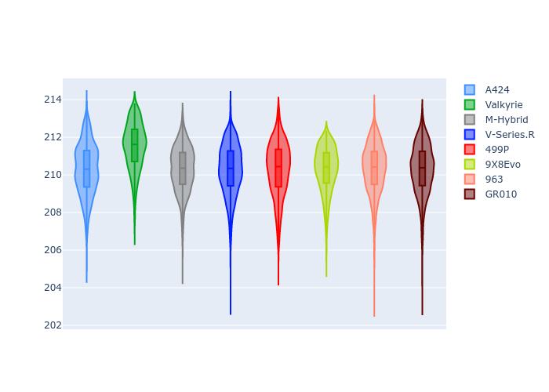
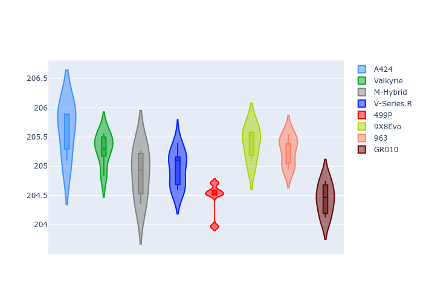
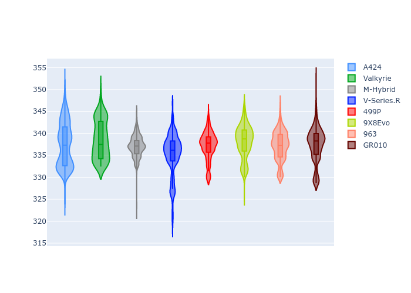
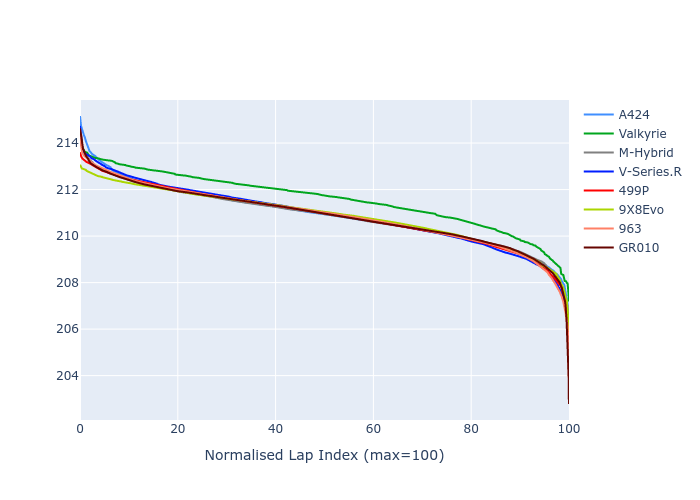

# Combined Plots

## Metadata

- BoP Accuracy: 99.62%
- Overall BoP Grade: A1
- Track: LEMANS
- Threshhold: 250.0kph
- Average Laptime: 3:30.44
- Average Quali Laptime: 3:25.34
- Laptime Std Dev: 0.41 seconds
- Filtered Average Topspeed: 339.10kph

## BoP Table
| Manufacturer   | Car        | Weight   | Power   | PINC   | E/Stint   | FDS    | RDP    | QDP    | TDP    |
|:---------------|:-----------|:---------|:--------|:-------|:----------|:-------|:-------|:-------|:-------|
| Alpine         | A424       | 1036kg   | 505.0kw | +2.90% | 894MJ     | -      | 52.20% | 54.51% | 24.58% |
| Aston Martin   | Valkyrie   | 1030kg   | 520.0kw | -      | 911MJ     | -      | 53.39% | 54.11% | 23.71% |
| BMW            | M-Hybrid   | 1037kg   | 509.0kw | +2.10% | 918MJ     | -      | 53.47% | 52.95% | 33.73% |
| Cadillac       | V-Series.R | 1039kg   | 520.0kw | -      | 909MJ     | -      | 49.22% | 60.31% | 18.04% |
| Ferrari        | 499P       | 1067kg   | 520.0kw | -2.20% | 904MJ     | 200kph | 51.56% | 44.72% | 9.86%  |
| Peugeot        | 9X8Evo     | 1032kg   | 520.0kw | -2.60% | 897MJ     | 200kph | 50.17% | 49.36% | 17.73% |
| Porsche        | 963        | 1031kg   | 504.0kw | -      | 907MJ     | -      | 50.78% | 41.25% | 27.61% |
| Toyota         | GR010      | 1066kg   | 520.0kw | -3.10% | 912MJ     | 190kph | 51.68% | 51.25% | 14.48% |

## Performance Table
| Manufacturer   | Car        | RP      | QP      | Vavg      |   RDLC | BOP-Grade   | Match   |
|:---------------|:-----------|:--------|:--------|:----------|-------:|:------------|:--------|
| Alpine         | A424       | 3:30.29 | 3:25.55 | 338.78kph |   1.02 | ~A1         | 99.94%  |
| Aston Martin   | Valkyrie   | 3:31.51 | 3:26.74 | 337.61kph |   1.02 | ~A1         | 97.65%  |
| BMW            | M-Hybrid   | 3:30.30 | 3:25.04 | 338.68kph |   1.03 | ~A1         | 100.00% |
| Cadillac       | V-Series.R | 3:30.27 | 3:25.05 | 337.20kph |   1.03 | ~A1         | 99.86%  |
| Ferrari        | 499P       | 3:30.28 | 3:24.93 | 340.36kph |   1.03 | ~A1         | 99.75%  |
| Peugeot        | 9X8Evo     | 3:30.27 | 3:25.43 | 340.04kph |   1.02 | ~A1         | 100.00% |
| Porsche        | 963        | 3:30.31 | 3:25.26 | 339.56kph |   1.02 | ~A1         | 99.92%  |
| Toyota         | GR010      | 3:30.28 | 3:24.71 | 340.55kph |   1.03 | ~A1         | 99.85%  |

## Race Laptimes

## Quali Laptimes

## Topspeeds

## Laptimes Lineplot

