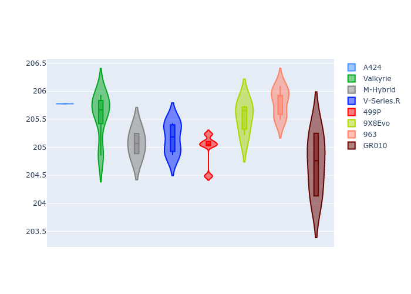
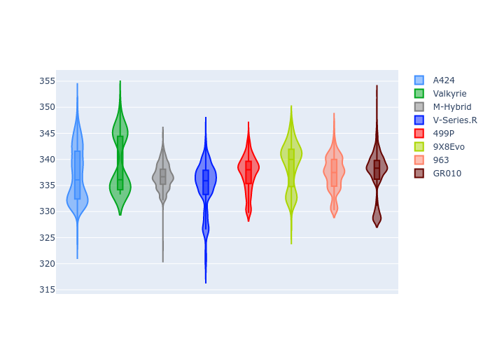

# Combined Plots

## Metadata

- BoP Accuracy: 99.79%
- Overall BoP Grade: A1
- Track: LEMANS
- Threshhold: 250.0kph
- Average Laptime: 3:31.16
- Average Quali Laptime: 3:25.33
- Average Topspeed: 337.32kph

## BoP Table
| Manufacturer   | Car        | Weight   | Power   | PINC   | E/Stint   | FDS    | RDP    | QDP    | TDP    |
|:---------------|:-----------|:---------|:--------|:-------|:----------|:-------|:-------|:-------|:-------|
| Alpine         | A424       | 1039kg   | 499.0kw | +4.00% | 901MJ     | -      | 51.64% | 59.31% | 26.80% |
| Aston Martin   | Valkyrie   | 1030kg   | 520.0kw | -      | 911MJ     | -      | 53.50% | 53.33% | 21.51% |
| BMW            | M-Hybrid   | 1040kg   | 504.0kw | +3.10% | 904MJ     | -      | 52.89% | 56.22% | 33.41% |
| Cadillac       | V-Series.R | 1043kg   | 520.0kw | -      | 910MJ     | -      | 48.63% | 60.80% | 19.01% |
| Ferrari        | 499P       | 1058kg   | 504.0kw | -1.00% | 888MJ     | 190kph | 51.38% | 44.98% | 9.83%  |
| Peugeot        | 9X8Evo     | 1030kg   | 520.0kw | -3.20% | 899MJ     | 190kph | 48.87% | 52.78% | 15.41% |
| Porsche        | 963        | 1032kg   | 506.0kw | -1.40% | 896MJ     | -      | 50.70% | 44.30% | 29.51% |
| Toyota         | GR010      | 1057kg   | 504.0kw | -2.10% | 898MJ     | 190kph | 51.09% | 52.71% | 11.46% |

## Performance Table
| Manufacturer   | Car        | RP      | QP      | Vavg      |   RDLC | BOP-Grade   | Match   |
|:---------------|:-----------|:--------|:--------|:----------|-------:|:------------|:--------|
| Alpine         | A424       | 3:31.06 | 3:25.78 | 337.01kph |   1.03 | ~A1         | 99.11%  |
| Aston Martin   | Valkyrie   | 3:31.85 | 3:25.57 | 339.17kph |   1.03 | ~A1         | 100.00% |
| BMW            | M-Hybrid   | 3:31.07 | 3:25.07 | 336.71kph |   1.03 | ~A1         | 99.94%  |
| Cadillac       | V-Series.R | 3:31.07 | 3:25.16 | 334.81kph |   1.03 | ~A1         | 99.72%  |
| Ferrari        | 499P       | 3:31.06 | 3:24.98 | 337.31kph |   1.03 | ~A1         | 99.92%  |
| Peugeot        | 9X8Evo     | 3:31.06 | 3:25.54 | 338.95kph |   1.03 | ~A1         | 100.00% |
| Porsche        | 963        | 3:31.07 | 3:25.80 | 337.30kph |   1.03 | ~A1         | 99.86%  |
| Toyota         | GR010      | 3:31.07 | 3:24.71 | 337.31kph |   1.03 | ~A1         | 99.79%  |

## Race Laptimes

## Quali Laptimes

## Topspeeds

## Laptimes Lineplot

