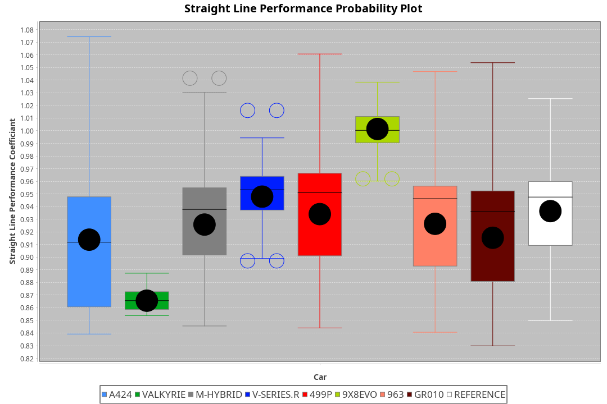
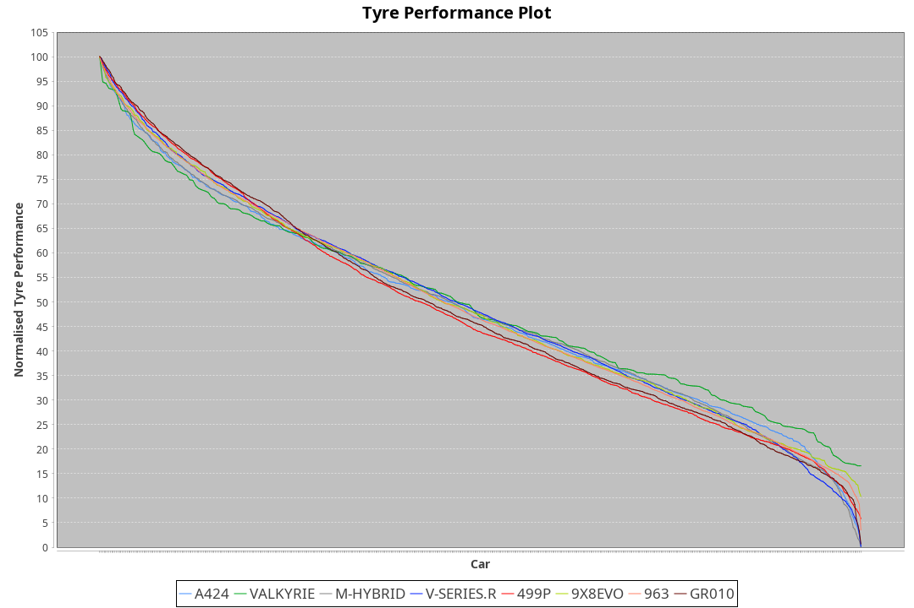

| Manufacturer | Car        | Weight | Power   | PINC    | E/Stint | FDS     |
|:-|:-|:-|:-|:-|:-|:-|
| Alpine       | A424       | 1036kg | 520.0kw | -0.70%  | 912MJ   |    -    |
| Aston Martin | Valkyrie   | 1030kg | 520.0kw |    -    | 911MJ   |    -    |
| BMW          | M-Hybrid   | 1038kg | 520.0kw | -0.30%  | 913MJ   |    -    |
| Cadillac     | V-Series.R | 1048kg | 519.0kw | 0.10%   | 910MJ   |    -    |
| Ferrari      | 499P       | 1069kg | 515.0kw | 0.20%   | 901MJ   | 190kph  |
| Peugeot      | 9X8Evo     | 1030kg | 520.0kw | -5.20%  | 897MJ   | 190kph  |
| Porsche      | 963        | 1040kg | 513.0kw | 1.30%   | 908MJ   |    -    |
| Toyota       | GR010      | 1074kg | 513.0kw | 1.30%   | 913MJ   | 190kph  |

### BoP Accuracy: 72.39%; Overall BoP Grade: C2
| Manufacturer | Car        | Type  | RP      | QP      | Weight | Power¹  | Threshhold | PINC    | Power²   | E/Stint | AVG Vmax  | FDS     | RDLC | L/Stint | BOP-Grade | Model Accuracy | Model Points | Match% | SimDiff |
|:-|:-|:-|:-|:-|:-|:-|:-|:-|:-|:-|:-|:-|:-|:-|:-|:-|:-|:-|:-|
| Alpine       | A424       | LMDH  | 3:28.77 | 3:24.82 | 1036kg | 520.0kw | 250.0kph   | -0.70%  | 516.40kw |  912MJ  | 338.45kph |    -    | 1.01 | 12      | -B1       | 99.49%         | 1360         | 85.52% | -0.81   |
| Aston Martin | Valkyrie   | LMHNH | 3:34.38 | 3:28.72 | 1030kg | 520.0kw | 0.0kph     |    -    | 520.00kw |  911MJ  | 328.86kph |    -    | 1.04 | 12      | +Ω2       | 100.00%        | 312          | -6.84% | #       |
| BMW          | M-Hybrid   | LMDH  | 3:28.77 | 3:23.04 | 1038kg | 520.0kw | 250.0kph   | -0.30%  | 518.40kw |  913MJ  | 337.13kph |    -    | 1.01 | 12      | -B1       | 98.62%         | 2363         | 85.61% | -0.27   |
| Cadillac     | V-Series.R | LMDH  | 3:28.76 | 3:23.74 | 1048kg | 519.0kw | 250.0kph   | 0.10%   | 519.50kw |  910MJ  | 331.00kph |    -    | 1.01 | 12      | -B1       | 98.50%         | 4201         | 85.70% | +0.44   |
| Ferrari      | 499P       | LMHHU | 3:28.75 | 3:23.43 | 1069kg | 515.0kw | 250.0kph   | 0.20%   | 516.00kw |  901MJ  | 335.02kph | 190kph  | 1.02 | 12      | -B2       | 100.00%        | 4441         | 81.93% | +0.46   |
| Peugeot      | 9X8Evo     | LMHHU | 3:28.76 | 3:24.19 | 1030kg | 520.0kw | 250.0kph   | -5.20%  | 493.00kw |  897MJ  | 335.86kph | 190kph  | 1.02 | 12      | -C1       | 100.00%        | 808          | 78.72% | +0.62   |
| Porsche      | 963        | LMDH  | 3:28.77 | 3:22.98 | 1040kg | 513.0kw | 250.0kph   | 1.30%   | 519.70kw |  908MJ  | 335.33kph |    -    | 1.01 | 12      | -B2       | 99.87%         | 12613        | 83.70% | +0.58   |
| Toyota       | GR010      | LMHHU | 3:28.77 | 3:23.08 | 1074kg | 513.0kw | 250.0kph   | 1.30%   | 519.70kw |  913MJ  | 332.10kph | 190kph  | 1.01 | 12      | -B2       | 99.73%         | 2956         | 84.79% | +0.61   |

## Power below Threshhold
| N/Nmax    | A424    | VALKYRIE | M-HYBRID | V-SERIES.R | 499P    | 9X8EVO  | 963     | GR010   |
|:-|:-|:-|:-|:-|:-|:-|:-|:-|
|  0.550    |  256    |  256     |  256     |  256       |  254    |  256    |  253    |  253    |
|  0.575    |  279    |  279     |  279     |  279       |  277    |  279    |  276    |  276    |
|  0.600    |  300    |  300     |  300     |  299       |  297    |  300    |  296    |  296    |
|  0.625    |  322    |  322     |  322     |  321       |  319    |  322    |  317    |  317    |
|  0.650    |  343    |  343     |  343     |  342       |  340    |  343    |  338    |  338    |
|  0.675    |  365    |  365     |  365     |  364       |  362    |  365    |  360    |  360    |
|  0.700    |  387    |  387     |  387     |  386       |  383    |  387    |  382    |  382    |
|  0.725    |  409    |  409     |  409     |  408       |  405    |  409    |  403    |  403    |
|  0.750    |  430    |  430     |  430     |  429       |  426    |  430    |  424    |  424    |
|  0.775    |  449    |  449     |  449     |  448       |  445    |  449    |  443    |  443    |
|  0.800    |  467    |  467     |  467     |  466       |  463    |  467    |  461    |  461    |
|  0.825    |  482    |  482     |  482     |  481       |  478    |  482    |  476    |  476    |
|  0.850    |  494    |  494     |  494     |  493       |  489    |  494    |  487    |  487    |
|  0.875    |  505    |  505     |  505     |  504       |  500    |  505    |  498    |  498    |
|  0.900    |  512    |  512     |  512     |  511       |  507    |  512    |  505    |  505    |
|  0.925    |  517    |  517     |  517     |  516       |  512    |  517    |  510    |  510    |
| **0.950** | **520** | **520**  | **520**  | **519**    | **515** | **520** | **513** | **513** |
|  0.975    |  518    |  518     |  518     |  517       |  513    |  518    |  511    |  511    |
|  1.000    |  514    |  514     |  514     |  513       |  509    |  514    |  507    |  507    |
|  1.025    |  444    |  444     |  444     |  443       |  440    |  444    |  438    |  438    |

## Power above Threshhold
| N/Nmax    | A424       | VALKYRIE | M-HYBRID   | V-SERIES.R | 499P       | 9X8EVO     | 963        | GR010      |
|:-|:-|:-|:-|:-|:-|:-|:-|:-|
|  0.550    |  254.18    |  256     |  255.22    |  256.26    |  254.01    |  242.47    |  256.33    |  256.33    |
|  0.575    |  277.19    |  279     |  278.24    |  279.28    |  277.02    |  265.52    |  279.36    |  279.36    |
|  0.600    |  298.21    |  300     |  299.25    |  299.30    |  298.02    |  284.55    |  299.39    |  299.39    |
|  0.625    |  319.22    |  322     |  321.27    |  321.32    |  319.02    |  304.59    |  321.41    |  321.41    |
|  0.650    |  340.24    |  343     |  342.29    |  342.34    |  340.02    |  325.63    |  342.44    |  342.44    |
|  0.675    |  362.25    |  365     |  364.31    |  364.36    |  362.02    |  345.67    |  364.47    |  364.47    |
|  0.700    |  384.27    |  387     |  386.33    |  386.39    |  384.02    |  366.71    |  386.50    |  386.50    |
|  0.725    |  406.28    |  409     |  407.35    |  408.41    |  406.02    |  387.76    |  408.53    |  408.53    |
|  0.750    |  427.30    |  430     |  428.36    |  429.43    |  427.02    |  407.79    |  429.55    |  429.55    |
|  0.775    |  446.31    |  449     |  447.38    |  448.45    |  446.03    |  425.83    |  448.58    |  448.58    |
|  0.800    |  463.32    |  467     |  465.39    |  466.47    |  463.03    |  442.86    |  466.60    |  466.60    |
|  0.825    |  478.33    |  482     |  480.41    |  481.48    |  478.03    |  456.89    |  481.62    |  481.62    |
|  0.850    |  490.34    |  494     |  492.42    |  493.49    |  490.03    |  467.91    |  493.64    |  493.64    |
|  0.875    |  501.35    |  505     |  503.43    |  504.50    |  501.03    |  477.93    |  504.65    |  504.65    |
|  0.900    |  508.35    |  512     |  510.43    |  511.51    |  508.03    |  484.94    |  511.66    |  511.66    |
|  0.925    |  513.36    |  517     |  515.44    |  516.52    |  513.03    |  489.95    |  516.67    |  516.67    |
| **0.950** | **516.36** | **520**  | **518.44** | **519.52** | **516.03** | **492.96** | **519.67** | **519.67** |
|  0.975    |  514.36    |  518     |  516.44    |  517.52    |  514.03    |  490.96    |  517.67    |  517.67    |
|  1.000    |  510.36    |  514     |  512.43    |  513.51    |  510.03    |  487.95    |  513.66    |  513.66    |
|  1.025    |  441.31    |  444     |  442.38    |  443.44    |  441.03    |  420.82    |  443.57    |  443.57    |
