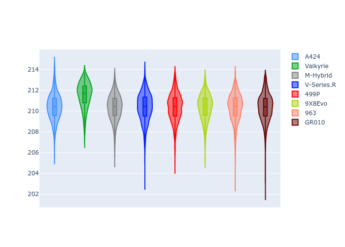
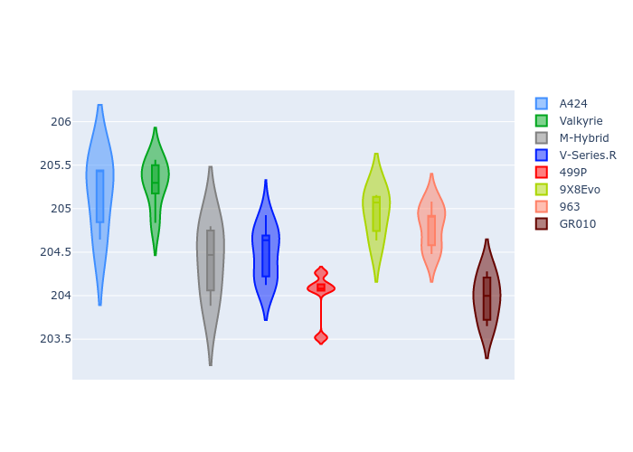
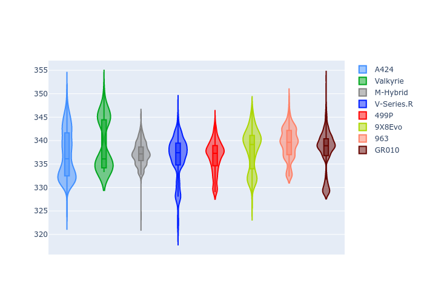
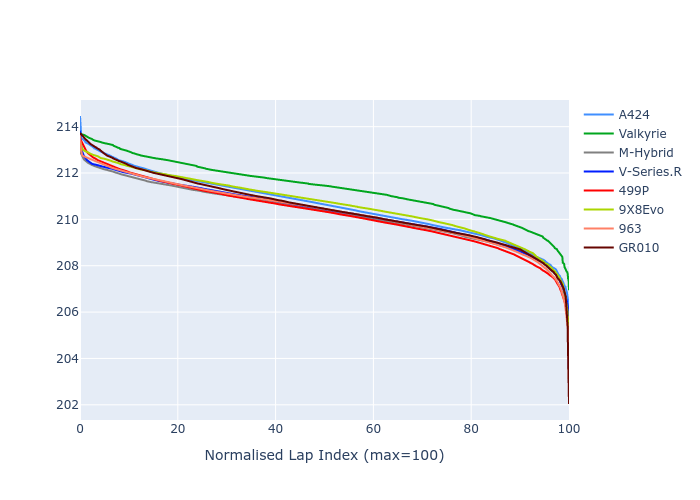

# Combined Plots

## Metadata

- BoP Accuracy: 99.90%
- Overall BoP Grade: A1
- Track: LEMANS
- Threshhold: 250.0kph
- Average Laptime: 3:30.70
- Average Quali Laptime: 3:25.58
- Laptime Std Dev: 0.35 seconds
- Filtered Average Topspeed: 338.76kph

## BoP Table
| Manufacturer   | Car        | Weight   | Power   | PINC   | E/Stint   | FDS    | RDP    | QDP    | TDP    |
|:---------------|:-----------|:---------|:--------|:-------|:----------|:-------|:-------|:-------|:-------|
| Alpine         | A424       | 1046kg   | 511.0kw | +0.50% | 896MJ     | -      | 52.20% | 54.51% | 24.58% |
| Aston Martin   | Valkyrie   | 1030kg   | 520.0kw | -      | 911MJ     | -      | 53.39% | 54.11% | 23.71% |
| BMW            | M-Hybrid   | 1040kg   | 513.0kw | -      | 918MJ     | -      | 53.47% | 52.95% | 33.73% |
| Cadillac       | V-Series.R | 1037kg   | 519.0kw | -      | 908MJ     | -      | 49.22% | 60.31% | 18.04% |
| Ferrari        | 499P       | 1052kg   | 503.0kw | -0.60% | 890MJ     | 190kph | 51.56% | 44.72% | 9.86%  |
| Peugeot        | 9X8Evo     | 1042kg   | 518.0kw | -      | 901MJ     | 190kph | 50.17% | 49.36% | 17.73% |
| Porsche        | 963        | 1046kg   | 511.0kw | +0.60% | 916MJ     | -      | 50.78% | 41.25% | 27.61% |
| Toyota         | GR010      | 1061kg   | 502.0kw | +1.50% | 904MJ     | 190kph | 51.68% | 51.25% | 14.48% |

## Performance Table
| Manufacturer   | Car        | RP      | QP      | Vavg      |   RDLC | BOP-Grade   | Match   |
|:---------------|:-----------|:--------|:--------|:----------|-------:|:------------|:--------|
| Alpine         | A424       | 3:30.82 | 3:26.05 | 337.04kph |   1.02 | ~A1         | 99.79%  |
| Aston Martin   | Valkyrie   | 3:31.51 | 3:26.74 | 337.61kph |   1.02 | ~A1         | 100.00% |
| BMW            | M-Hybrid   | 3:30.51 | 3:25.24 | 337.52kph |   1.03 | ~A1         | 100.00% |
| Cadillac       | V-Series.R | 3:30.22 | 3:25.00 | 337.20kph |   1.03 | ~A1         | 99.95%  |
| Ferrari        | 499P       | 3:30.54 | 3:25.18 | 339.38kph |   1.03 | ~A1         | 99.75%  |
| Peugeot        | 9X8Evo     | 3:30.67 | 3:25.81 | 340.61kph |   1.02 | ~A1         | 100.00% |
| Porsche        | 963        | 3:30.59 | 3:25.51 | 339.99kph |   1.02 | ~A1         | 99.92%  |
| Toyota         | GR010      | 3:30.74 | 3:25.15 | 340.72kph |   1.03 | ~A1         | 99.76%  |

## Race Laptimes

## Quali Laptimes

## Topspeeds

## Laptimes Lineplot

