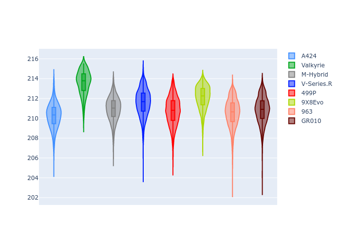

# Combined Plots

## Metadata

- BoP Accuracy: 98.38%
- Overall BoP Grade: A1
- Track: LEMANS
- Threshhold: 210.0kph

## BoP Table
| Manufacturer   | Car        | Weight   | Power   | PINC   | E/Stint   | FDS    | RDP    | QDP    | TDP    |
|:---------------|:-----------|:---------|:--------|:-------|:----------|:-------|:-------|:-------|:-------|
| Alpine         | A424       | 1047kg   | 520.0kw | -      | 914MJ     | -      | 52.35% | 61.85% | 27.84% |
| Aston Martin   | Valkyrie   | 1042kg   | 504.0kw | +0.40% | 899MJ     | -      | 53.59% | 53.33% | 21.51% |
| BMW            | M-Hybrid   | 1041kg   | 512.0kw | -      | 906MJ     | -      | 53.26% | 57.23% | 34.54% |
| Cadillac       | V-Series.R | 1034kg   | 510.0kw | -      | 901MJ     | -      | 47.80% | 56.73% | 19.63% |
| Ferrari        | 499P       | 1063kg   | 508.0kw | -      | 894MJ     | 190kph | 53.02% | 42.32% | 9.88%  |
| Peugeot        | 9X8Evo     | 1050kg   | 510.0kw | -      | 898MJ     | 190kph | 48.47% | 51.26% | 16.02% |
| Porsche        | 963        | 1047kg   | 516.0kw | -      | 909MJ     | -      | 50.87% | 45.25% | 30.77% |
| Toyota         | GR010      | 1080kg   | 512.0kw | -      | 911MJ     | 190kph | 52.43% | 57.12% | 12.82% |

## Performance Table
| Manufacturer   | Car        | RP      | QP      | Vavg      |   RDLC | BOP-Grade   | Match   |
|:---------------|:-----------|:--------|:--------|:----------|-------:|:------------|:--------|
| Alpine         | A424       | 3:28.07 | 3:23.20 | 335.67kph |   1.02 | ~A1         | 99.82%  |
| Aston Martin   | Valkyrie   | 3:31.10 | 3:24.86 | 331.91kph |   1.03 | +A2         | 91.38%  |
| BMW            | M-Hybrid   | 3:28.82 | 3:23.19 | 333.46kph |   1.03 | ~A1         | 100.00% |
| Cadillac       | V-Series.R | 3:29.36 | 3:23.76 | 329.89kph |   1.03 | ~A1         | 99.62%  |
| Ferrari        | 499P       | 3:27.29 | 3:20.82 | 334.05kph |   1.03 | ~A1         | 98.03%  |
| Peugeot        | 9X8Evo     | 3:28.95 | 3:23.65 | 335.30kph |   1.03 | ~A1         | 99.54%  |
| Porsche        | 963        | 3:28.56 | 3:23.06 | 334.36kph |   1.03 | ~A1         | 99.85%  |
| Toyota         | GR010      | 3:27.24 | 3:20.57 | 334.21kph |   1.03 | ~A1         | 98.79%  |

## Race Laptimes

## Quali Laptimes

## Topspeeds

## Laptimes Lineplot

