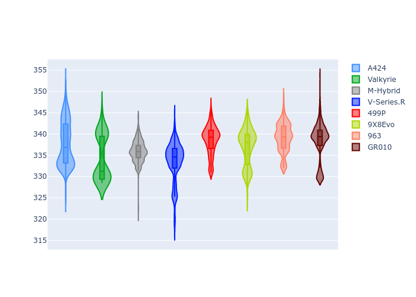

# Combined Plots

## Metadata

- BoP Accuracy: 96.70%
- Overall BoP Grade: A1
- Track: LEMANS
- Threshhold: 210.0kph
- Average Laptime: 3:31.32
- Average Quali Laptime: 3:25.47
- Average Topspeed: 336.82kph

## BoP Table
| Manufacturer   | Car        | Weight   | Power   | PINC   | E/Stint   | FDS    | RDP    | QDP    | TDP    |
|:---------------|:-----------|:---------|:--------|:-------|:----------|:-------|:-------|:-------|:-------|
| Alpine         | A424       | 1047kg   | 520.0kw | -      | 914MJ     | -      | 51.64% | 59.31% | 26.80% |
| Aston Martin   | Valkyrie   | 1042kg   | 504.0kw | +0.40% | 899MJ     | -      | 53.50% | 53.33% | 21.51% |
| BMW            | M-Hybrid   | 1041kg   | 512.0kw | -      | 906MJ     | -      | 52.89% | 56.22% | 33.41% |
| Cadillac       | V-Series.R | 1034kg   | 510.0kw | -      | 901MJ     | -      | 48.63% | 60.80% | 19.01% |
| Ferrari        | 499P       | 1063kg   | 508.0kw | -      | 894MJ     | 190kph | 51.38% | 44.98% | 9.83%  |
| Peugeot        | 9X8Evo     | 1050kg   | 510.0kw | -      | 898MJ     | 190kph | 48.87% | 52.78% | 15.41% |
| Porsche        | 963        | 1047kg   | 516.0kw | -      | 909MJ     | -      | 50.70% | 44.30% | 29.51% |
| Toyota         | GR010      | 1080kg   | 512.0kw | -      | 911MJ     | 190kph | 51.09% | 52.71% | 11.46% |

## Performance Table
| Manufacturer   | Car        | RP      | QP      | Vavg      |   RDLC | BOP-Grade   | Match   |
|:---------------|:-----------|:--------|:--------|:----------|-------:|:------------|:--------|
| Alpine         | A424       | 3:30.24 | 3:25.00 | 337.77kph |   1.03 | ~A1         | 99.97%  |
| Aston Martin   | Valkyrie   | 3:33.60 | 3:27.21 | 334.29kph |   1.03 | +C2         | 74.73%  |
| BMW            | M-Hybrid   | 3:30.94 | 3:24.94 | 335.93kph |   1.03 | ~A1         | 100.00% |
| Cadillac       | V-Series.R | 3:31.59 | 3:25.65 | 333.51kph |   1.03 | ~A1         | 99.35%  |
| Ferrari        | 499P       | 3:30.73 | 3:24.67 | 338.55kph |   1.03 | ~A1         | 99.95%  |
| Peugeot        | 9X8Evo     | 3:32.10 | 3:26.51 | 336.96kph |   1.03 | ~A1         | 100.00% |
| Porsche        | 963        | 3:30.55 | 3:25.31 | 339.13kph |   1.03 | ~A1         | 99.83%  |
| Toyota         | GR010      | 3:30.84 | 3:24.50 | 338.39kph |   1.03 | ~A1         | 99.79%  |

## Race Laptimes

## Quali Laptimes

## Topspeeds

## Laptimes Lineplot

