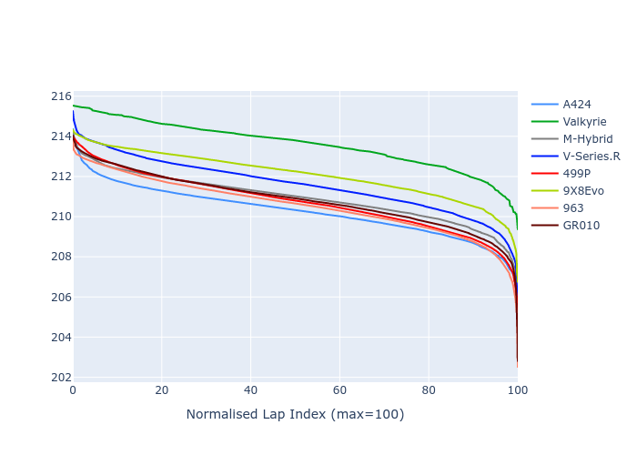

# Combined Plots

## Metadata

- BoP Accuracy: 98.06%
- Overall BoP Grade: A1
- Track: LEMANS
- Threshhold: 210.0kph

## BoP Table
| Manufacturer   | Car        | Weight   | Power   | PINC   | E/Stint   | FDS    |
|:---------------|:-----------|:---------|:--------|:-------|:----------|:-------|
| Alpine         | A424       | 1047kg   | 520.0kw | -      | 914MJ     | -      |
| Aston Martin   | Valkyrie   | 1042kg   | 504.0kw | +0.40% | 899MJ     | -      |
| BMW            | M-Hybrid   | 1041kg   | 512.0kw | -      | 906MJ     | -      |
| Cadillac       | V-Series.R | 1034kg   | 510.0kw | -      | 901MJ     | -      |
| Ferrari        | 499P       | 1063kg   | 508.0kw | -      | 894MJ     | 190kph |
| Peugeot        | 9X8Evo     | 1050kg   | 510.0kw | -      | 898MJ     | 190kph |
| Porsche        | 963        | 1047kg   | 516.0kw | -      | 909MJ     | -      |
| Toyota         | GR010      | 1080kg   | 512.0kw | -      | 911MJ     | 190kph |

## Performance Table
| Manufacturer   | Car        | RP      | QP      | Vavg      |   RDLC | BOP-Grade   | Match   |
|:---------------|:-----------|:--------|:--------|:----------|-------:|:------------|:--------|
| Alpine         | A424       | 3:28.33 | 3:23.72 | 335.90kph |   1.02 | ~A1         | 98.96%  |
| Aston Martin   | Valkyrie   | 3:32.06 | 3:25.79 | 331.91kph |   1.03 | +B1         | 88.09%  |
| BMW            | M-Hybrid   | 3:29.28 | 3:23.95 | 333.52kph |   1.03 | ~A1         | 99.96%  |
| Cadillac       | V-Series.R | 3:29.80 | 3:24.62 | 330.15kph |   1.03 | ~A1         | 99.96%  |
| Ferrari        | 499P       | 3:29.26 | 3:23.77 | 334.13kph |   1.03 | ~A1         | 99.79%  |
| Peugeot        | 9X8Evo     | 3:30.04 | 3:24.72 | 335.30kph |   1.03 | ~A1         | 97.91%  |
| Porsche        | 963        | 3:29.00 | 3:23.83 | 333.96kph |   1.03 | ~A1         | 99.81%  |
| Toyota         | GR010      | 3:29.88 | 3:24.16 | 333.73kph |   1.03 | ~A1         | 99.97%  |

## Race Laptimes

## Quali Laptimes

## Topspeeds

## Laptimes Lineplot

