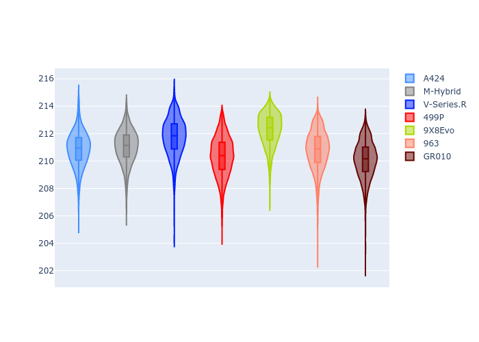
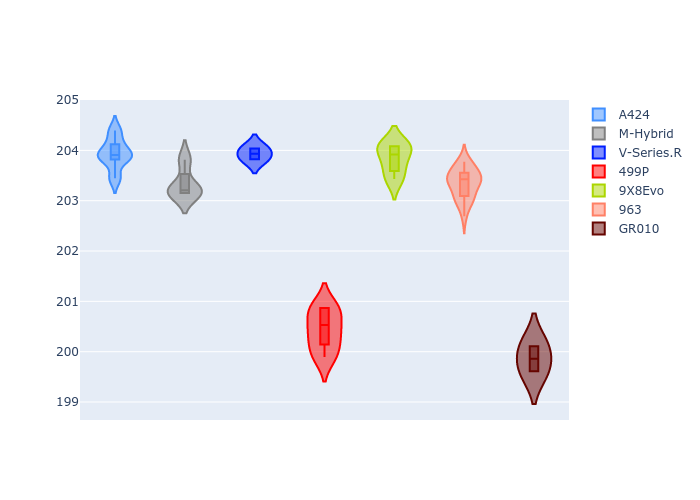
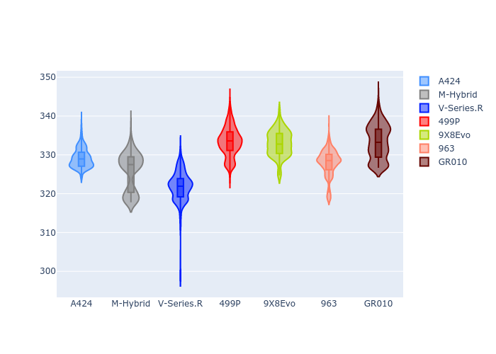
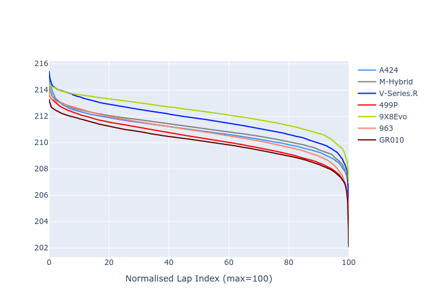

# Combined Plots

## Metadata

- BoP Accuracy: 99.63%
- Overall BoP Grade: A1
- Track: LEMANS
- Threshhold: 250.0kph
- Average Laptime: 3:31.02
- Average Quali Laptime: 3:25.25
- Average Topspeed: 337.28kph

## BoP Table
| Manufacturer   | Car        | Weight   | Power   | PINC   | E/Stint   | FDS    | RDP    | QDP    | TDP    |
|:---------------|:-----------|:---------|:--------|:-------|:----------|:-------|:-------|:-------|:-------|
| Alpine         | A424       | 1038kg   | 507.0kw | +0.90% | 903MJ     | -      | 51.64% | 59.31% | 26.80% |
| BMW            | M-Hybrid   | 1039kg   | 508.0kw | +0.90% | 904MJ     | -      | 52.89% | 56.22% | 33.41% |
| Cadillac       | V-Series.R | 1036kg   | 509.0kw | -      | 900MJ     | -      | 48.63% | 60.80% | 19.01% |
| Ferrari        | 499P       | 1043kg   | 508.0kw | -1.70% | 889MJ     | 190kph | 51.38% | 44.98% | 9.83%  |
| Peugeot        | 9X8Evo     | 1047kg   | 508.0kw | -0.70% | 895MJ     | 190kph | 48.87% | 52.78% | 15.41% |
| Porsche        | 963        | 1042kg   | 511.0kw | -      | 904MJ     | -      | 50.70% | 44.30% | 29.51% |
| Toyota         | GR010      | 1053kg   | 508.0kw | +0.90% | 906MJ     | 190kph | 51.09% | 52.71% | 11.46% |

## Performance Table
| Manufacturer   | Car        | RP      | QP      | Vavg      |   RDLC | BOP-Grade   | Match   |
|:---------------|:-----------|:--------|:--------|:----------|-------:|:------------|:--------|
| Alpine         | A424       | 3:30.84 | 3:25.57 | 336.49kph |   1.03 | ~A1         | 99.48%  |
| BMW            | M-Hybrid   | 3:31.06 | 3:25.05 | 335.96kph |   1.03 | ~A1         | 100.00% |
| Cadillac       | V-Series.R | 3:31.75 | 3:25.80 | 333.04kph |   1.03 | ~A1         | 98.77%  |
| Ferrari        | 499P       | 3:30.33 | 3:24.29 | 339.43kph |   1.03 | ~A1         | 99.98%  |
| Peugeot        | 9X8Evo     | 3:32.27 | 3:26.68 | 336.23kph |   1.03 | ~A1         | 99.51%  |
| Porsche        | 963        | 3:30.78 | 3:25.53 | 338.52kph |   1.03 | ~A1         | 99.92%  |
| Toyota         | GR010      | 3:30.10 | 3:23.80 | 341.30kph |   1.03 | ~A1         | 99.76%  |

## Race Laptimes

## Quali Laptimes

## Topspeeds

## Laptimes Lineplot

