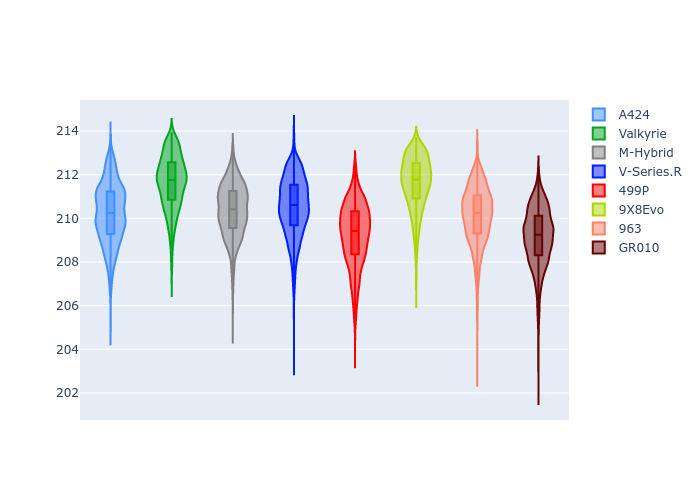
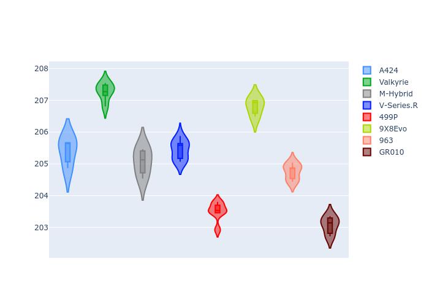
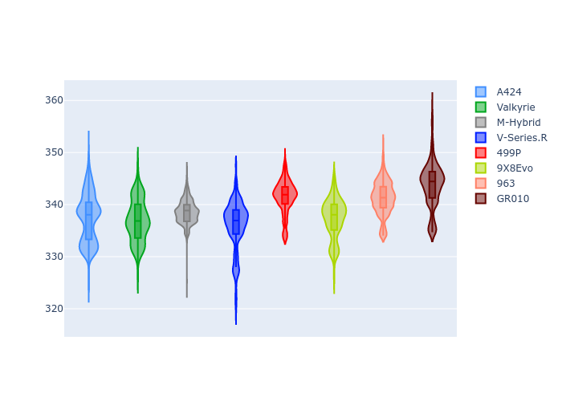
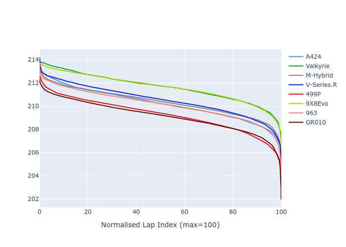

# Combined Plots

## Metadata

- BoP Accuracy: 98.97%
- Overall BoP Grade: A1
- Track: LEMANS
- Threshhold: 250.0kph
- Average Laptime: 3:30.37
- Average Quali Laptime: 3:25.27
- Laptime Std Dev: 0.87 seconds
- Filtered Average Topspeed: 339.09kph

## BoP Table
| Manufacturer   | Car        | Weight   | Power   | PINC   | E/Stint   | FDS    | RDP    | QDP    | TDP    |
|:---------------|:-----------|:---------|:--------|:-------|:----------|:-------|:-------|:-------|:-------|
| Alpine         | A424       | 1039kg   | 517.0kw | -1.70% | 897MJ     | -      | 52.20% | 54.51% | 24.58% |
| Aston Martin   | Valkyrie   | 1030kg   | 520.0kw | -0.80% | 910MJ     | -      | 53.39% | 54.11% | 23.71% |
| BMW            | M-Hybrid   | 1039kg   | 510.0kw | +2.00% | 919MJ     | -      | 53.47% | 52.95% | 33.73% |
| Cadillac       | V-Series.R | 1037kg   | 517.0kw | -0.80% | 905MJ     | -      | 49.22% | 60.31% | 18.04% |
| Ferrari        | 499P       | 1042kg   | 515.0kw | -2.90% | 896MJ     | 190kph | 51.56% | 44.72% | 9.86%  |
| Peugeot        | 9X8Evo     | 1039kg   | 507.0kw | -1.20% | 889MJ     | 190kph | 50.17% | 49.36% | 17.73% |
| Porsche        | 963        | 1041kg   | 511.0kw | +1.40% | 917MJ     | -      | 50.78% | 41.25% | 27.61% |
| Toyota         | GR010      | 1053kg   | 520.0kw | -1.30% | 914MJ     | 190kph | 51.68% | 51.25% | 14.48% |

## Performance Table
| Manufacturer   | Car        | RP      | QP      | Vavg      |   RDLC | BOP-Grade   | Match   |
|:---------------|:-----------|:--------|:--------|:----------|-------:|:------------|:--------|
| Alpine         | A424       | 3:30.22 | 3:25.48 | 337.43kph |   1.02 | ~A1         | 99.94%  |
| Aston Martin   | Valkyrie   | 3:31.65 | 3:26.87 | 336.93kph |   1.02 | +A2         | 94.56%  |
| BMW            | M-Hybrid   | 3:30.37 | 3:25.10 | 338.60kph |   1.03 | ~A1         | 100.00% |
| Cadillac       | V-Series.R | 3:30.53 | 3:25.29 | 336.05kph |   1.03 | ~A1         | 99.66%  |
| Ferrari        | 499P       | 3:29.26 | 3:23.97 | 341.49kph |   1.03 | ~A1         | 99.96%  |
| Peugeot        | 9X8Evo     | 3:31.63 | 3:26.71 | 337.31kph |   1.02 | ~A1         | 97.98%  |
| Porsche        | 963        | 3:30.13 | 3:25.08 | 341.26kph |   1.02 | ~A1         | 99.94%  |
| Toyota         | GR010      | 3:29.15 | 3:23.65 | 343.63kph |   1.03 | ~A1         | 99.69%  |

## Race Laptimes

## Quali Laptimes

## Topspeeds

## Laptimes Lineplot

