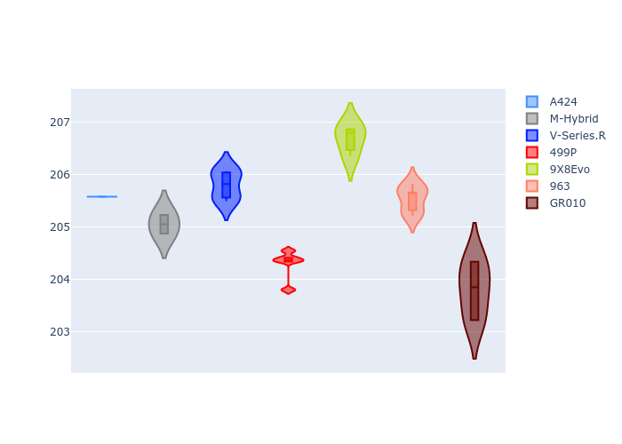
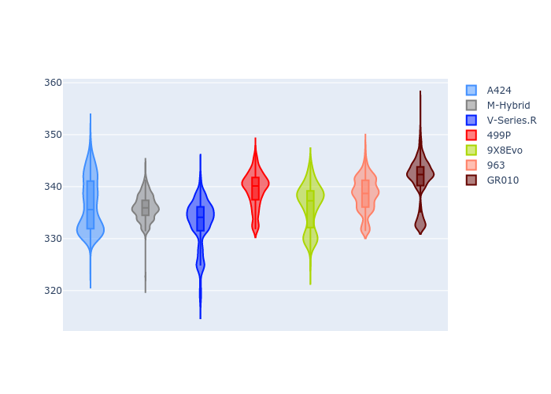

# Combined Plots

## Metadata

- BoP Accuracy: 99.00%
- Overall BoP Grade: A1
- Track: LEMANS
- Threshhold: 250.0kph

## BoP Table
| Manufacturer   | Car        | Weight   | Power   | PINC   | E/Stint   | FDS    | RDP    | QDP    | TDP    |
|:---------------|:-----------|:---------|:--------|:-------|:----------|:-------|:-------|:-------|:-------|
| Alpine         | A424       | 1038kg   | 507.0kw | +0.90% | 903MJ     | -      | 52.35% | 61.85% | 27.84% |
| BMW            | M-Hybrid   | 1039kg   | 508.0kw | +0.90% | 904MJ     | -      | 53.26% | 57.23% | 34.54% |
| Cadillac       | V-Series.R | 1036kg   | 509.0kw | -      | 900MJ     | -      | 47.80% | 56.73% | 19.63% |
| Ferrari        | 499P       | 1043kg   | 508.0kw | -1.70% | 889MJ     | 190kph | 53.02% | 42.32% | 9.88%  |
| Peugeot        | 9X8Evo     | 1047kg   | 508.0kw | -0.70% | 895MJ     | 190kph | 48.47% | 51.26% | 16.02% |
| Porsche        | 963        | 1042kg   | 511.0kw | -      | 904MJ     | -      | 50.87% | 45.25% | 30.77% |
| Toyota         | GR010      | 1053kg   | 508.0kw | +0.90% | 906MJ     | 190kph | 52.43% | 57.12% | 12.82% |

## Performance Table
| Manufacturer   | Car        | RP      | QP      | Vavg      |   RDLC | BOP-Grade   | Match   |
|:---------------|:-----------|:--------|:--------|:----------|-------:|:------------|:--------|
| Alpine         | A424       | 3:28.85 | 3:23.93 | 334.38kph |   1.02 | ~A1         | 99.68%  |
| BMW            | M-Hybrid   | 3:28.98 | 3:23.34 | 333.48kph |   1.03 | ~A1         | 99.75%  |
| Cadillac       | V-Series.R | 3:29.55 | 3:23.93 | 329.43kph |   1.03 | ~A1         | 99.45%  |
| Ferrari        | 499P       | 3:26.86 | 3:20.42 | 334.95kph |   1.03 | ~A1         | 98.04%  |
| Peugeot        | 9X8Evo     | 3:29.15 | 3:23.84 | 334.59kph |   1.03 | ~A1         | 98.79%  |
| Porsche        | 963        | 3:28.85 | 3:23.34 | 333.76kph |   1.03 | ~A1         | 99.86%  |
| Toyota         | GR010      | 3:26.48 | 3:19.86 | 337.07kph |   1.03 | ~A1         | 97.44%  |

## Race Laptimes

## Quali Laptimes

## Topspeeds

## Laptimes Lineplot

