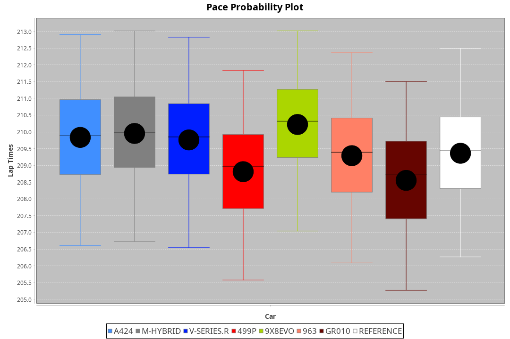
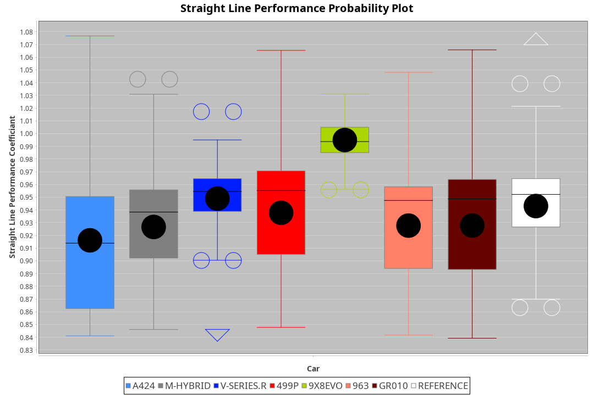
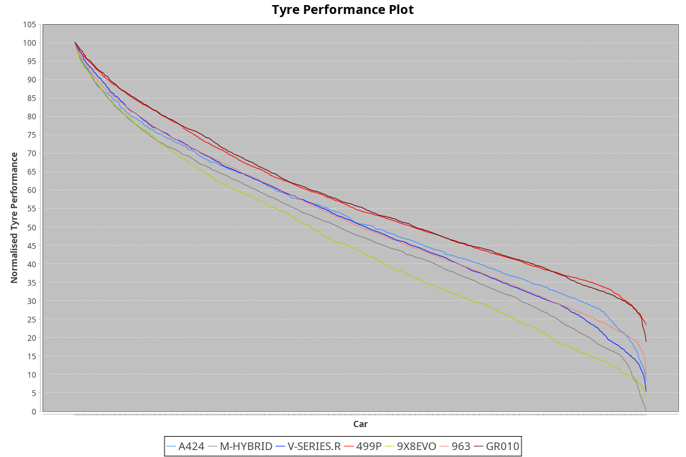

| Manufacturer | Car        | Weight | Power   | PINC    | E/Stint | FDS     |
|:-|:-|:-|:-|:-|:-|:-|
| Alpine       | A424       | 1038kg | 507.0kw | 0.90%   | 903MJ   |    -    |
| BMW          | M-Hybrid   | 1039kg | 508.0kw | 0.90%   | 904MJ   |    -    |
| Cadillac     | V-Series.R | 1036kg | 509.0kw |    -    | 900MJ   |    -    |
| Ferrari      | 499P       | 1043kg | 508.0kw | -1.70%  | 889MJ   | 190kph  |
| Peugeot      | 9X8Evo     | 1047kg | 508.0kw | -0.70%  | 895MJ   | 190kph  |
| Porsche      | 963        | 1042kg | 511.0kw |    -    | 904MJ   |    -    |
| Toyota       | GR010      | 1053kg | 508.0kw | 0.90%   | 906MJ   | 190kph  |

### BoP Accuracy: 85.94%; Overall BoP Grade: B1
| Manufacturer | Car        | Type  | RP      | QP      | Weight | Power¹  | Threshhold | PINC    | Power²   | E/Stint | AVG Vmax  | FDS     | RDLC | L/Stint | BOP-Grade | Model Accuracy | Model Points | Match% | SimDiff |
|:-|:-|:-|:-|:-|:-|:-|:-|:-|:-|:-|:-|:-|:-|:-|:-|:-|:-|:-|:-|
| Alpine       | A424       | LMDH  | 3:28.81 | 3:23.58 | 1038kg | 507.0kw | 250.0kph   | 0.90%   | 511.60kw |  903MJ  | 328.96kph |    -    | 1.02 | 12      | -A2       | 97.47%         | 1810         | 91.25% | +0.18   |
| BMW          | M-Hybrid   | LMDH  | 3:29.71 | 3:23.95 | 1039kg | 508.0kw | 250.0kph   | 0.90%   | 512.60kw |  904MJ  | 324.48kph |    -    | 1.03 | 12      | +A2       | 100.00%        | 3339         | 91.67% | -0.30   |
| Cadillac     | V-Series.R | LMDH  | 3:29.90 | 3:23.92 | 1036kg | 509.0kw | 250.0kph   |    -    | 509.00kw |  900MJ  | 325.00kph |    -    | 1.03 | 12      | +C1       | 99.00%         | 6039         | 78.60% | -0.46   |
| Ferrari      | 499P       | LMHHU | 3:28.60 | 3:22.83 | 1043kg | 508.0kw | 250.0kph   | -1.70%  | 499.40kw |  889MJ  | 323.41kph | 190kph  | 1.06 | 12      | -B2       | 99.56%         | 7418         | 84.81% | +0.20   |
| Peugeot      | 9X8Evo     | LMHHU | 3:30.14 | 3:24.68 | 1047kg | 508.0kw | 250.0kph   | -0.70%  | 504.40kw |  895MJ  | 333.52kph | 190kph  | 1.00 | 12      | +C1       | 100.00%        | 1889         | 79.23% | +0.10   |
| Porsche      | 963        | LMDH  | 3:29.31 | 3:23.21 | 1042kg | 511.0kw | 250.0kph   |    -    | 511.00kw |  904MJ  | 322.26kph |    -    | 1.03 | 12      | ~A1       | 100.00%        | 14574        | 98.70% | +0.10   |
| Toyota       | GR010      | LMHHU | 3:28.27 | 3:22.45 | 1053kg | 508.0kw | 250.0kph   | 0.90%   | 512.60kw |  906MJ  | 322.05kph | 190kph  | 1.06 | 12      | -C1       | 97.78%         | 5323         | 77.33% | +0.18   |

## Power below Threshhold
| N/Nmax    | A424    | M-HYBRID | V-SERIES.R | 499P    | 9X8EVO  | 963     | GR010   |
|:-|:-|:-|:-|:-|:-|:-|:-|
|  0.550    |  250    |  250     |  251       |  250    |  250    |  252    |  250    |
|  0.575    |  273    |  273     |  274       |  273    |  273    |  275    |  273    |
|  0.600    |  293    |  293     |  294       |  293    |  293    |  295    |  293    |
|  0.625    |  314    |  314     |  315       |  314    |  314    |  316    |  314    |
|  0.650    |  335    |  335     |  336       |  335    |  335    |  337    |  335    |
|  0.675    |  356    |  357     |  357       |  357    |  357    |  359    |  357    |
|  0.700    |  377    |  378     |  379       |  378    |  378    |  380    |  378    |
|  0.725    |  399    |  399     |  400       |  399    |  399    |  402    |  399    |
|  0.750    |  419    |  420     |  421       |  420    |  420    |  422    |  420    |
|  0.775    |  438    |  439     |  440       |  439    |  439    |  441    |  439    |
|  0.800    |  455    |  456     |  457       |  456    |  456    |  459    |  456    |
|  0.825    |  470    |  471     |  472       |  471    |  471    |  474    |  471    |
|  0.850    |  482    |  483     |  484       |  483    |  483    |  485    |  483    |
|  0.875    |  492    |  493     |  494       |  493    |  493    |  496    |  493    |
|  0.900    |  499    |  500     |  501       |  500    |  500    |  503    |  500    |
|  0.925    |  504    |  505     |  506       |  505    |  505    |  508    |  505    |
| **0.950** | **507** | **508**  | **509**    | **508** | **508** | **511** | **508** |
|  0.975    |  505    |  506     |  507       |  506    |  506    |  509    |  506    |
|  1.000    |  502    |  503     |  504       |  503    |  503    |  505    |  503    |
|  1.025    |  433    |  434     |  435       |  434    |  434    |  436    |  434    |

## Power above Threshhold
| N/Nmax    | A424       | M-HYBRID   | V-SERIES.R | 499P       | 9X8EVO     | 963     | GR010      |
|:-|:-|:-|:-|:-|:-|:-|:-|
|  0.550    |  252.28    |  252.28    |  251       |  246.18    |  248.22    |  252    |  252.28    |
|  0.575    |  275.30    |  275.31    |  274       |  268.20    |  271.24    |  275    |  275.31    |
|  0.600    |  295.33    |  296.33    |  294       |  288.21    |  291.26    |  295    |  296.33    |
|  0.625    |  316.35    |  317.35    |  315       |  308.22    |  312.27    |  316    |  317.35    |
|  0.650    |  337.37    |  338.38    |  336       |  329.24    |  333.29    |  337    |  338.38    |
|  0.675    |  359.40    |  359.40    |  357       |  350.26    |  354.31    |  359    |  359.40    |
|  0.700    |  380.42    |  381.43    |  379       |  371.27    |  375.33    |  380    |  381.43    |
|  0.725    |  402.44    |  403.45    |  400       |  392.29    |  396.35    |  402    |  403.45    |
|  0.750    |  422.46    |  423.47    |  421       |  412.30    |  416.37    |  422    |  423.47    |
|  0.775    |  441.49    |  442.49    |  440       |  431.31    |  435.38    |  441    |  442.49    |
|  0.800    |  459.51    |  460.51    |  457       |  448.33    |  453.40    |  459    |  460.51    |
|  0.825    |  474.52    |  475.53    |  472       |  463.34    |  468.41    |  474    |  475.53    |
|  0.850    |  485.53    |  486.54    |  484       |  474.35    |  479.42    |  485    |  486.54    |
|  0.875    |  496.55    |  497.56    |  494       |  484.35    |  489.43    |  496    |  497.56    |
|  0.900    |  503.55    |  504.56    |  501       |  491.36    |  496.44    |  503    |  504.56    |
|  0.925    |  508.56    |  509.57    |  506       |  496.36    |  501.44    |  508    |  509.57    |
| **0.950** | **511.56** | **512.57** | **509**    | **499.36** | **504.44** | **511** | **512.57** |
|  0.975    |  509.56    |  510.57    |  507       |  497.36    |  502.44    |  509    |  510.57    |
|  1.000    |  505.56    |  506.57    |  504       |  494.36    |  499.44    |  505    |  506.57    |
|  1.025    |  436.48    |  437.49    |  435       |  426.31    |  430.38    |  436    |  437.49    |
